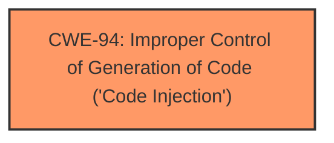

# Raw Analyzer Response for CVE-2025-21400

# Summary
| CWE ID | CWE Name | Confidence | CWE Abstraction Level | CWE Vulnerability Mapping Label | CWE-Vulnerability Mapping Notes |
|---|---|---|---|---|---|
| CWE-94 | Improper Control of Generation of Code ('Code Injection') | 0.7 | Base | Primary | Allowed-with-Review |

## Evidence and Confidence

*   **Confidence Score:** 0.7
*   **Evidence Strength:** LOW

## Relationship Analysis
The primary relationship considered was the parent-child relationship, specifically looking at children of CWE-94, however, none of the children fit the description given the lack of detail.

## Vulnerability Chain
The vulnerability chain is as follows:
1.  The application **improperly controls the generation of code** (CWE-94)
2.  This leads to Remote Code Execution

## Summary of Analysis
The vulnerability description indicates a Remote Code Execution vulnerability in Microsoft SharePoint Server. The description and reference links provided are limited, with the reference links being unrelated. Based on the available information, the best match is **CWE-94: Improper Control of Generation of Code ('Code Injection')**. This is because the vulnerability leads to code execution, and CWE-94 addresses scenarios where the application does not properly control the generation of code.

The retriever results also list CWE-94 as a potential candidate. While the usage is "Allowed-with-Review", the rationale mentions that it is often misused for vulnerabilities with a technical impact of "code execution," which does not by itself indicate a root cause weakness. However, without further information, it's difficult to pinpoint a more specific root cause.

Other CWEs considered but not selected:

*   CWE-78: Improper Neutralization of Special Elements used in an OS Command ('OS Command Injection') - This is more specific and requires the injection to occur at the OS command level, which isn't specified in the description.
*   CWE-79: Improper Neutralization of Input During Web Page Generation ('Cross-site Scripting') - This is specific to web page generation and XSS, which is not indicated in the description.

Because the provided description lacks specific root cause details, my confidence is only 0.7.