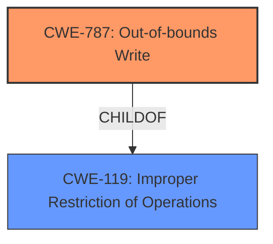

# Enhanced Analysis for CVE-2025-21428

# Summary
| CWE ID | CWE Name | Confidence | CWE Abstraction Level | CWE Vulnerability Mapping Label | CWE-Vulnerability Mapping Notes |
|---|---|---|---|---|---|
| CWE-787 | Out-of-bounds Write | 0.9 | Base | Allowed | Primary CWE. The vulnerability description indicates **memory corruption** which aligns with the characteristics of an out-of-bounds write. |

## Evidence and Confidence

*   **Confidence Score:** 0.9
*   **Evidence Strength:** MEDIUM

## Relationship Analysis
The primary CWE, CWE-787, is a base level CWE. The retriever results and the vulnerability description point to **memory corruption**. Since the vulnerability description is brief, it is difficult to pinpoint the exact mechanism causing the **memory corruption**, but Out-of-bounds Write is the most likely cause.



## Vulnerability Chain
The vulnerability chain starts with the **memory corruption** occurring during the connection of a STA to an AP and initiation of an ADD TS request. The root cause is likely an out-of-bounds write (CWE-787) due to improper handling of the ADD TS request, leading to memory corruption.

## Summary of Analysis
The analysis is based on the provided evidence, which indicates **memory corruption** during a specific process involving STA and AP connections. The retriever results strongly suggest CWE-787 (Out-of-bounds Write) as the primary candidate. Given the limited information, CWE-787 is the most appropriate and specific CWE to represent the vulnerability. Other CWEs like integer overflows or null pointer dereferences are less likely given the information.

The vulnerability description directly mentions **memory corruption**, aligning with CWE-787's description. The graph relationships show that CWE-787 is a child of CWE-119 (Improper Restriction of Operations Within the Bounds of a Memory Buffer), further supporting its relevance.

Other CWEs considered but not selected:

*   CWE-823 (Use of Out-of-range Pointer Offset): While related to memory access issues, the description doesn't explicitly mention pointer offsets.
*   CWE-704 (Incorrect Type Conversion or Cast): The description doesn't mention type conversion issues.
*   CWE-190 (Integer Overflow or Wraparound): There's no indication of integer overflow in the description.
*   CWE-476 (NULL Pointer Dereference): No mention of null pointers.


## CWE Relationship Analysis

Current CWEs represent these abstraction levels: .


### Vulnerability Chain Analysis

**Chain starting from CWE-476:**
- 476 (NULL Pointer Dereference) - ROOT


**Chain starting from CWE-823:**
- 823 (Use of Out-of-range Pointer Offset) - ROOT


### CWE Relationship Diagram

```mermaid
graph TD
    classDef primary fill:#f96,stroke:#333,stroke-width:2px
    classDef secondary fill:#69f,stroke:#333
    classDef tertiary fill:#9e9,stroke:#333
```