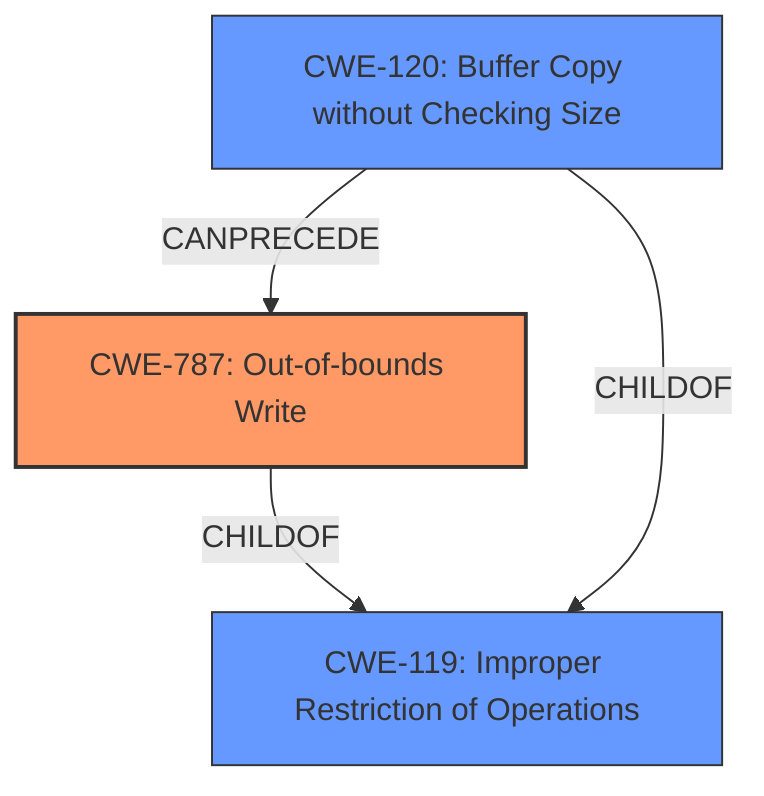

# Raw Analyzer Response for CVE-2025-21460

# Summary
| CWE ID | CWE Name | Confidence | CWE Abstraction Level | CWE Vulnerability Mapping Label | CWE-Vulnerability Mapping Notes |
|---|---|---|---|---|---|
| CWE-787 | Out-of-bounds Write | 0.9 | Base | Primary | Allowed |
| CWE-119 | Improper Restriction of Operations within the Bounds of a Memory Buffer | 0.7 | Class | Secondary | Allowed |

## Evidence and Confidence

*   **Confidence Score:** 0.8
*   **Evidence Strength:** LOW

## Relationship Analysis
The primary relationship is that CWE-787 is a child of CWE-119, indicating a specific type of memory buffer issue. CWE-120 (Buffer Copy without Checking Size) is also a child of CWE-119, and it can precede CWE-787, suggesting a possible chain. However, the evidence provided does not explicitly state the type of buffer overflow. Therefore, I am choosing the base CWE as there is no clear indication of how the out-of-bounds write occurs.

## Vulnerability Chain
The vulnerability chain involves a **memory corruption** issue leading to an out-of-bounds write. The initial flaw is the **improper handling of the buffer**, allowing an attacker (Guest VM) to continuously change the buffer, which ultimately results in a **CWE-787 Out-of-bounds Write**. There isn't sufficient information to map intermediate steps, so the chain is: **Improper buffer handling** -> **CWE-787 Out-of-bounds Write**.

## Summary of Analysis
The primary CWE is CWE-787 (Out-of-bounds Write) because the vulnerability description explicitly mentions **memory corruption** that occurs when processing a message, and the buffer can be controlled and changed continuously by a Guest VM, leading to an out-of-bounds write. The evidence is weak, as it's a general description. CWE-119 (Improper Restriction of Operations within the Bounds of a Memory Buffer) is a parent of CWE-787 and represents a broader class of buffer-related vulnerabilities.

The retriever results also suggest CWE-787 as the best match with a score of 1.000. CWE-122 (Heap-based Buffer Overflow) could have been a more specific Variant, but there is no evidence about where the buffer is stored, therefore it is not possible to prove that it is on the heap.

Relevant CWE Information:

# Enhanced Context (25 CWEs)
The following CWEs were identified as potentially relevant to this vulnerability:

## CWE-131: Incorrect Calculation of Buffer Size
**Abstraction Level**: Base
**Similarity Score**: 0.74

## CWE-805: Buffer Access with Incorrect Length Value
**Abstraction Level**: Base
**Similarity Score**: 0.73

## CWE-823: Use of Out-of-range Pointer Offset
**Abstraction Level**: Base
**Similarity Score**: 0.73

## CWE-822: Untrusted Pointer Dereference
**Abstraction Level**: Base
**Similarity Score**: 0.72

## CWE-124: Buffer Underwrite ('Buffer Underflow')
**Abstraction Level**: Base
**Similarity Score**: 0.72

## CWE-789: Memory Allocation with Excessive Size Value
**Abstraction Level**: Variant
**Similarity Score**: 0.72

## CWE-193: Off-by-one Error
**Abstraction Level**: Base
**Similarity Score**: 0.71

## CWE-197: Numeric Truncation Error
**Abstraction Level**: Base
**Similarity Score**: 0.71

## CWE-824: Access of Uninitialized Pointer
**Abstraction Level**: Base
**Similarity Score**: 0.71

## CWE-191: Integer Underflow (Wrap or Wraparound)
**Abstraction Level**: Base
**Similarity Score**: 0.71

## CWE-190: Integer Overflow or Wraparound
**Abstraction Level**: Base
**Similarity Score**: 360.11

## CWE-681: Incorrect Conversion between Numeric Types
**Abstraction Level**: Base
**Similarity Score**: 347.00

## CWE-1284: Improper Validation of Specified Quantity in Input
**Abstraction Level**: Base
**Similarity Score**: 344.56

## CWE-197: Numeric Truncation Error
**Abstraction Level**: Base
**Similarity Score**: 339.53

## CWE-122: Heap-based Buffer Overflow
**Abstraction Level**: Variant
**Similarity Score**: 332.51

## CWE-787: Out-of-bounds Write
**Abstraction Level**: base
**Similarity Score**: 4.33

## CWE-190: Integer Overflow or Wraparound
**Abstraction Level**: base
**Similarity Score**: 3.80

## CWE-681: Incorrect Conversion between Numeric Types
**Abstraction Level**: base
**Similarity Score**: 3.07

## CWE-1284: Improper Validation of Specified Quantity in Input
**Abstraction Level**: base
**Similarity Score**: 2.93

## CWE-195: Signed to Unsigned Conversion Error
**Abstraction Level**: variant
**Similarity Score**: 2.92

## CWE-822: Untrusted Pointer Dereference
**Abstraction Level**: Base
**Similarity Score**: 2.89

## CWE-823: Use of Out-of-range Pointer Offset
**Abstraction Level**: Base
**Similarity Score**: 2.89

## CWE-364: Signal Handler Race Condition
**Abstraction Level**: base
**Similarity Score**: 2.87

## CWE-120: Buffer Copy without Checking Size of Input ('Classic Buffer Overflow')
**Abstraction Level**: base
**Similarity Score**: 2.70

## CWE-124: Buffer Underwrite ('Buffer Underflow')
**Abstraction Level**: Base
**Similarity Score**: 2.65