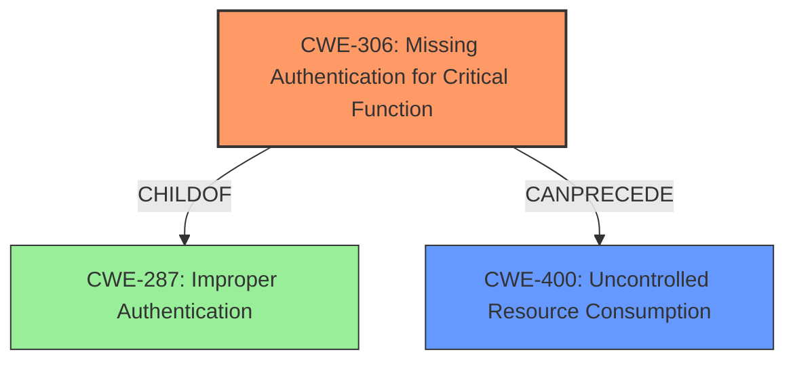

# Enhanced Analysis for CVE-2025-21549

# Summary
| CWE ID | CWE Name | Confidence | CWE Abstraction Level | CWE Vulnerability Mapping Label | CWE-Vulnerability Mapping Notes |
|---|---|---|---|---|---|
| CWE-306 | Missing Authentication for Critical Function | 0.7 | Base | Primary CWE | Allowed |
| CWE-400 | Uncontrolled Resource Consumption | 0.6 | Base | Secondary Candidate | Allowed |

## Evidence and Confidence

*   **Confidence Score:** 0.7
*   **Evidence Strength:** MEDIUM

## Relationship Analysis
The primary relationship influencing the decision is the need for authentication for critical functions. CWE-306 is a child of CWE-287 (Improper Authentication), which is a more general case. However, the description specifically mentions an unauthenticated attacker, making CWE-306 a more accurate fit. CWE-400 (Uncontrolled Resource Consumption) is a potential result of the **missing authentication**, as an attacker could potentially cause a denial-of-service by exhausting server resources.



## Vulnerability Chain
The vulnerability chain starts with the **missing authentication** (CWE-306) which allows an unauthenticated attacker to exploit the system. This leads to a denial-of-service condition, potentially through **uncontrolled resource consumption** (CWE-400).

## Summary of Analysis
The initial analysis focused on the vulnerability description and the retriever results. The description clearly states that an **unauthenticated attacker** can cause a denial-of-service. Therefore, CWE-306 (Missing Authentication for Critical Function) is the most appropriate primary CWE. The retriever results listed CWE-306 with a reasonable score, further supporting this choice. The impact of causing a hang or crash points to CWE-400 (Uncontrolled Resource Consumption), due to lack of authentication.

The evidence from the Vulnerability Description Key Phrases:
- **attacker:** unauthenticated attacker with network access

Relevant CWE Information:

# Enhanced Context (25 CWEs)
The following CWEs were identified as potentially relevant to this vulnerability:

## CWE-306: Missing Authentication for Critical Function
**Abstraction Level**: Base
**Similarity Score**: 364.91
**Source**: sparse

**Description**:
The product does not perform any authentication for functionality that requires a provable user identity or consumes a significant amount of resources.

**Mapping Guidance**:
- Usage: Allowed
- Rationale: This CWE entry is at the Base level of abstraction, which is a preferred level of abstraction for mapping to the root causes of vulnerabilities.

### Other CWEs Considered:

*   **CWE-173: Improper Handling of Alternate Encoding**: While listed as a top result, there's no evidence suggesting encoding issues in the description.
*   **CWE-611: Improper Restriction of XML External Entity Reference**: Not relevant as the description doesn't mention XML or external entities.
*   **CWE-502: Deserialization of Untrusted Data**: Not relevant as the description doesn't mention deserialization.
*   **CWE-918: Server-Side Request Forgery (SSRF)**: Not directly relevant as there is no mention of external request being made.
*   **CWE-400: Uncontrolled Resource Consumption**: This is a possible consequence of the **missing authentication**, but it's not the root cause. Therefore, it can be a secondary CWE.


## CWE Relationship Analysis

Current CWEs represent these abstraction levels: .


### Vulnerability Chain Analysis

**Chain starting from CWE-502:**
- 502 (Deserialization of Untrusted Data) - ROOT


**Chain starting from CWE-611:**
- 611 (Improper Restriction of XML External Entity Reference) - ROOT


### CWE Relationship Diagram

```mermaid
graph TD
    classDef primary fill:#f96,stroke:#333,stroke-width:2px
    classDef secondary fill:#69f,stroke:#333
    classDef tertiary fill:#9e9,stroke:#333
```