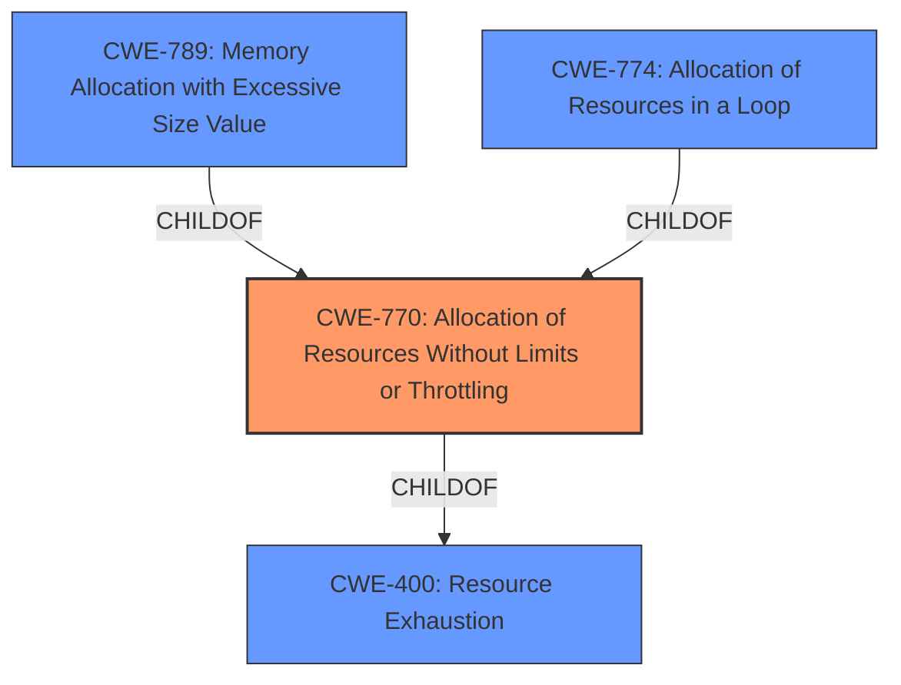

# Analysis Report for CVE-2025-21588

# Vulnerability Analysis Report: CVE-2025-21588

## Description

Vulnerability in the MySQL Server product of Oracle MySQL (component Server DML). Supported versions that are affected are 8.4.0-8.4.4 and 9.0.0-9.2.0. Easily exploitable vulnerability allows high privileged attacker with network access via multiple protocols to compromise MySQL Server. Successful attacks of this vulnerability can result in unauthorized ability to cause a hang or frequently repeatable crash (complete DOS) of MySQL Server. CVSS 3.1 Base Score 4.9 (Availability impacts). CVSS Vector (CVSS3.1/AVN/ACL/PRH/UIN/SU/CN/IN/AH).

## Vulnerability Description Key Phrases

- **Impact:** ['cause a hang or frequently repeatable crash', 'Availability', 'DOS']
- **Vector:** multiple protocols
- **Attacker:** high privileged attacker
- **Product:** MySQL Server product of Oracle MySQL
- **Version:** ["'9.0.0-9.2.0']", "['8.4.0-8.4.4'"]

## Analysis (with Relationship Data)

# Summary
| CWE ID | CWE Name | Confidence | CWE Abstraction Level | CWE Vulnerability Mapping Label | CWE-Vulnerability Mapping Notes |
|---|---|---|---|---|---|
| CWE-770 | Allocation of Resources Without Limits or Throttling | 0.7 | Base | Allowed | Primary CWE |

## Evidence and Confidence

*   **Confidence Score:** 0.7
*   **Evidence Strength:** LOW

## Relationship Analysis
The primary CWE is CWE-770, which is a base-level CWE. It has child CWEs like CWE-789 and CWE-774, but the provided information isn't specific enough to select those. CWE-770 is a child of CWE-400 (Resource Exhaustion). This relationship indicates that CWE-770 directly contributes to resource exhaustion issues, which aligns with the vulnerability's impact of causing a hang or crash (complete DOS).



## Vulnerability Chain
The vulnerability chain starts with **uncontrolled resource allocation** (CWE-770), leading to **resource exhaustion** and ultimately a **denial of service** condition.

## Summary of Analysis
The vulnerability description points to a denial-of-service (DOS) condition caused by a hang or crash of the MySQL server. The key phrase "cause a hang or frequently repeatable crash" suggests resource exhaustion. The Retriever results include CWE-770 "Allocation of Resources Without Limits or Throttling", which aligns with the DOS impact.

The vulnerability description mentions "easily exploitable vulnerability allows high privileged attacker with network access via multiple protocols to compromise MySQL Server. Successful attacks of this vulnerability can result in unauthorized ability to cause a hang or frequently repeatable crash (complete DOS) of MySQL Server." This indicates that an attacker can exploit the vulnerability to cause a denial of service by exhausting resources.

I am selecting CWE-770 as the primary CWE because it describes the root cause of the DOS vulnerability. It directly relates to allocating resources without limits, leading to resource exhaustion and a crash. The other CWEs in the Retriever Results were not selected. I did not select CWE-89, as there's no mention of SQL injection in the description. The other CWEs in the Retriever Results did not closely align with the vulnerability description.
The evidence is somewhat weak, as the CVE Reference Links Content Summary is "UNRELATED". My confidence is moderate (0.7) due to the lack of detailed information and the "UNRELATED" finding in the CVE Reference Links.


## CWE Relationship Analysis

Current CWEs represent these abstraction levels: .


### Vulnerability Chain Analysis

**Chain starting from CWE-89:**
- 89 (Improper Neutralization of Special Elements used in an SQL Command ('SQL Injection')) - ROOT


**Chain starting from CWE-400:**
- 400 (Uncontrolled Resource Consumption) - ROOT


### CWE Relationship Diagram

```mermaid
graph TD
    classDef primary fill:#f96,stroke:#333,stroke-width:2px
    classDef secondary fill:#69f,stroke:#333
    classDef tertiary fill:#9e9,stroke:#333
```


*Report generated on 2025-07-14 09:38:58*
