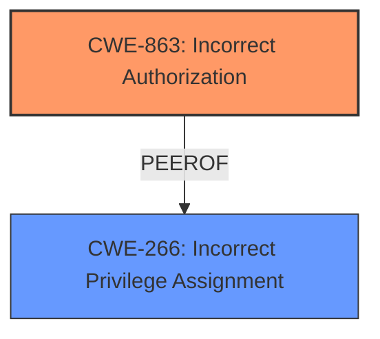

# Raw Analyzer Response for CVE-2025-21611

# Summary
| CWE ID | CWE Name | Confidence | CWE Abstraction Level | CWE Vulnerability Mapping Label | CWE-Vulnerability Mapping Notes |
|---|---|---|---|---|---|
| CWE-863 | Incorrect Authorization | 0.9 | Class | Primary CWE | Allowed-with-Review |
| CWE-266 | Incorrect Privilege Assignment | 0.7 | Base | Secondary | Allowed |

## Evidence and Confidence

*   **Confidence Score:** 0.8
*   **Evidence Strength:** HIGH

## Relationship Analysis
The primary CWE is CWE-863, "Incorrect Authorization," which is a Class-level CWE. Several potential child CWEs could be considered for more specificity, but the description does not provide enough detail to confidently select a more specific base or variant. CWE-266 "Incorrect Privilege Assignment" is related as a potential cause but the vulnerability description focuses more on the authorization logic itself being flawed rather than the privilege assignment being the root cause. Therefore, CWE-863 is more appropriate as the primary CWE.

## Vulnerability Chain
The vulnerability chain starts with the **incorrectly ORed instead of ANDed** roles in the authorization logic (CWE-863), leading to enabled users gaining unauthorized access to API methods.

## Summary of Analysis
The initial assessment identified CWE-863 as the primary candidate due to the **incorrect authorization** logic. The retriever results also suggested CWE-266, CWE-285, CWE-269, and others. However, after reviewing the vulnerability description and the provided guidance, CWE-863 remains the most appropriate primary CWE. The description explicitly states that the roles were **incorrectly ORed instead of ANDed**, indicating a flaw in the authorization check itself, aligning perfectly with CWE-863. CWE-266 is a possible secondary candidate because the **incorrect** logical operation could be caused by an incorrect privilege assignment, but more likely points to a coding error in the authorization check.

Relevant CWE Information:

# Enhanced Context (25 CWEs)
The following CWEs were identified as potentially relevant to this vulnerability:

## CWE-266: Incorrect Privilege Assignment
**Abstraction Level**: Base
**Similarity Score**: 1394.24
**Source**: sparse

**Description**:
A product incorrectly assigns a privilege to a particular actor, creating an unintended sphere of control for that actor.

**Mapping Guidance**:
- Usage: Allowed
- Rationale: This CWE entry is at the Base level of abstraction, which is a preferred level of abstraction for mapping to the root causes of vulnerabilities.

## CWE-863: Incorrect Authorization
**Abstraction Level**: Class
**Similarity Score**: 1548.64
**Source**: sparse

**Description**:
The product performs an authorization check when an actor attempts to access a resource or perform an action, but it does not correctly perform the check.

**Mapping Guidance**:
- Usage: Allowed-with-Review
- Rationale: This CWE entry is a Class and might have Base-level children that would be more appropriate

## Vulnerability Description
tgstation-server is a production scale tool for BYOND server management. Prior to 6.12.3, roles used to authorize API methods were **incorrectly ORd instead of ANDed** with the role used to determine if a user was enabled. This allows enabled users access to most, but not all, authorized actions regardless of their permissions. Notably, the WriteUsers right is unaffected so users may not use this bug to permanently elevate their account permissions. The fix is release in tgstation-server-v6.12.3.

### Vulnerability Description Key Phrases
- **rootcause:** **incorrectly ORed instead of ANDed**
- **impact:** enabled users access to most, but not all, authorized actions regardless of their permissions
- **attacker:** enabled users
- **product:** tgstation-server
- **version:** Prior to 6.12.3