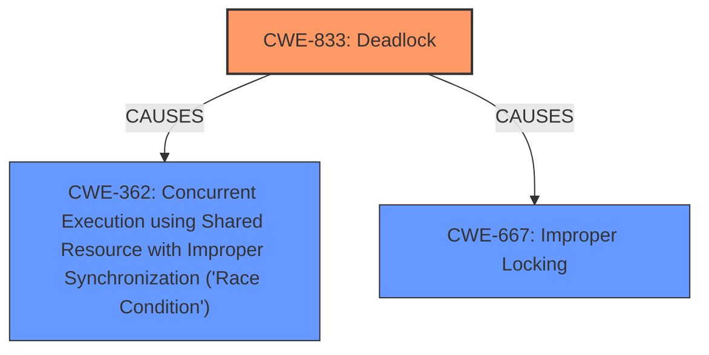

# Analysis Report for CVE-2025-21634

# Vulnerability Analysis Report: CVE-2025-21634

## Description

In the Linux kernel, the following vulnerability has been resolved cgroup/cpuset remove kernfs active break A warning was found WARNING CPU 10 PID 3486953 at fs/kernfs/file.c828 CPU 10 PID 3486953 Comm rmdir Kdump loaded Tainted G RIP 0010kernfs_should_drain_open_files+0x1a1/0x1b0 RSP 0018ffff8881107ef9e0 EFLAGS 00010202 RAX 0000000080000002 RBX ffff888154738c00 RCX dffffc0000000000 RDX 0000000000000007 RSI 0000000000000004 RDI ffff888154738c04 RBP ffff888154738c04 R08 ffffffffaf27fa15 R09 ffffed102a8e7180 R10 ffff888154738c07 R11 0000000000000000 R12 ffff888154738c08 R13 ffff888750f8c000 R14 ffff888750f8c0e8 R15 ffff888154738ca0 FS 00007f84cd0be740(0000) GSffff8887ddc00000(0000) knlGS0000000000000000 CS 0010 DS 0000 ES 0000 CR0 0000000080050033 CR2 0000555f9fbe00c8 CR3 0000000153eec001 CR4 0000000000370ee0 DR0 0000000000000000 DR1 0000000000000000 DR2 0000000000000000 DR3 0000000000000000 DR6 00000000fffe0ff0 DR7 0000000000000400 Call Trace kernfs_drain+0x15e/0x2f0 __kernfs_remove+0x165/0x300 kernfs_remove_by_name_ns+0x7b/0xc0 cgroup_rm_file+0x154/0x1c0 cgroup_addrm_files+0x1c2/0x1f0 css_clear_dir+0x77/0x110 kill_css+0x4c/0x1b0 cgroup_destroy_locked+0x194/0x380 cgroup_rmdir+0x2a/0x140 It can be explained by rmdir echo 1 > cpuset.cpus kernfs_fop_write_iter // active=0 cgroup_rm_file kernfs_remove_by_name_ns kernfs_get_active // active=1 __kernfs_remove // active=0x80000002 kernfs_drain cpuset_write_resmask wait_event //waiting (active == 0x80000001) kernfs_break_active_protection // active = 0x80000001 // continue kernfs_unbreak_active_protection // active = 0x80000002 ... kernfs_should_drain_open_files // warning occurs kernfs_put_active This warning is caused by kernfs_break_active_protection when it is writing to cpuset.cpus, and the cgroup is removed concurrently. The commit 3a5a6d0c2b03 (cpuset dont nest cgroup_mutex inside get_online_cpus()) made cpuset_hotplug_workfn asynchronous, This change involves calling flush_work(), which can create a multiple processes circular locking dependency that involve cgroup_mutex, potentially leading to a deadlock. To avoid deadlock. the commit 76bb5ab8f6e3 (cpuset break kernfs active protection in cpuset_write_resmask()) added kernfs_break_active_protection in the cpuset_write_resmask. This could lead to this warning. After the commit 2125c0034c5d (cgroup/cpuset Make cpuset hotplug processing synchronous), the cpuset_write_resmask no longer needs to wait the hotplug to finish, which means that concurrent hotplug and cpuset operations are no longer possible. Therefore, the deadlock doesnt exist anymore and it does not have to break active protection now. To fix this warning, just remove kernfs_break_active_protection operation in the cpuset_write_resmask.

## Vulnerability Description Key Phrases

- **Impact:** warning
- **Product:** Linux kernel
- **Component:** cgroup/cpuset remove kernfs active break

## Analysis (with Relationship Data)

# Summary
| CWE ID | CWE Name | Confidence | CWE Abstraction Level | CWE Vulnerability Mapping Label | CWE-Vulnerability Mapping Notes |
|---|---|---|---|---|---|
| CWE-833 | Deadlock | 0.7 | Base | Primary | Allowed |
| CWE-362 | Concurrent Execution using Shared Resource with Improper Synchronization ('Race Condition') | 0.6 | Class | Secondary | Allowed-with-Review |
| CWE-667 | Improper Locking | 0.5 | Class | Secondary | Allowed-with-Review |

## Evidence and Confidence

*   **Confidence Score:** 0.7
*   **Evidence Strength:** MEDIUM

## Relationship Analysis
The primary relationship that influenced the decision was the presence of deadlock scenarios. While **CWE-362** [Concurrent Execution using Shared Resource with Improper Synchronization ('Race Condition')] and **CWE-667** [Improper Locking] are related, **CWE-833** [Deadlock] is a more specific outcome of these conditions. The analysis also considered that **CWE-833** [Deadlock] is a Base level CWE, while **CWE-362** [Concurrent Execution using Shared Resource with Improper Synchronization ('Race Condition')] and **CWE-667** [Improper Locking] are Class level CWEs.



## Vulnerability Chain
The vulnerability chain starts with asynchronous execution leading to potential circular locking dependencies. The breaking of active protection to avoid deadlock introduces a warning condition which could be fixed by removing the protection breaking operation now that the original deadlock source is gone.
  - **Root Cause:** Asynchronous execution and circular locking dependencies
  - **Intermediate:** Breaking active protection to avoid deadlock
  - **Impact:** Warning due to concurrent cgroup removal

## Summary of Analysis
The initial assessment focused on identifying the root cause of the vulnerability. The description clearly states that the vulnerability is related to a **deadlock** scenario in the Linux kernel's cgroup/cpuset component. The evidence from the vulnerability description supports this assessment: "This change involves calling flush_work(), which can create a multiple processes circular locking dependency that involve cgroup_mutex, potentially leading to a deadlock." Based on this evidence, **CWE-833** [Deadlock] was selected as the primary CWE.

The retriever results also listed **CWE-362** [Concurrent Execution using Shared Resource with Improper Synchronization ('Race Condition')] and **CWE-667** [Improper Locking] as potential candidates. These CWEs were considered as secondary because they represent conditions that could lead to a **deadlock**, but the description explicitly mentions the **deadlock** itself.

The analysis also considered the relationships between the CWEs. **CWE-362** [Concurrent Execution using Shared Resource with Improper Synchronization ('Race Condition')] and **CWE-667** [Improper Locking] can contribute to **CWE-833** [Deadlock].

The final decision was based on the evidence from the vulnerability description and the relationships between the CWEs. **CWE-833** [Deadlock] was selected as the primary CWE because it directly represents the vulnerability, while **CWE-362** [Concurrent Execution using Shared Resource with Improper Synchronization ('Race Condition')] and **CWE-667** [Improper Locking] were considered as contributing factors.

The selected CWEs are at the optimal level of specificity because they accurately represent the vulnerability and its contributing factors. **CWE-833** [Deadlock] is a Base level CWE, which is preferred for mapping to the root causes of vulnerabilities. **CWE-362** [Concurrent Execution using Shared Resource with Improper Synchronization ('Race Condition')] and **CWE-667** [Improper Locking] are Class level CWEs, which provide additional context about the conditions that could lead to the **deadlock**.


## CWE Relationship Analysis

Current CWEs represent these abstraction levels: .


### Vulnerability Chain Analysis

**Chain starting from CWE-667:**
- 667 (Improper Locking) - ROOT


**Chain starting from CWE-833:**
- 833 (Deadlock) - ROOT


### CWE Relationship Diagram

```mermaid
graph TD
    classDef primary fill:#f96,stroke:#333,stroke-width:2px
    classDef secondary fill:#69f,stroke:#333
    classDef tertiary fill:#9e9,stroke:#333
```


*Report generated on 2025-07-14 09:42:01*
