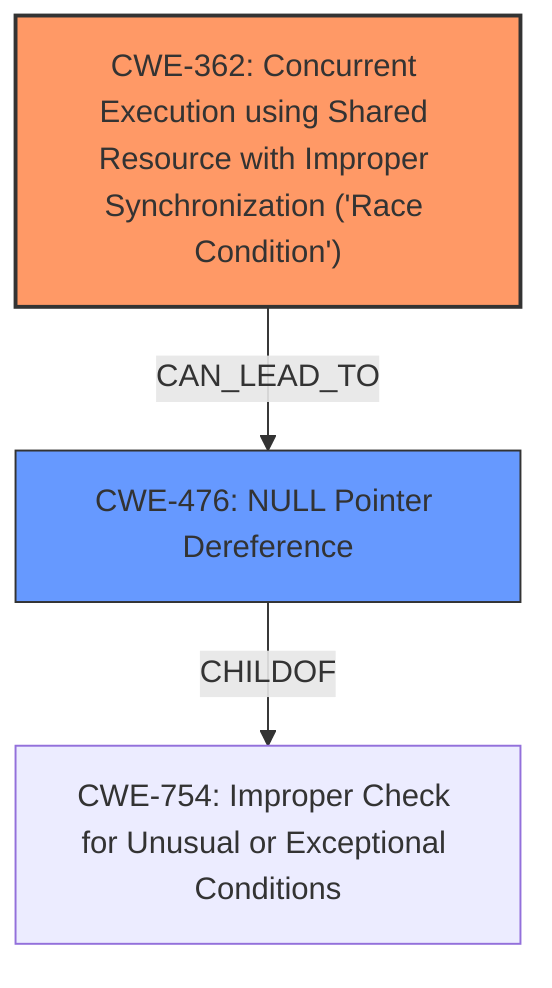

# Analysis Report for CVE-2025-21688

# Vulnerability Analysis Report: CVE-2025-21688

## Description

In the Linux kernel, the following vulnerability has been resolved drm/v3d Assign job pointer to NULL before signaling the fence In commit e4b5ccd392b9 (drm/v3d Ensure job pointer is set to NULL after job completion), we introduced a change to assign the job pointer to NULL after completing a job, indicating job completion. However, this approach created a **race condition** between the DRM scheduler workqueue and the IRQ execution thread. As soon as the fence is signaled in the IRQ execution thread, a new job starts to be executed. This results in a **race condition** where the IRQ execution thread sets the job pointer to NULL simultaneously as the `run_job()` function assigns a new job to the pointer. This **race condition** can lead to a NULL pointer dereference if the IRQ execution thread sets the job pointer to NULL after `run_job()` assigns it to the new job. When the new job completes and the GPU emits an interrupt, `v3d_irq()` is triggered, potentially causing a crash. [ 466.310099] Unable to handle **kernel NULL pointer dereference** at virtual address 00000000000000c0 [ 466.318928] Mem abort info [ 466.321723] ESR = 0x0000000096000005 [ 466.325479] EC = 0x25 DABT (current EL), IL = 32 bits [ 466.330807] SET = 0, FnV = 0 [ 466.333864] EA = 0, S1PTW = 0 [ 466.337010] FSC = 0x05 level 1 translation fault [ 466.341900] Data abort info [ 466.344783] ISV = 0, ISS = 0x00000005, ISS2 = 0x00000000 [ 466.350285] CM = 0, WnR = 0, TnD = 0, TagAccess = 0 [ 466.355350] GCS = 0, Overlay = 0, DirtyBit = 0, Xs = 0 [ 466.360677] user pgtable 4k pages, 39-bit VAs, pgdp=0000000089772000 [ 466.367140] [00000000000000c0] pgd=0000000000000000, p4d=0000000000000000, pud=0000000000000000 [ 466.375875] Internal error Oops 0000000096000005

## Vulnerability Description Key Phrases

- **Rootcause:** race condition
- **Weakness:** kernel NULL pointer dereference
- **Impact:** ['crash', 'Oops']
- **Product:** Linux kernel
- **Component:** drm/v3d

## Analysis (with Relationship Data)

# Summary
| CWE ID | CWE Name | Confidence | CWE Abstraction Level | CWE Vulnerability Mapping Label | CWE-Vulnerability Mapping Notes |
|---|---|---|---|---|---|
| CWE-362 | Concurrent Execution using Shared Resource with Improper Synchronization ('**Race Condition**') | 0.9 | Class | Allowed-with-Review | Primary CWE. The vulnerability is caused by a **race condition** between the DRM scheduler workqueue and the IRQ execution thread. |
| CWE-476 | **NULL Pointer Dereference** | 0.8 | Base | Allowed | Secondary. The **race condition** can lead to a **NULL pointer dereference** when the IRQ execution thread sets the job pointer to NULL after run_job() assigns it to the new job. |

## Evidence and Confidence

*   **Confidence Score:** 0.85
*   **Evidence Strength:** HIGH

## Relationship Analysis
The primary weakness is CWE-362, a Class-level CWE describing a **race condition**. CWE-476, a Base-level CWE, describes the resulting **NULL pointer dereference**. CWE-476 is a child of CWE-754 (Improper Check for Unusual or Exceptional Conditions), suggesting that the **NULL pointer dereference** occurs because a condition is not properly checked. CWE-362 can lead to CWE-476.



## Vulnerability Chain
The vulnerability chain starts with a **race condition** (CWE-362) where the IRQ execution thread and the DRM scheduler workqueue access the job pointer concurrently. This **race condition** leads to a **NULL pointer dereference** (CWE-476), which in turn causes a crash.

## Summary of Analysis
The analysis is based on the provided vulnerability description and the retriever results. The vulnerability description explicitly mentions a **race condition** and a **NULL pointer dereference**.

The evidence from the vulnerability description includes:
- "This approach created a **race condition** between the DRM scheduler workqueue and the IRQ execution thread."
- "This **race condition** can lead to a NULL pointer dereference if the IRQ execution thread sets the job pointer to NULL after `run_job()` assigns it to the new job."
- "Unable to handle **kernel NULL pointer dereference** at virtual address 00000000000000c0"

CWE-362 is selected as the primary CWE because it represents the root cause of the vulnerability: the **race condition**. CWE-476 is selected as a secondary CWE because it represents the direct consequence of the **race condition**: a **NULL pointer dereference**.

CWE-362 is a Class-level CWE. While it is recommended to use a Base-level CWE when possible, the description of CWE-362 closely matches the **race condition** described in the vulnerability.
CWE-476 is a Base-level CWE which is the preferred level of abstraction.

Other CWEs considered but not used:

- CWE-665 (Improper Initialization): While initialization might be related, the core issue is the **race condition**, not the initialization itself.
- CWE-364 (Signal Handler Race Condition): This is more specific than the general **race condition** and doesn't capture the essence of the vulnerability.
- CWE-835 (Loop with Unreachable Exit Condition ('Infinite Loop')): This is not related to the vulnerability.
- CWE-822 (Untrusted Pointer Dereference): The pointer is not necessarily from an untrusted source.
- CWE-909 (Missing Initialization of Resource): Not the primary issue.
- CWE-1325 (Improperly Controlled Sequential Memory Allocation): Not related to memory allocation issues.


## CWE Relationship Analysis

Current CWEs represent these abstraction levels: .


### Vulnerability Chain Analysis

**Chain starting from CWE-476:**
- 476 (NULL Pointer Dereference) - ROOT


**Chain starting from CWE-909:**
- 909 (Missing Initialization of Resource) - ROOT


### CWE Relationship Diagram

```mermaid
graph TD
    classDef primary fill:#f96,stroke:#333,stroke-width:2px
    classDef secondary fill:#69f,stroke:#333
    classDef tertiary fill:#9e9,stroke:#333
```


*Report generated on 2025-07-14 09:44:02*
