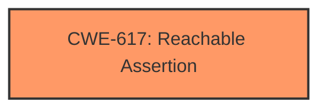

# Raw Analyzer Response for CVE-2025-21754

# Summary
| CWE ID | CWE Name | Confidence | CWE Abstraction Level | CWE Vulnerability Mapping Label | CWE-Vulnerability Mapping Notes |
|---|---|---|---|---|---|
| CWE-617 | Reachable Assertion | 1.0 | Base | Primary | Allowed |

## Evidence and Confidence

*   **Confidence Score:** 1.0
*   **Evidence Strength:** HIGH

## Relationship Analysis
The primary relationship identified is that CWE-617 is a Base level CWE, which is preferred for mapping root causes. There are no direct parent-child or chain relationships significantly influencing the selection in this case. The focus is on the direct match of the vulnerability description to the CWE definition.

## Vulnerability Chain
The vulnerability chain is straightforward:
1.  **Root Cause:** **Assertion Failure** due to unexpected flag being set (BTRFS_ORDERED_IOERR).
2.  **Impact:** Application exit/abnormal termination, potentially disrupting system operations.

## Summary of Analysis
The primary CWE selected is CWE-617 (Reachable Assertion). This is based on the explicit mention of "**assertion failure**" in the vulnerability description. The description states "we will fail on the following assertion at btrfs_split_ordered_extent() ASSERT(!(flags & ~BTRFS_ORDERED_TYPE_FLAGS))". This directly matches the definition of CWE-617, where an assertion is triggered, leading to abnormal program behavior. The retriever results also strongly support this, with CWE-617 having the highest score. The other CWEs considered, such as those related to locking or race conditions, do not directly address the **assertion failure** aspect, making CWE-617 the most appropriate choice. The selection is at the optimal level of specificity as CWE-617 is a Base level CWE.

Relevant CWE Information:

# Enhanced Context (25 CWEs)
The following CWEs were identified as potentially relevant to this vulnerability:

## CWE-617: Reachable Assertion
**Abstraction Level**: Base
**Similarity Score**: 0.76
**Source**: dense

**Description**:
The product contains an assert() or similar statement that can be triggered by an attacker, which leads to an application exit or other behavior that is more severe than necessary.

**Mapping Guidance**:
- Usage: Allowed
- Rationale: This CWE entry is at the Base level of abstraction, which is a preferred level of abstraction for mapping to the root causes of vulnerabilities.
---