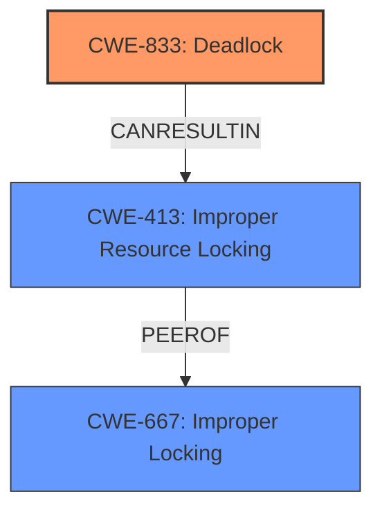

# Analysis Report for CVE-2025-21809

# Vulnerability Analysis Report: CVE-2025-21809

## Description

In the Linux kernel, the following vulnerability has been resolved rxrpc, afs Fix peer hash locking vs RCU callback In its address list, afs now retains pointers to and refs on one or more rxrpc_peer objects. The address list is freed under RCU and at this time, it puts the refs on those peers. Now, when an rxrpc_peer object runs out of refs, it gets removed from the peer hash table and, for that, rxrpc has to take a spinlock. However, it is now being called from afss RCU cleanup, which takes place in BH context - but it is just taking an ordinary spinlock. The put may also be called from non-BH context, and so there exists the possibility of deadlock if the BH-based RCU cleanup happens whilst the hash spinlock is held. This led to the attached lockdep complaint. Fix this by changing spinlocks of rxnet->peer_hash_lock back to BH-disabling locks. ================================ WARNING inconsistent lock state 6.13.0-rc5-build2+ #1223 Tainted G E -------------------------------- inconsistent {SOFTIRQ-ON-W} -> {IN-SOFTIRQ-W} usage. swapper/1/0 [HC0[0]SC1[1]HE1SE0] takes ffff88810babe228 (&rxnet->peer_hash_lock){+.?.}-{33}, at rxrpc_put_peer+0xcb/0x180 {SOFTIRQ-ON-W} state was registered at mark_usage+0x164/0x180 __lock_acquire+0x544/0x990 lock_acquire.part.0+0x103/0x280 _raw_spin_lock+0x2f/0x40 rxrpc_peer_keepalive_worker+0x144/0x440 process_one_work+0x486/0x7c0 process_scheduled_works+0x73/0x90 worker_thread+0x1c8/0x2a0 kthread+0x19b/0x1b0 ret_from_fork+0x24/0x40 ret_from_fork_asm+0x1a/0x30 irq event stamp 972402 hardirqs last enabled at (972402) [] _raw_spin_unlock_irqrestore+0x2e/0x50 hardirqs last disabled at (972401) [] _raw_spin_lock_irqsave+0x18/0x60 softirqs last enabled at (972300) [] handle_softirqs+0x3ee/0x430 softirqs last disabled at (972313) [] __irq_exit_rcu+0x44/0x110 other info that might help us debug this Possible **unsafe locking scenario** CPU0 ---- lock(&rxnet->peer_hash_lock) lock(&rxnet->peer_hash_lock) *** DEADLOCK *** 1 lock held by swapper/1/0 #0 ffffffff83576be0 (rcu_callback){....}-{00}, at rcu_lock_acquire+0x7/0x30 stack backtrace CPU 1 UID 0 PID 0 Comm swapper/1 Tainted G E 6.13.0-rc5-build2+ #1223 Tainted [E]=UNSIGNED_MODULE Hardware name ASUS All Series/H97-PLUS, BIOS 2306 10/09/2014 Call Trace dump_stack_lvl+0x57/0x80 print_usage_bug.part.0+0x227/0x240 valid_state+0x53/0x70 mark_lock_irq+0xa5/0x2f0 mark_lock+0xf7/0x170 mark_usage+0xe1/0x180 __lock_acquire+0x544/0x990 lock_acquire.part.0+0x103/0x280 _raw_spin_lock+0x2f/0x40 rxrpc_put_peer+0xcb/0x180 afs_free_addrlist+0x46/0x90 [kafs] rcu_do_batch+0x2d2/0x640 rcu_core+0x2f7/0x350 handle_softirqs+0x1ee/0x430 __irq_exit_rcu+0x44/0x110 irq_exit_rcu+0xa/0x30 sysvec_apic_timer_interrupt+0x7f/0xa0

## Vulnerability Description Key Phrases

- **Rootcause:** unsafe locking scenario
- **Impact:** deadlock
- **Vector:** RCU callback
- **Product:** Linux kernel
- **Version:** 6.13.0-rc5-build2
- **Component:** rxrpc

## Analysis (with Relationship Data)

# Summary
| CWE ID | CWE Name | Confidence | CWE Abstraction Level | CWE Vulnerability Mapping Label | CWE-Vulnerability Mapping Notes |
|---|---|---|---|---|---|
| CWE-833 | Deadlock | 0.9 | Base | Primary CWE | Allowed |
| CWE-413 | Improper Resource Locking | 0.7 | Base | Secondary Candidate | Allowed |
| CWE-667 | Improper Locking | 0.6 | Class | Secondary Candidate | Allowed-with-Review |

## Evidence and Confidence

*   **Confidence Score:** 0.8
*   **Evidence Strength:** MEDIUM

## Relationship Analysis
The primary identified weakness is CWE-833 Deadlock, which can arise from problems related to resource locking. CWE-413 Improper Resource Locking and CWE-667 Improper Locking are related because they describe conditions that can lead to deadlocks. CWE-413 is more specific about the locking issues, while CWE-667 is a more general category. The hierarchical relationships support the selection of CWE-833 as the primary issue and CWE-413 and CWE-667 as contributing factors.



## Vulnerability Chain
The vulnerability chain starts with an **unsafe locking scenario** in the rxrpc component of the Linux kernel. This leads to a condition where the system attempts to acquire the same lock recursively in different contexts (BH and non-BH), resulting in **CWE-833 Deadlock**. The root cause involves the interaction between RCU callbacks and spinlocks within the kernel's memory management.

## Summary of Analysis
The primary assessment is based on the provided vulnerability description, specifically the phrases "**unsafe locking scenario**" and "DEADLOCK". The vulnerability involves an interaction between different execution contexts (BH and non-BH) when acquiring a spinlock, leading to a deadlock.

The graph relationships helped to clarify the connections between the different locking-related CWEs. CWE-833 (Deadlock) is chosen as the primary CWE because it directly describes the observed failure. CWE-413 and CWE-667 are considered related issues as they are causes that contribute to deadlocks.

The selected CWEs are at an appropriate level of specificity, with CWE-833 being a Base-level CWE that directly represents the deadlock condition.

Relevant CWE Information:

# Enhanced Context (25 CWEs)
The following CWEs were identified as potentially relevant to this vulnerability:

## CWE-667: Improper Locking
**Abstraction Level**: Class
**Similarity Score**: 0.80
**Source**: dense

**Description**:
The product does not properly acquire or release a lock on a resource, leading to unexpected resource state changes and behaviors.

**Mapping Guidance**:
- Usage: Allowed-with-Review
- Rationale: This CWE entry is a Class and might have Base-level children that would be more appropriate


## CWE-833: Deadlock
**Abstraction Level**: Base
**Similarity Score**: 0.77
**Source**: dense

**Description**:
The product contains multiple threads or executable segments that are waiting for each other to release a necessary lock, resulting in deadlock.

**Mapping Guidance**:
- Usage: Allowed
- Rationale: This CWE entry is at the Base level of abstraction, which is a preferred level of abstraction for mapping to the root causes of vulnerabilities.


## CWE-413: Improper Resource Locking
**Abstraction Level**: Base
**Similarity Score**: 0.75
**Source**: dense

**Description**:
The product does not lock or does not correctly lock a resource when the product must have exclusive access to the resource.

**Mapping Guidance**:
- Usage: Allowed
- Rationale: This CWE entry is at the Base level of abstraction, which is a preferred level of abstraction for mapping to the root causes of vulnerabilities.


## CWE-362: Concurrent Execution using Shared Resource with Improper Synchronization ('Race Condition')
**Abstraction Level**: Class
**Similarity Score**: 0.74
**Source**: dense

**Description**:
The product contains a concurrent code sequence that requires temporary, exclusive access to a shared resource, but a timing window exists in which the shared resource can be modified by another code sequence operating concurrently.

**Mapping Guidance**:
- Usage: Allowed-with-Review
- Rationale: This CWE entry is a Class and might have Base-level children that would be more appropriate


## CWE-404: Improper Resource Shutdown or Release
**Abstraction Level**: Class
**Similarity Score**: 0.74
**Source**: dense

**Description**:
The product does not release or incorrectly releases a resource before it is made available for re-use.

**Mapping Guidance**:
- Usage: Allowed-with-Review
- Rationale: This CWE entry is a Class and might have Base-level children that would be more appropriate


## CWE-755: Improper Handling of Exceptional Conditions
**Abstraction Level**: Class
**Similarity Score**: 0.73
**Source**: dense

**Description**:
The product does not handle or incorrectly handles an exceptional condition.

**Mapping Guidance**:
- Usage: Discouraged
- Rationale: This CWE entry is a level-1 Class (i.e., a child of a Pillar). It might have lower-level children that would be more appropriate


## CWE-909: Missing Initialization of Resource
**Abstraction Level**: Class
**Similarity Score**: 0.73
**Source**: dense

**Description**:
The product does not initialize a critical resource.

**Mapping Guidance**:
- Usage: Allowed-with-Review
- Rationale: This CWE entry is a Class and might have Base-level children that would be more appropriate


## CWE-252: Unchecked Return Value
**Abstraction Level**: Base
**Similarity Score**: 0.73
**Source**: dense

**Description**:
The product does not check the return value from a method or function, which can prevent it from detecting unexpected states and conditions.

**Mapping Guidance**:
- Usage: Allowed
- Rationale: This CWE entry is at the Base level of abstraction, which is a preferred level of abstraction for mapping to the root causes of vulnerabilities.


## CWE-908: Use of Uninitialized Resource
**Abstraction Level**: Base
**Similarity Score**: 0.72
**Source**: dense

**Description**:
The product uses or accesses a resource that has not been initialized.

**Mapping Guidance**:
- Usage: Allowed
- Rationale: This CWE entry is at the Base level of abstraction, which is a preferred level of abstraction for mapping to the root causes of vulnerabilities.


## CWE-754: Improper Check for Unusual or Exceptional Conditions
**Abstraction Level**: Class
**Similarity Score**: 0.72
**Source**: dense

**Description**:
The product does not check or incorrectly checks for unusual or exceptional conditions that are not expected to occur frequently during day to day operation of the product.

**Mapping Guidance**:
- Usage: Allowed-with-Review
- Rationale: This CWE entry is a Class and might have Base-level children that would be more appropriate


## CWE-667: Improper Locking
**Abstraction Level**: Class
**Similarity Score**: 601.29
**Source**: sparse

**Description**:
The product does not properly acquire or release a lock on a resource, leading to unexpected resource state changes and behaviors.

**Mapping Guidance**:
- Usage: Allowed-with-Review
- Rationale: This CWE entry is a Class and might have Base-level children that would be more appropriate


## CWE-833: Deadlock
**Abstraction Level**: Base
**Similarity Score**: 551.46
**Source**: sparse

**Description**:
The product contains multiple threads or executable segments that are waiting for each other to release a necessary lock, resulting in deadlock.

**Mapping Guidance**:
- Usage: Allowed
- Rationale: This CWE entry is at the Base level of abstraction, which is a preferred level of abstraction for mapping to the root causes of vulnerabilities.


## CWE-79: Improper Neutralization of Input During Web Page Generation ('Cross-site Scripting')
**Abstraction Level**: Base
**Similarity Score**: 542.05
**Source**: sparse

**Description**:
The product does not neutralize or incorrectly neutralizes user-controllable input before it is placed in output that is used as a web page that is served to other users.

**Mapping Guidance**:
- Usage: Allowed
- Rationale: This CWE entry is at the Base level of abstraction, which is a preferred level of abstraction for mapping to the root causes of vulnerabilities.


## CWE-770: Allocation


## CWE Relationship Analysis

Current CWEs represent these abstraction levels: .


### Vulnerability Chain Analysis

**Chain starting from CWE-770:**
- 770 (Allocation of Resources Without Limits or Throttling) - ROOT


**Chain starting from CWE-404:**
- 404 (Improper Resource Shutdown or Release) - ROOT


### CWE Relationship Diagram

```mermaid
graph TD
    classDef primary fill:#f96,stroke:#333,stroke-width:2px
    classDef secondary fill:#69f,stroke:#333
    classDef tertiary fill:#9e9,stroke:#333
```


*Report generated on 2025-07-14 09:50:53*
