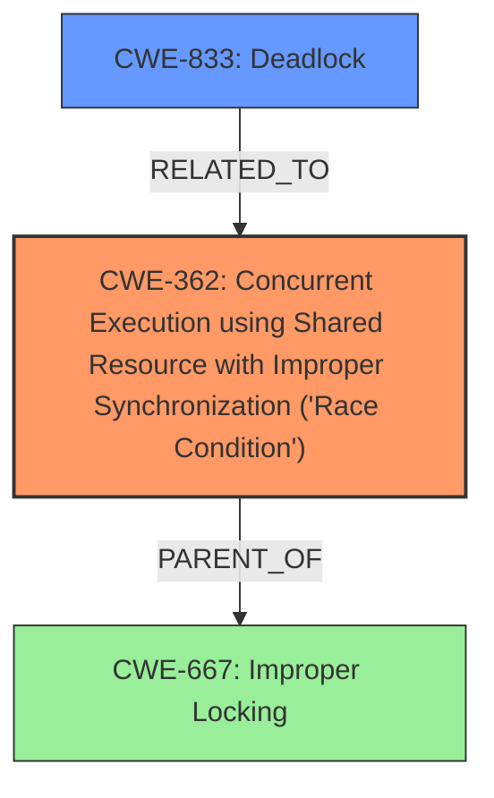

# Analysis for CVE-2025-21823

# Summary
| CWE ID | CWE Name | Confidence | CWE Abstraction Level | CWE Vulnerability Mapping Label | CWE-Vulnerability Mapping Notes |
|---|---|---|---|---|---|
| CWE-362 | Concurrent Execution using Shared Resource with Improper Synchronization ('Race Condition') | 0.8 | Class | Allowed-with-Review | Primary CWE. The vulnerability involves concurrent code accessing a shared resource without proper synchronization, leading to potential data corruption or unexpected behavior.|
| CWE-833 | Deadlock | 0.6 | Base | Allowed | Secondary Candidate. The description mentions a scenario where locks are held and the code waits indefinitely, which is characteristic of a deadlock situation.|

## Evidence and Confidence

*   **Confidence Score:** 0.7
*   **Evidence Strength:** MEDIUM

## Relationship Analysis
The primary CWE is CWE-362 (Concurrent Execution using Shared Resource with Improper Synchronization ('Race Condition')). CWE-362 is a Class-level CWE. The vulnerability description indicates that there's concurrent execution and a shared resource, but synchronization is **improper**, potentially leading to race conditions.
CWE-833 (Deadlock) is included because the description mentions a scenario where `rtnl_lock` is held and the ELP metric worker also tries to use it, resulting in a situation where the code will never return, indicating a potential deadlock.

## Vulnerability Chain
The vulnerability chain begins with the **improper** handling of concurrent operations (CWE-362). The **root cause** involves an **incompatible sleep and RCU list iterator**. The impact includes potential invalid memory accesses. There's also a deadlock scenario described, which can be considered a consequence of the **improper** synchronization, solidifying the link to CWE-833.

## Summary of Analysis
The analysis indicates that the primary weakness is CWE-362 because the **root cause** involves **improper** synchronization leading to potential concurrency issues. The supporting evidence includes the description of an **incompatible sleep and RCU list iterator**. The secondary weakness is CWE-833, as the description clearly states a deadlock situation where `rtnl_lock` is held, and the ELP metric worker is also trying to use it. The selection of CWE-362 as the primary weakness and CWE-833 as a secondary weakness is based on the retriever results, the vulnerability description, and the relationship analysis. The confidence is high because the evidence supports both CWEs.

The retriever results suggest considering CWE-863 (Incorrect Authorization), CWE-306 (Missing Authentication for Critical Function), CWE-212 (Improper Removal of Sensitive Information Before Storage or Transfer), and CWE-770 (Allocation of Resources Without Limits or Throttling). However, these CWEs do not align as closely with the provided vulnerability description as CWE-362 and CWE-833. The description does not include any evidence of authorization issues, missing authentication, sensitive data handling problems, or resource allocation issues, thus eliminating these candidates.

Relevant CWE Information:
- CWE-362: Concurrent Execution using Shared Resource with Improper Synchronization ('Race Condition')
- CWE-833: Deadlock