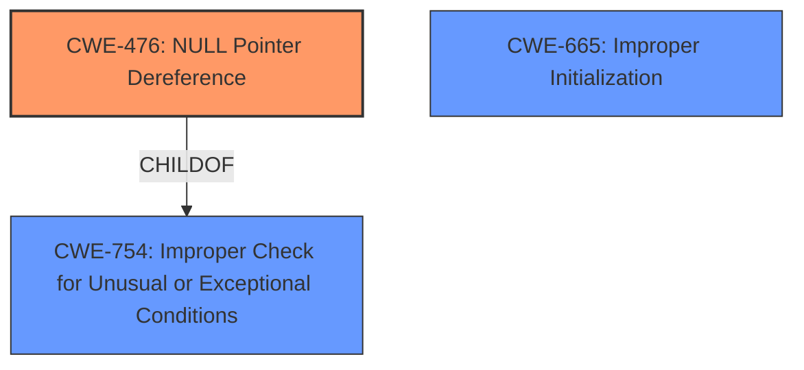

# Raw Analyzer Response for CVE-2025-21870

# Summary
| CWE ID | CWE Name | Confidence | CWE Abstraction Level | CWE Vulnerability Mapping Label | CWE-Vulnerability Mapping Notes |
|---|---|---|---|---|---|
| CWE-476 | NULL Pointer Dereference | 1.0 | Base | Primary | Allowed |
| CWE-665 | Improper Initialization | 0.4 | Class | Secondary | Discouraged |

## Evidence and Confidence

*   **Confidence Score:** 0.9
*   **Evidence Strength:** HIGH

## Relationship Analysis
The primary relationship influencing the decision is the ChildOf relationship between CWE-476 and CWE-754 (Improper Check for Unusual or Exceptional Conditions). While CWE-754 could be considered because the code doesn't properly check for the NULL condition, CWE-476 is a more specific and accurate description of the vulnerability.

## Vulnerability Chain
The vulnerability chain starts with potential **improper initialization** (CWE-665) leading to a **NULL pointer dereference** (CWE-476), which results in a crash.

## Summary of Analysis
The vulnerability description clearly states a **NULL pointer dereference** as the weakness. The analysis heavily relies on this explicit statement. The retriever results also strongly suggest CWE-476. While other CWEs like CWE-665 (Improper Initialization) are plausible as contributing factors, the direct evidence points to CWE-476 as the primary weakness.
The selection is based on the provided evidence: "which could lead to **NULL pointer dereference**".
CWE-476 is the optimal level of specificity as it directly describes the error condition.

Relevant CWE Information:

# Enhanced Context (25 CWEs)
The following CWEs were identified as potentially relevant to this vulnerability:

## CWE-476: NULL Pointer Dereference
**Abstraction Level**: Base
**Similarity Score**: 0.77
**Source**: dense

**Description**:
The product dereferences a pointer that it expects to be valid but is NULL.

**Mapping Guidance**:
- Usage: Allowed
- Rationale: This CWE entry is at the Base level of abstraction, which is a preferred level of abstraction for mapping to the root causes of vulnerabilities.

## CWE-665: Improper Initialization
**Abstraction Level**: Class
**Similarity Score**: 0.74
**Source**: dense

**Description**:
The product does not initialize or incorrectly initializes a resource, which might leave the resource in an unexpected state when it is accessed or used.

**Mapping Guidance**:
- Usage: Discouraged
- Rationale: This CWE entry is a level-1 Class (i.e., a child of a Pillar). It might have lower-level children that would be more appropriate

### Selected CWEs Justification:

*   **CWE-476: NULL Pointer Dereference**
    *   **Explanation:** The vulnerability description explicitly mentions "**NULL pointer dereference**" as the weakness. This aligns perfectly with the definition of CWE-476, where the product dereferences a pointer that is expected to be valid but is NULL.
    *   **Security Implications:** A NULL pointer dereference can lead to program crashes, denial of service, or potentially exploitable conditions.
    *   **Relationships:** CWE-476 is a child of CWE-754 (Improper Check for Unusual or Exceptional Conditions), indicating that the root cause might be the lack of proper checking for the NULL condition.
    *   **Mapping Guidance:** The MITRE mapping guidance allows for the usage of CWE-476.
    *   **Primary/Secondary:** Primary. This is the direct cause of the crash.
    *   **Confidence:** 1.0
*   **CWE-665: Improper Initialization**
    *   **Explanation:** It's plausible that the root cause is related to improper initialization, as the `copier->data` being NULL suggests it wasn't properly set up.
    *   **Security Implications:** Improper initialization can lead to unexpected states and behaviors.
    *   **Relationships:** This is a Class-level CWE, and more specific Base-level children might be more appropriate if there were more initialization details.
    *   **Mapping Guidance:** The MITRE mapping guidance discourages the use of Class-level CWEs when more specific options exist.
    *   **Primary/Secondary:** Secondary. It is a potential contributing factor, but not explicitly stated.
    *   **Confidence:** 0.4

### Rejected CWEs:

*   **CWE-824: Access of Uninitialized Pointer:** While related to pointer issues, the description specifically mentions a NULL pointer, not an uninitialized one.
*   **CWE-252: Unchecked Return Value:** There is no mention of an unchecked return value in the vulnerability description.
*   **CWE-787: Out-of-bounds Write:** There is no mention of memory corruption or out-of-bounds writes.
*   **CWE-1285: Improper Validation of Specified Index, Position, or Offset in Input:** This CWE is not relevant to the provided vulnerability description.
*   **CWE-703: Improper Check or Handling of Exceptional Conditions:** This CWE is too high-level (Pillar) and doesn't accurately reflect the specific weakness.
*   **CWE-822: Untrusted Pointer Dereference:** The pointer dereference is not explicitly stated as being sourced from untrusted data.
*   **CWE-362: Concurrent Execution using Shared Resource with Improper Synchronization ('Race Condition'):** There is no mention of concurrency or race conditions in the description.
*   **CWE-131: Incorrect Calculation of Buffer Size:** This CWE is not relevant to the provided vulnerability description.
*   **CWE-754: Improper Check for Unusual or Exceptional Conditions:** While related as a parent of CWE-476, CWE-476 is a more precise description of the vulnerability.
*   **CWE-781: Improper Address Validation in IOCTL with METHOD_NEITHER I/O Control Code:** There is no mention of IOCTLs.
*   **CWE-789: Memory Allocation with Excessive Size Value:** Not relevant.
*   **CWE-123: Write-what-where Condition:** Not relevant.
*   **CWE-1325: Improperly Controlled Sequential Memory Allocation:** Not relevant.
*   **CWE-835: Loop with Unreachable Exit Condition ('Infinite Loop'):** The vulnerability description mentions loops, but not infinite loops or unreachable exit conditions.