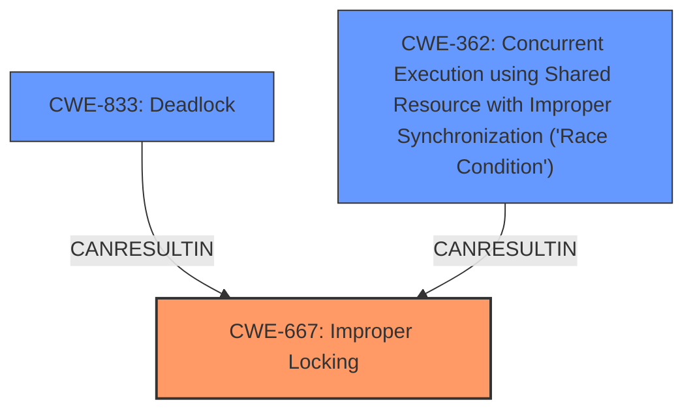

# Analysis Report for CVE-2025-21876

# Vulnerability Analysis Report: CVE-2025-21876

## Description

In the Linux kernel, the following vulnerability has been resolved iommu/vt-d Fix suspicious **RCU usage** Commit (iommu/vt-d Allocate DMAR fault interrupts locally) moved the call to enable_drhd_fault_handling() to a code path that does not hold any lock while traversing the drhd list. Fix it by ensuring the dmar_global_lock lock is held when traversing the drhd list. Without this fix, the following warning is triggered ============================= WARNING suspicious **RCU usage** 6.14.0-rc3 #55 Not tainted ----------------------------- drivers/iommu/intel/dmar.c2046 RCU-list traversed in non-reader section!! other info that might help us debug this rcu_scheduler_active = 1, debug_locks = 1 2 locks held by cpuhp/1/23 #0 ffffffff84a67c50 (cpu_hotplug_lock){++++}-{00}, at cpuhp_thread_fun+0x87/0x2c0 #1 ffffffff84a6a380 (cpuhp_state-up){+.+.}-{00}, at cpuhp_thread_fun+0x87/0x2c0 stack backtrace CPU 1 UID 0 PID 23 Comm cpuhp/1 Not tainted 6.14.0-rc3 #55 Call Trace dump_stack_lvl+0xb7/0xd0 lockdep_rcu_suspicious+0x159/0x1f0 ? __pfx_enable_drhd_fault_handling+0x10/0x10 enable_drhd_fault_handling+0x151/0x180 cpuhp_invoke_callback+0x1df/0x990 cpuhp_thread_fun+0x1ea/0x2c0 smpboot_thread_fn+0x1f5/0x2e0 ? __pfx_smpboot_thread_fn+0x10/0x10 kthread+0x12a/0x2d0 ? __pfx_kthread+0x10/0x10 ret_from_fork+0x4a/0x60 ? __pfx_kthread+0x10/0x10 ret_from_fork_asm+0x1a/0x30 Holding the lock in enable_drhd_fault_handling() triggers a lockdep splat about a possible deadlock between dmar_global_lock and cpu_hotplug_lock. This is avoided by not holding dmar_global_lock when calling iommu_device_register(), which initiates the device probe process.

## Vulnerability Description Key Phrases

- **Rootcause:** improper synchronization
- **Weakness:** RCU usage
- **Product:** Linux kernel
- **Component:** iommu/vt-d

## Analysis (with Relationship Data)

# Summary

| CWE ID | CWE Name | Confidence | CWE Abstraction Level | CWE Vulnerability Mapping Label | CWE-Vulnerability Mapping Notes |
|---|---|---|---|---|---|
| CWE-667 | Improper Locking | 0.9 | Class | Allowed-with-Review | Primary CWE. The vulnerability is caused by improper locking during RCU usage, leading to a potential deadlock. |
| CWE-833 | Deadlock | 0.7 | Base | Allowed | Secondary candidate. The **improper locking** can lead to a deadlock situation. |
| CWE-362 | Concurrent Execution using Shared Resource with Improper Synchronization ('Race Condition') | 0.6 | Class | Allowed-with-Review | Secondary candidate. The **improper locking** is a form of **improper synchronization** which causes a race condition. |

## Evidence and Confidence

*   **Confidence Score:** 0.8
*   **Evidence Strength:** MEDIUM

## Relationship Analysis
The primary weakness is **CWE-667 (Improper Locking)**, a Class-level CWE. **CWE-833 (Deadlock)** and **CWE-362 (Concurrent Execution using Shared Resource with Improper Synchronization ('Race Condition'))** are related to **CWE-667** as potential consequences of **improper locking**.


## Vulnerability Chain
The vulnerability chain starts with **improper locking (CWE-667)**, which leads to a potential **deadlock (CWE-833)** or a **race condition (CWE-362)** due to **improper synchronization**.

## Summary of Analysis
The vulnerability involves **improper locking** in the Linux kernel's iommu/vt-d component, leading to a potential deadlock. The analysis is based on the provided vulnerability description, which highlights the **suspicious RCU usage** and the need to hold the `dmar_global_lock` when traversing the `drhd` list. This confirms **improper synchronization**. The retriever results also point towards **CWE-667 (Improper Locking)** as the most relevant CWE. The confidence is high because the vulnerability description explicitly mentions the locking issue. The selection of **CWE-667** is appropriate because it directly addresses the root cause of the vulnerability. While **CWE-833 (Deadlock)** is a possible consequence, **CWE-667** represents the underlying weakness. The evidence is sufficient to identify **CWE-667** as the primary CWE.

Relevant CWE Information:

# Enhanced Context (25 CWEs)
The following CWEs were identified as potentially relevant to this vulnerability:

## CWE-667: Improper Locking
**Abstraction Level**: Class
**Similarity Score**: 0.80
**Source**: dense

**Description**:
The product does not properly acquire or release a lock on a resource, leading to unexpected resource state changes and behaviors.

**Mapping Guidance**:
- Usage: Allowed-with-Review
- Rationale: This CWE entry is a Class and might have Base-level children that would be more appropriate

## CWE-833: Deadlock
**Abstraction Level**: Base
**Similarity Score**: 0.75
**Source**: dense

**Description**:
The product contains multiple threads or executable segments that are waiting for each other to release a necessary lock, resulting in deadlock.

**Mapping Guidance**:
- Usage: Allowed
- Rationale: This CWE entry is at the Base level of abstraction, which is a preferred level of abstraction for mapping to the root causes of vulnerabilities.

## CWE-362: Concurrent Execution using Shared Resource with Improper Synchronization ('Race Condition')
**Abstraction Level**: Class
**Similarity Score**: 0.74
**Source**: dense

**Description**:
The product contains a concurrent code sequence that requires temporary, exclusive access to a shared resource, but a timing window exists in which the shared resource can be modified by another code sequence operating concurrently.

**Mapping Guidance**:
- Usage: Allowed-with-Review
- Rationale: This CWE entry is a Class and might have Base-level children that would be more appropriate

CWEs Considered but not Used:

*   CWE-770: Allocation of Resources Without Limits or Throttling - Not applicable as the vulnerability is related to locking issues and not resource allocation.
*   CWE-835: Loop with Unreachable Exit Condition ('Infinite Loop') - Not applicable as the vulnerability is related to locking issues and not infinite loops.
*   CWE-400: Uncontrolled Resource Consumption - Not applicable as the vulnerability is related to locking issues and not resource consumption.
*   CWE-863: Incorrect Authorization - Not applicable as the vulnerability is related to locking issues and not authorization.
*   CWE-401: Missing Release of Memory after Effective Lifetime - Not applicable as the vulnerability is related to locking issues and not memory management.
*   CWE-1284: Improper Validation of Specified Quantity in Input - Not applicable as the vulnerability is related to locking issues and not input validation.
*   CWE-909: Missing Initialization of Resource - Not applicable as the vulnerability is related to locking issues and not resource initialization.
*   CWE-1325: Improperly Controlled Sequential Memory Allocation - Not applicable as the vulnerability is related to locking issues and not memory allocation.


## CWE Relationship Analysis

Current CWEs represent these abstraction levels: .


### Vulnerability Chain Analysis

**Chain starting from CWE-863:**
- 863 (Incorrect Authorization) - ROOT


**Chain starting from CWE-1284:**
- 1284 (Improper Validation of Specified Quantity in Input) - ROOT


### CWE Relationship Diagram

```mermaid
graph TD
    classDef primary fill:#f96,stroke:#333,stroke-width:2px
    classDef secondary fill:#69f,stroke:#333
    classDef tertiary fill:#9e9,stroke:#333
```


*Report generated on 2025-07-14 09:56:46*
