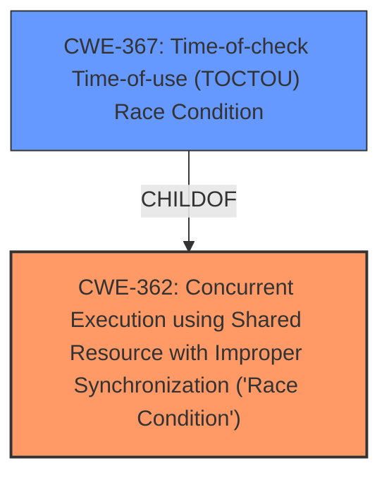

# Analysis Report for CVE-2025-21892

# Vulnerability Analysis Report: CVE-2025-21892

## Description

In the Linux kernel, the following vulnerability has been resolved RDMA/mlx5 Fix the recovery flow of the UMR QP This patch addresses an issue in the recovery flow of the UMR QP, ensuring tasks do not get stuck, as highlighted by the call trace [1]. During recovery, before transitioning the QP to the RESET state, the software must wait for all outstanding WRs to complete. Failing to do so can cause the firmware to skip sending some flushed CQEs with errors and simply discard them upon the RESET, as per the IB specification. This **race condition** can result in lost CQEs and tasks becoming stuck. To resolve this, the patch sends a final WR which serves only as a barrier before moving the QP state to RESET. Once a CQE is received for that final WR, it guarantees that no outstanding WRs remain, making it safe to transition the QP to RESET and subsequently back to RTS, restoring proper functionality. Note For the barrier WR, we simply reuse the failed and ready WR. Since the QP is in an error state, it will only receive IB_WC_WR_FLUSH_ERR. However, as it serves only as a barrier we dont care about its status. [1] INFO task rdma_resource_l1922 blocked for more than 120 seconds. Tainted G W 6.12.0-rc7+ #1626 echo 0 > /proc/sys/kernel/hung_task_timeout_secs disables this message. taskrdma_resource_l stateD stack0 pid1922 tgid1922 ppid1369 flags0x00004004 Call Trace __schedule+0x420/0xd30 schedule+0x47/0x130 schedule_timeout+0x280/0x300 ? mark_held_locks+0x48/0x80 ? lockdep_hardirqs_on_prepare+0xe5/0x1a0 wait_for_completion+0x75/0x130 mlx5r_umr_post_send_wait+0x3c2/0x5b0 [mlx5_ib] ? __pfx_mlx5r_umr_done+0x10/0x10 [mlx5_ib] mlx5r_umr_revoke_mr+0x93/0xc0 [mlx5_ib] __mlx5_ib_dereg_mr+0x299/0x520 [mlx5_ib] ? _raw_spin_unlock_irq+0x24/0x40 ? wait_for_completion+0xfe/0x130 ? rdma_restrack_put+0x63/0xe0 [ib_core] ib_dereg_mr_user+0x5f/0x120 [ib_core] ? lock_release+0xc6/0x280 destroy_hw_idr_uobject+0x1d/0x60 [ib_uverbs] uverbs_destroy_uobject+0x58/0x1d0 [ib_uverbs] uobj_destroy+0x3f/0x70 [ib_uverbs] ib_uverbs_cmd_verbs+0x3e4/0xbb0 [ib_uverbs] ? __pfx_uverbs_destroy_def_handler+0x10/0x10 [ib_uverbs] ? __lock_acquire+0x64e/0x2080 ? mark_held_locks+0x48/0x80 ? find_held_lock+0x2d/0xa0 ? lock_acquire+0xc1/0x2f0 ? ib_uverbs_ioctl+0xcb/0x170 [ib_uverbs] ? __fget_files+0xc3/0x1b0 ib_uverbs_ioctl+0xe7/0x170 [ib_uverbs] ? ib_uverbs_ioctl+0xcb/0x170 [ib_uverbs] __x64_sys_ioctl+0x1b0/0xa70 do_syscall_64+0x6b/0x140 entry_SYSCALL_64_after_hwframe+0x76/0x7e RIP 00330x7f99c918b17b RSP 002b00007ffc766d0468 EFLAGS 00000246 ORIG_RAX 0000000000000010 RAX ffffffffffffffda RBX 00007ffc766d0578 RCX 00007f99c918b17b RDX 00007ffc766d0560 RSI 00000000c0181b01 RDI 0000000000000003 RBP 00007ffc766d0540 R08 00007f99c8f99010 R09 000000000000bd7e R10 00007f99c94c1c70 R11 0000000000000246 R12 00007ffc766d0530 R13 000000000000001c R14 0000000040246a80 R15 0000000000000000

## Vulnerability Description Key Phrases

- **Component:** RDMA/mlx5
- **Weakness:** race condition
- **Product:** Linux kernel
- **Impact:** lost CQEs, tasks becoming stuck

## Analysis (with Relationship Data)

# Summary
| CWE ID | CWE Name | Confidence | CWE Abstraction Level | CWE Vulnerability Mapping Label | CWE-Vulnerability Mapping Notes |
|---|---|---|---|---|---|
| CWE-362 | Concurrent Execution using Shared Resource with Improper Synchronization ('Race Condition') | 0.9 | Class | Allowed-with-Review | Primary CWE |
| CWE-367 | Time-of-check Time-of-use (TOCTOU) Race Condition | 0.7 | Base | Allowed | Secondary Candidate |

## Evidence and Confidence

*   **Confidence Score:** 0.8
*   **Evidence Strength:** HIGH

## Relationship Analysis
The primary CWE identified is CWE-362, a Class-level CWE representing a general **race condition**. CWE-367 is a Base-level CWE that describes a specific type of **race condition** (TOCTOU). CWE-367 is a child of CWE-362, making it a more specific candidate. However, the description indicates a general concurrency issue rather than a specific time-of-check time-of-use scenario. The relationship influenced the decision to prioritize CWE-362 as the primary mapping due to its broader applicability to the described vulnerability.



## Vulnerability Chain
The vulnerability chain involves a **race condition** during the recovery flow of the UMR QP in the Linux kernel's RDMA/mlx5 component. This **race condition** leads to lost CQEs, causing tasks to become stuck.

1.  **Root Cause:** CWE-362 Concurrent Execution using Shared Resource with Improper Synchronization ('Race Condition') - The core issue is the unsynchronized access to shared resources during the QP recovery process.
2.  **Impact:** Lost CQEs due to firmware discarding them upon RESET.
3.  **Resulting Symptom:** Tasks becoming stuck due to missing completion events.

## Summary of Analysis
The initial analysis focused on identifying the core weakness described in the vulnerability report. The report explicitly mentions a **race condition** in the RDMA/mlx5 component of the Linux kernel. The evidence supports this, as quoted: "This **race condition** can result in lost CQEs and tasks becoming stuck." Based on the retriever results, CWE-362 was identified as the most relevant CWE, with a high score. While CWE-367 is a more specific type of **race condition**, the vulnerability description doesn't specifically point to a time-of-check time-of-use issue. Therefore, CWE-362 is chosen as the primary CWE.

Relevant CWE Information:

# Enhanced Context (25 CWEs)
The following CWEs were identified as potentially relevant to this vulnerability:

## CWE-362: Concurrent Execution using Shared Resource with Improper Synchronization ('Race Condition')
**Abstraction Level**: Class
**Similarity Score**: 0.77
**Source**: dense

**Description**:
The product contains a concurrent code sequence that requires temporary, exclusive access to a shared resource, but a timing window exists in which the shared resource can be modified by another code sequence operating concurrently.

**Mapping Guidance**:
- Usage: Allowed-with-Review
- Rationale: This CWE entry is a Class and might have Base-level children that would be more appropriate

## CWE-367: Time-of-check Time-of-use (TOCTOU) Race Condition
**Abstraction Level**: Base
**Similarity Score**: 0.77
**Source**: dense

**Description**:
The product checks the state of a resource before using that resource, but the resource's state can change between the check and the use in a way that invalidates the results of the check. This can cause the product to perform invalid actions when the resource is in an unexpected state.

**Mapping Guidance**:
- Usage: Allowed
- Rationale: This CWE entry is at the Base level of abstraction, which is a preferred level of abstraction for mapping to the root causes of vulnerabilities.

## CWE-667: Improper Locking
**Abstraction Level**: Class
**Similarity Score**: 0.76
**Source**: dense

**Description**:
The product does not properly acquire or release a lock on a resource, leading to unexpected resource state changes and behaviors.

**Mapping Guidance**:
- Usage: Allowed-with-Review
- Rationale: This CWE entry is a Class and might have Base-level children that would be more appropriate

## CWE-696: Incorrect Behavior Order
**Abstraction Level**: Class
**Similarity Score**: 0.75
**Source**: dense

**Description**:
The product performs multiple related behaviors, but the behaviors are performed in the wrong order in ways which may produce resultant weaknesses.

**Mapping Guidance**:
- Usage: Allowed-with-Review
- Rationale: This CWE entry is a Class and might have Base-level children that would be more appropriate

## CWE-703: Improper Check or Handling of Exceptional Conditions
**Abstraction Level**: Pillar
**Similarity Score**: 0.75
**Source**: dense

**Description**:
The product does not properly anticipate or handle exceptional conditions that rarely occur during normal operation of the product.

**Mapping Guidance**:
- Usage: Discouraged
- Rationale: This CWE entry is extremely high-level, a Pillar.

## CWE-366: Race Condition within a Thread
**Abstraction Level**: Base
**Similarity Score**: 0.74
**Source**: dense

**Description**:
If two threads of execution use a resource simultaneously, there exists the possibility that resources may be used while invalid, in turn making the state of execution undefined.

**Mapping Guidance**:
- Usage: Allowed
- Rationale: This CWE entry is at the Base level of abstraction, which is a preferred level of abstraction for mapping to the root causes of vulnerabilities.

## CWE-755: Improper Handling of Exceptional Conditions
**Abstraction Level**: Class
**Similarity Score**: 0.74
**Source**: dense

**Description**:
The product does not handle or incorrectly handles an exceptional condition.

**Mapping Guidance**:
- Usage: Discouraged
- Rationale: This CWE entry is a level-1 Class (i.e., a child of a Pillar). It might have lower-level children that would be more appropriate

## CWE-754: Improper Check for Unusual or Exceptional Conditions
**Abstraction Level**: Class
**Similarity Score**: 0.74
**Source**: dense

**Description**:
The product does not check or incorrectly checks for unusual or exceptional conditions that are not expected to occur frequently during day to day operation of the product.

**Mapping Guidance**:
- Usage: Allowed-with-Review
- Rationale: This CWE entry is a Class and might have Base-level children that would be more appropriate

## CWE-1285: Improper Validation of Specified Index, Position, or Offset in Input
**Abstraction Level**: Base
**Similarity Score**: 0.74
**Source**: dense

**Description**:
The product receives input that is expected to specify an index, position, or offset into an indexable resource such as a buffer or file, but it does not validate or incorrectly validates that the specified index/position/offset has the required properties.

**Mapping Guidance**:
- Usage: Allowed
- Rationale: This CWE entry is at the Base level of abstraction, which is a preferred level of abstraction for mapping to the root causes of vulnerabilities.

## CWE-824: Access of Uninitialized Pointer
**Abstraction Level**: Base
**Similarity Score**: 0.73
**Source**: dense

**Description**:
The product accesses or uses a pointer that has not been initialized.

**Mapping Guidance**:
- Usage: Allowed
- Rationale: This CWE entry is at the Base level of abstraction, which is a preferred level of abstraction for mapping to the root causes of vulnerabilities.

## CWE-367: Time-of-check Time-of-use (TOCTOU) Race Condition
**Abstraction Level**: Base
**Similarity Score**: 671.88
**Source**: sparse

**Description**:
The product checks the state of a resource before using that resource, but the resource's state can change between the check and the use in a way that invalidates the results of the check. This can cause the product to perform invalid actions when the resource is in an unexpected state.

**Mapping Guidance**:
- Usage: Allowed
- Rationale: This CWE entry is at the Base level of abstraction, which is a preferred level of abstraction for mapping to the root causes of vulnerabilities.

## CWE-362: Concurrent Execution using Shared Resource with Improper Synchronization ('Race Condition')
**Abstraction Level**: Class
**Similarity Score**: 649.12
**Source**: sparse

**Description**:
The product contains a concurrent code sequence that requires temporary, exclusive access to a shared resource, but a


## CWE Relationship Analysis

Current CWEs represent these abstraction levels: .


### Vulnerability Chain Analysis

**Chain starting from CWE-667:**
- 667 (Improper Locking) - ROOT


**Chain starting from CWE-1285:**
- 1285 (Improper Validation of Specified Index, Position, or Offset in Input) - ROOT


### CWE Relationship Diagram

```mermaid
graph TD
    classDef primary fill:#f96,stroke:#333,stroke-width:2px
    classDef secondary fill:#69f,stroke:#333
    classDef tertiary fill:#9e9,stroke:#333
```


*Report generated on 2025-07-14 09:57:50*
