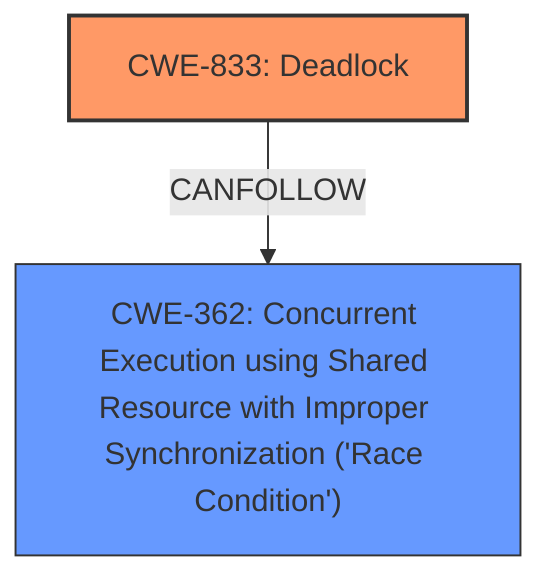

# Analysis Report for CVE-2025-21897

# Vulnerability Analysis Report: CVE-2025-21897

## Description

In the Linux kernel, the following vulnerability has been resolved sched_ext Fix pick_task_scx() picking non-queued tasks when its called without balance() a6250aa251ea (sched_ext Handle cases where pick_task_scx() is called without preceding balance_scx()) added a workaround to handle the cases where pick_task_scx() is called without prececing balance_scx() which is due to a fair class bug where pick_taks_fair() may return NULL after a true return from balance_fair(). The workaround detects when pick_task_scx() is called without preceding balance_scx() and emulates SCX_RQ_BAL_KEEP and triggers kicking to avoid stalling. Unfortunately, the workaround code was testing whether @prev was on SCX to decide whether to keep the task running. This is incorrect as the task may be on SCX but no longer runnable. This could lead to a **non-runnable task to be returned from pick_task_scx()** which cause interesting confusions and failures. e.g. A common failure mode is the task ending up with (!on_rq && on_cpu) state which can cause potential wakers to busy loop, which can easily lead to deadlocks. Fix it by testing whether @prev has SCX_TASK_QUEUED set. This makes @prev_on_scx only used in one place. Open code the usage and improve the comment while at it.

## Vulnerability Description Key Phrases

- **Weakness:** non-runnable task to be returned from pick_task_scx()
- **Impact:** busy loop
- **Product:** Linux kernel

## Analysis (with Relationship Data)

# Summary

| CWE ID  | CWE Name                                                                                                 | Confidence | CWE Abstraction Level | CWE Vulnerability Mapping Label | CWE-Vulnerability Mapping Notes |
| :------- | :-------------------------------------------------------------------------------------------------------- | :--------- | :---------------------- | :------------------------------ | :------------------------------ |
| CWE-833 | Deadlock                                                                                                   | 0.9        | Base                    | Primary                         | Allowed                         |
| CWE-362 | Concurrent Execution using Shared Resource with Improper Synchronization ('Race Condition')                 | 0.7        | Class                   | Secondary                       | Allowed-with-Review           |

## Evidence and Confidence

*   **Confidence Score:** 0.8
*   **Evidence Strength:** MEDIUM

## Relationship Analysis

The primary relationship influencing the CWE selection is that the vulnerability ultimately leads to a deadlock. The analysis also considered that the vulnerability involves concurrent execution and shared resources, which is a race condition.



## Vulnerability Chain

The vulnerability chain starts with a fair class bug that can cause `pick_taks_fair()` to return NULL. This leads to `pick_task_scx()` being called without `balance_scx()`, which is handled by a workaround. However, the workaround **incorrectly tests** whether `@prev` was on SCX, leading to a **non-runnable task** being returned. This state (`!on_rq && on_cpu`) can cause potential wakers to busy loop, eventually resulting in a **deadlock**.

The primary root cause is the incorrect test condition in the workaround. The impact is a deadlock.

## Summary of Analysis

The initial assessment considered several CWEs, particularly those related to race conditions and resource management. However, the key aspect of the vulnerability is that it can easily lead to **deadlocks**. The vulnerability description explicitly mentions this outcome: "A common failure mode is the task ending up with (!on_rq && on_cpu) state which can cause potential wakers to busy loop, which can easily lead to deadlocks."

The **weakness**, a **non-runnable task to be returned from pick_task_scx()**, leads to a deadlock. While a race condition (CWE-362) is present, the ultimate and most severe outcome is a deadlock (CWE-833). Therefore, CWE-833 is selected as the primary CWE. The concurrency aspects are represented by CWE-362 as a secondary factor.

The selected CWEs are at the optimal level of specificity because they directly reflect the **root cause** (incorrect test leading to non-runnable task) and the final impact (deadlock).

Relevant CWE Information:

# Enhanced Context (25 CWEs)

## CWE-667: Improper Locking
**Abstraction Level**: Class
**Similarity Score**: 0.77
**Source**: dense

**Description**:
The product does not properly acquire or release a lock on a resource, leading to unexpected resource state changes and behaviors.

**Mapping Guidance**:
- Usage: Allowed-with-Review
- Rationale: This CWE entry is a Class and might have Base-level children that would be more appropriate

*Not Selected:* Improper Locking (CWE-667) isn't the direct issue, although locking could be involved in preventing the race condition and deadlock.

## CWE-362: Concurrent Execution using Shared Resource with Improper Synchronization ('Race Condition')
**Abstraction Level**: Class
**Similarity Score**: 0.76
**Source**: dense

**Description**:
The product contains a concurrent code sequence that requires temporary, exclusive access to a shared resource, but a timing window exists in which the shared resource can be modified by another code sequence operating concurrently.

**Mapping Guidance**:
- Usage: Allowed-with-Review
- Rationale: This CWE entry is a Class and might have Base-level children that would be more appropriate

*Selected as Secondary:* Although deadlock is the ultimate issue, the race condition is a contributing factor.

## CWE-367: Time-of-check Time-of-use (TOCTOU) Race Condition
**Abstraction Level**: Base
**Similarity Score**: 0.76
**Source**: dense

**Description**:
The product checks the state of a resource before using that resource, but the resource's state can change between the check and the use in a way that invalidates the results of the check. This can cause the product to perform invalid actions when the resource is in an unexpected state.

**Mapping Guidance**:
- Usage: Allowed
- Rationale: This CWE entry is at the Base level of abstraction, which is a preferred level of abstraction for mapping to the root causes of vulnerabilities.

*Not Selected:* While TOCTOU could conceptually apply, there isn't a clear check-then-use scenario described.

## CWE-366: Race Condition within a Thread
**Abstraction Level**: Base
**Similarity Score**: 0.76
**Source**: dense

**Description**:
If two threads of execution use a resource simultaneously, there exists the possibility that resources may be used while invalid, in turn making the state of execution undefined.

**Mapping Guidance**:
- Usage: Allowed
- Rationale: This CWE entry is at the Base level of abstraction, which is a preferred level of abstraction for mapping to the root causes of vulnerabilities.

*Not Selected:* There isn't enough information to say for sure that threads are involved.

## CWE-703: Improper Check or Handling of Exceptional Conditions
**Abstraction Level**: Pillar
**Similarity Score**: 0.75
**Source**: dense

**Description**:
The product does not properly anticipate or handle exceptional conditions that rarely occur during normal operation of the product.

**Mapping Guidance**:
- Usage: Discouraged
- Rationale: This CWE entry is extremely high-level, a Pillar.

*Not Selected:* Too general. The issue is more specific than just a generic exceptional condition.

## CWE-754: Improper Check for Unusual or Exceptional Conditions
**Abstraction Level**: Class
**Similarity Score**: 0.75
**Source**: dense

**Description**:
The product does not check or incorrectly checks for unusual or exceptional conditions that are not expected to occur frequently during day to day operation of the product.

**Mapping Guidance**:
- Usage: Allowed-with-Review
- Rationale: This CWE entry is a Class and might have Base-level children that would be more appropriate

*Not Selected:* There is an incorrect check, but the more specific problem is a deadlock.

## CWE-833: Deadlock
**Abstraction Level**: Base
**Similarity Score**: 0.75
**Source**: dense

**Description**:
The product contains multiple threads or executable segments that are waiting for each other to release a necessary lock, resulting in deadlock.

**Mapping Guidance**:
- Usage: Allowed
- Rationale: This CWE entry is at the Base level of abstraction, which is a preferred level of abstraction for mapping to the root causes of vulnerabilities.

*Selected as Primary:* This is the direct result of the vulnerability.

## CWE-755: Improper Handling of Exceptional Conditions
**Abstraction Level**: Class
**Similarity Score**: 0.75
**Source**: dense

**Description**:
The product does not handle or incorrectly handles an exceptional condition.

**Mapping Guidance**:
- Usage: Discouraged
- Rationale: This CWE entry is a level-1 Class (i.e., a child of a Pillar). It might have lower-level children that would be more appropriate

*Not Selected:* Too general.

## CWE-252: Unchecked Return Value
**Abstraction Level**: Base
**Similarity Score**: 0.75
**Source**: dense

**Description**:
The product does not check the return value from a method or function, which can prevent it from detecting unexpected states and conditions.

**Mapping Guidance**:
- Usage: Allowed
- Rationale: This CWE entry is at the Base level of abstraction, which is a preferred level of abstraction for mapping to the root causes of vulnerabilities.

*Not Selected:* The description doesn't suggest a missing check on a return value.

## CWE-404: Improper Resource Shutdown or Release
**Abstraction Level**: Class
**Similarity Score**: 0.74
**Source**: dense

**Description**:
The product does not release or incorrectly releases a resource before it is made available for re-use.

**Mapping Guidance**:
- Usage: Allowed-with-Review
- Rationale: This CWE entry is a Class and might have Base-level children that would be more appropriate

*Not Selected:* Not directly related to resource shutdown or release.

## CWE-362: Concurrent Execution using Shared Resource with Improper Synchronization ('Race Condition')
**Abstraction Level**: Class
**Similarity Score**: 585.68
**Source**: sparse

**Description**:
The product contains a concurrent code sequence that requires temporary, exclusive access to


## CWE Relationship Analysis

Current CWEs represent these abstraction levels: .


### Vulnerability Chain Analysis

**Chain starting from CWE-404:**
- 404 (Improper Resource Shutdown or Release) - ROOT


**Chain starting from CWE-667:**
- 667 (Improper Locking) - ROOT


### CWE Relationship Diagram

```mermaid
graph TD
    classDef primary fill:#f96,stroke:#333,stroke-width:2px
    classDef secondary fill:#69f,stroke:#333
    classDef tertiary fill:#9e9,stroke:#333
```


*Report generated on 2025-07-14 09:58:37*
