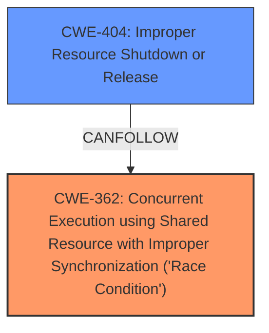

# Analysis Report for CVE-2025-21938

# Vulnerability Analysis Report: CVE-2025-21938

## Description

In the Linux kernel, the following vulnerability has been resolved mptcp fix scheduling while atomic in mptcp_pm_nl_append_new_local_addr If multiple connection requests attempt to create an implicit mptcp endpoint in parallel, more than one caller may end up in mptcp_pm_nl_append_new_local_addr because none found the address in local_addr_list during their call to mptcp_pm_nl_get_local_id. In this case, the concurrent new_local_addr calls may delete the address entry created by the previous caller. These deletes use synchronize_rcu, but this is not permitted in some of the contexts where this function may be called. During packet recv, the caller may be in a rcu read critical section and have preemption disabled. An example stack BUG scheduling while atomic swapper/2/0/0x00000302 Call Trace dump_stack_lvl (lib/dump_stack.c117 (discriminator 1)) dump_stack (lib/dump_stack.c124) __schedule_bug (kernel/sched/core.c5943) schedule_debug.constprop.0 (arch/x86/include/asm/preempt.h33 kernel/sched/core.c5970) __schedule (arch/x86/include/asm/jump_label.h27 include/linux/jump_label.h207 kernel/sched/features.h29 kernel/sched/core.c6621) schedule (arch/x86/include/asm/preempt.h84 kernel/sched/core.c6804 kernel/sched/core.c6818) schedule_timeout (kernel/time/timer.c2160) wait_for_completion (kernel/sched/completion.c96 kernel/sched/completion.c116 kernel/sched/completion.c127 kernel/sched/completion.c148) __wait_rcu_gp (include/linux/rcupdate.h311 kernel/rcu/update.c444) synchronize_rcu (kernel/rcu/tree.c3609) mptcp_pm_nl_append_new_local_addr (net/mptcp/pm_netlink.c966 net/mptcp/pm_netlink.c1061) mptcp_pm_nl_get_local_id (net/mptcp/pm_netlink.c1164) mptcp_pm_get_local_id (net/mptcp/pm.c420) subflow_check_req (net/mptcp/subflow.c98 net/mptcp/subflow.c213) subflow_v4_route_req (net/mptcp/subflow.c305) tcp_conn_request (net/ipv4/tcp_input.c7216) subflow_v4_conn_request (net/mptcp/subflow.c651) tcp_rcv_state_process (net/ipv4/tcp_input.c6709) tcp_v4_do_rcv (net/ipv4/tcp_ipv4.c1934) tcp_v4_rcv (net/ipv4/tcp_ipv4.c2334) ip_protocol_deliver_rcu (net/ipv4/ip_input.c205 (discriminator 1)) ip_local_deliver_finish (include/linux/rcupdate.h813 net/ipv4/ip_input.c234) ip_local_deliver (include/linux/netfilter.h314 include/linux/netfilter.h308 net/ipv4/ip_input.c254) ip_sublist_rcv_finish (include/net/dst.h461 net/ipv4/ip_input.c580) ip_sublist_rcv (net/ipv4/ip_input.c640) ip_list_rcv (net/ipv4/ip_input.c675) __netif_receive_skb_list_core (net/core/dev.c5583 net/core/dev.c5631) netif_receive_skb_list_internal (net/core/dev.c5685 net/core/dev.c5774) napi_complete_done (include/linux/list.h37 include/net/gro.h449 include/net/gro.h444 net/core/dev.c6114) igb_poll (drivers/net/ethernet/intel/igb/igb_main.c8244) igb __napi_poll (net/core/dev.c6582) net_rx_action (net/core/dev.c6653 net/core/dev.c6787) handle_softirqs (kernel/softirq.c553) __irq_exit_rcu (kernel/softirq.c588 kernel/softirq.c427 kernel/softirq.c636) irq_exit_rcu (kernel/softirq.c651) common_interrupt (arch/x86/kernel/irq.c247 (discriminator 14)) This problem seems particularly prevalent if the user advertises an endpoint that has a different external vs internal address. In the case where the external address is advertised and multiple connections already exist, multiple subflow SYNs arrive in parallel which tends to trigger the race during creation of the first local_addr_list entries which have the internal address instead. Fix by skipping the replacement of an existing implicit local address if called via mptcp_pm_nl_get_local_id.

## Vulnerability Description Key Phrases

- **Rootcause:** race condition in mptcp_pm_nl_append_new_local_addr function
- **Weakness:** synchronize_rcu in a non-permissible context
- **Product:** Linux kernel
- **Component:** mptcp_pm_nl_append_new_local_addr function

## Analysis (with Relationship Data)

# Summary
| CWE ID | CWE Name | Confidence | CWE Abstraction Level | CWE Vulnerability Mapping Label | CWE-Vulnerability Mapping Notes |
|---|---|---|---|---|---|
| CWE-362 | Concurrent Execution using Shared Resource with Improper Synchronization ('Race Condition') | 0.9 | Class | Allowed-with-Review | Primary CWE. The vulnerability occurs due to multiple connection requests attempting to create an implicit mptcp endpoint in parallel leading to a race condition.|
| CWE-404 | Improper Resource Shutdown or Release | 0.7 | Class | Allowed-with-Review | Secondary CWE. The concurrent new_local_addr calls may delete the address entry created by the previous caller.|

## Evidence and Confidence

*   **Confidence Score:** 0.8
*   **Evidence Strength:** HIGH

## Relationship Analysis
The primary CWE is CWE-362, a class-level weakness describing a race condition. CWE-404 is a Class-level weakness, which is a potential consequence of the race condition where resources are improperly released.



## Vulnerability Chain
The vulnerability chain starts with a **race condition** (CWE-362) due to concurrent connection requests. This leads to the potential improper release of resources (CWE-404).

## Summary of Analysis
The primary weakness is a **race condition** (CWE-362) in the `mptcp_pm_nl_append_new_local_addr` function. Multiple connection requests, processed concurrently, can lead to one caller deleting an address entry created by another, resulting in an improper resource shutdown or release (CWE-404).

The evidence from the vulnerability description includes: "If multiple connection requests attempt to create an implicit mptcp endpoint in parallel, more than one caller may end up in mptcp_pm_nl_append_new_local_addr because none found the address in local_addr_list during their call to mptcp_pm_nl_get_local_id. In this case, the concurrent new_local_addr calls may delete the address entry created by the previous caller."

The graph relationship shows that CWE-404 can follow CWE-362.

CWE-362 is chosen as the primary CWE because the **race condition** is the root cause of the issue. The deletion of the address entry (CWE-404) is a consequence of the **race condition**.

I considered other CWEs from the Retriever Results, but they were not as relevant.
- CWE-911: Improper Update of Reference Count - While reference counting might be involved, the core issue is the **race condition** itself.
- CWE-909: Missing Initialization of Resource - This doesn't fit the scenario described.
- CWE-667: Improper Locking - While locking might help prevent the **race condition**, the description doesn't explicitly mention improper locking.
- CWE-415: Double Free - This is a specific type of memory error, and the description doesn't explicitly state that memory is being freed twice.

Relevant CWE Information:
*   CWE-362: Concurrent Execution using Shared Resource with Improper Synchronization ('Race Condition')
*   CWE-404: Improper Resource Shutdown or Release


## CWE Relationship Analysis

Current CWEs represent these abstraction levels: .


### Vulnerability Chain Analysis

**Chain starting from CWE-911:**
- 911 (Improper Update of Reference Count) - ROOT


**Chain starting from CWE-404:**
- 404 (Improper Resource Shutdown or Release) - ROOT


### CWE Relationship Diagram

```mermaid
graph TD
    classDef primary fill:#f96,stroke:#333,stroke-width:2px
    classDef secondary fill:#69f,stroke:#333
    classDef tertiary fill:#9e9,stroke:#333
```


*Report generated on 2025-07-14 10:01:42*
