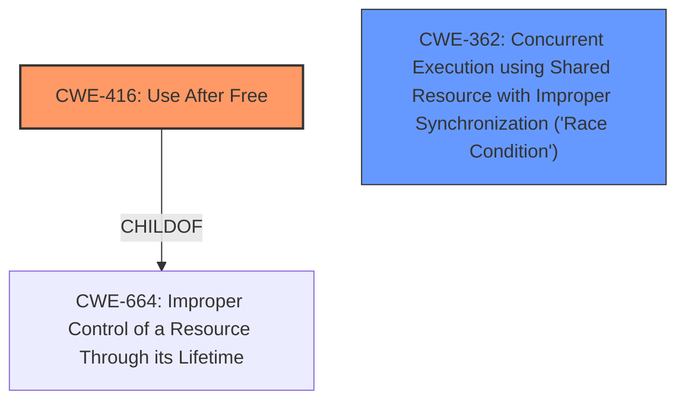

# Analysis Report for CVE-2025-21969

# Vulnerability Analysis Report: CVE-2025-21969

## Description

In the Linux kernel, the following vulnerability has been resolved Bluetooth L2CAP Fix **slab-use-after-free** Read in l2cap_send_cmd After the hci sync command releases l2cap_conn, the hci receive data work queue references the released l2cap_conn when sending to the upper layer. Add hci dev lock to the hci receive data work queue to synchronize the two. [1] BUG KASAN **slab-use-after-free** in l2cap_send_cmd+0x187/0x8d0 net/bluetooth/l2cap_core.c954 Read of size 8 at addr ffff8880271a4000 by task kworker/u92/5837 CPU 0 UID 0 PID 5837 Comm kworker/u92 Not tainted 6.13.0-rc5-syzkaller-00163-gab75170520d4 #0 Hardware name Google Google Compute Engine/Google Compute Engine, BIOS Google 09/13/2024 Workqueue hci1 hci_rx_work Call Trace __dump_stack lib/dump_stack.c94 [inline] dump_stack_lvl+0x241/0x360 lib/dump_stack.c120 print_address_description mm/kasan/report.c378 [inline] print_report+0x169/0x550 mm/kasan/report.c489 kasan_report+0x143/0x180 mm/kasan/report.c602 l2cap_build_cmd net/bluetooth/l2cap_core.c2964 [inline] l2cap_send_cmd+0x187/0x8d0 net/bluetooth/l2cap_core.c954 l2cap_sig_send_rej net/bluetooth/l2cap_core.c5502 [inline] l2cap_sig_channel net/bluetooth/l2cap_core.c5538 [inline] l2cap_recv_frame+0x221f/0x10db0 net/bluetooth/l2cap_core.c6817 hci_acldata_packet net/bluetooth/hci_core.c3797 [inline] hci_rx_work+0x508/0xdb0 net/bluetooth/hci_core.c4040 process_one_work kernel/workqueue.c3229 [inline] process_scheduled_works+0xa66/0x1840 kernel/workqueue.c3310 worker_thread+0x870/0xd30 kernel/workqueue.c3391 kthread+0x2f0/0x390 kernel/kthread.c389 ret_from_fork+0x4b/0x80 arch/x86/kernel/process.c147 ret_from_fork_asm+0x1a/0x30 arch/x86/entry/entry_64.S244 Allocated by task 5837 kasan_save_stack mm/kasan/common.c47 [inline] kasan_save_track+0x3f/0x80 mm/kasan/common.c68 poison_kmalloc_redzone mm/kasan/common.c377 [inline] __kasan_kmalloc+0x98/0xb0 mm/kasan/common.c394 kasan_kmalloc include/linux/kasan.h260 [inline] __kmalloc_cache_noprof+0x243/0x390 mm/slub.c4329 kmalloc_noprof include/linux/slab.h901 [inline] kzalloc_noprof include/linux/slab.h1037 [inline] l2cap_conn_add+0xa9/0x8e0 net/bluetooth/l2cap_core.c6860 l2cap_connect_cfm+0x115/0x1090 net/bluetooth/l2cap_core.c7239 hci_connect_cfm include/net/bluetooth/hci_core.h2057 [inline] hci_remote_features_evt+0x68e/0xac0 net/bluetooth/hci_event.c3726 hci_event_func net/bluetooth/hci_event.c7473 [inline] hci_event_packet+0xac2/0x1540 net/bluetooth/hci_event.c7525 hci_rx_work+0x3f3/0xdb0 net/bluetooth/hci_core.c4035 process_one_work kernel/workqueue.c3229 [inline] process_scheduled_works+0xa66/0x1840 kernel/workqueue.c3310 worker_thread+0x870/0xd30 kernel/workqueue.c3391 kthread+0x2f0/0x390 kernel/kthread.c389 ret_from_fork+0x4b/0x80 arch/x86/kernel/process.c147 ret_from_fork_asm+0x1a/0x30 arch/x86/entry/entry_64.S244 Freed by task 54 kasan_save_stack mm/kasan/common.c47 [inline] kasan_save_track+0x3f/0x80 mm/kasan/common.c68 kasan_save_free_info+0x40/0x50 mm/kasan/generic.c582 poison_slab_object mm/kasan/common.c247 [inline] __kasan_slab_free+0x59/0x70 mm/kasan/common.c264 kasan_slab_free include/linux/kasan.h233 [inline] slab_free_hook mm/slub.c2353 [inline] slab_free mm/slub.c4613 [inline] kfree+0x196/0x430 mm/slub.c4761 l2cap_connect_cfm+0xcc/0x1090 net/bluetooth/l2cap_core.c7235 hci_connect_cfm include/net/bluetooth/hci_core.h2057 [inline] hci_conn_failed+0x287/0x400 net/bluetooth/hci_conn.c1266 hci_abort_conn_sync+0x56c/0x11f0 net/bluetooth/hci_sync.c5603 hci_cmd_sync_work+0x22b/0x400 net/bluetooth/hci_sync.c332 process_one_work kernel/workqueue.c3229 [inline] process_scheduled_works+0xa66/0x1840 kernel/workqueue.c3310 worker_thread+0x870/0xd30 kernel/workqueue.c3391 kthread+0x2f0/0x390 kernel/kthread.c389 ret_from_fork+0x4b/0x80 arch/x86/kernel/process.c147 ret_from_fork_asm+0x1a/0x30 arch/x86/entry/entr ---truncated---

## Vulnerability Description Key Phrases

- **Rootcause:** slab-use-after-free
- **Product:** Linux kernel
- **Version:** 6.13.0-rc5-syzkaller-00163-gab75170520d4
- **Component:** Bluetooth L2CAP

## Analysis (with Relationship Data)

# Summary
| CWE ID  | CWE Name                                                                                                                    | Confidence | CWE Abstraction Level | CWE Vulnerability Mapping Label | CWE-Vulnerability Mapping Notes |
| :-------- | :-------------------------------------------------------------------------------------------------------------------------- | :---------- | :----------------------- | :------------------------------ | :-------------------------------- |
| CWE-416 | Use After Free                                                                                                            | 1         | Variant                  | Primary                         | Allowed                           |
| CWE-362 | Concurrent Execution using Shared Resource with Improper Synchronization ('Race Condition')                               | 0.5         | Class                    | Secondary                       | Allowed-with-Review               |

## Evidence and Confidence

*   **Confidence Score:** 0.8
*   **Evidence Strength:** HIGH

## Relationship Analysis
The primary relationship that impacted my decision was the parent-child relationship, specifically that CWE-416 "Use After Free" is a variant of the class CWE-664 "Improper Control of a Resource Through its Lifetime".
The vulnerability description clearly indicates a **use-after-free** condition, so I chose the more specific CWE-416.



## Vulnerability Chain
The vulnerability chain starts with a memory object being freed, followed by a later attempt to access that memory, resulting in a **use-after-free** condition.

## Summary of Analysis
The primary CWE is CWE-416 "Use After Free" as the vulnerability description clearly states "**slab-use-after-free**". The provided evidence includes the specific line of code where the issue occurs. This provides strong evidence for this classification.

While the patch adds a lock, suggesting a potential race condition, the primary issue and the one explicitly reported is the **use-after-free**. Therefore, CWE-362 "Concurrent Execution using Shared Resource with Improper Synchronization ('Race Condition')" is considered a secondary candidate.

The selection of CWE-416 is at the optimal level of specificity, as it directly describes the vulnerability.

Relevant CWE Information:

# Enhanced Context (25 CWEs)
The following CWEs were identified as potentially relevant to this vulnerability:

## CWE-362: Concurrent Execution using Shared Resource with Improper Synchronization ('Race Condition')
**Abstraction Level**: Class
**Similarity Score**: 0.75
**Source**: dense

**Description**:
The product contains a concurrent code sequence that requires temporary, exclusive access to a shared resource, but a timing window exists in which the shared resource can be modified by another code sequence operating concurrently.

**Mapping Guidance**:
- Usage: Allowed-with-Review
- Rationale: This CWE entry is a Class and might have Base-level children that would be more appropriate

## CWE-667: Improper Locking
**Abstraction Level**: Class
**Similarity Score**: 0.74
**Source**: dense

**Description**:
The product does not properly acquire or release a lock on a resource, leading to unexpected resource state changes and behaviors.

**Mapping Guidance**:
- Usage: Allowed-with-Review
- Rationale: This CWE entry is a Class and might have Base-level children that would be more appropriate

## CWE-366: Race Condition within a Thread
**Abstraction Level**: Base
**Similarity Score**: 0.74
**Source**: dense

**Description**:
If two threads of execution use a resource simultaneously, there exists the possibility that resources may be used while invalid, in turn making the state of execution undefined.

**Mapping Guidance**:
- Usage: Allowed
- Rationale: This CWE entry is at the Base level of abstraction, which is a preferred level of abstraction for mapping to the root causes of vulnerabilities.

## CWE-824: Access of Uninitialized Pointer
**Abstraction Level**: Base
**Similarity Score**: 0.73
**Source**: dense

**Description**:
The product accesses or uses a pointer that has not been initialized.

**Mapping Guidance**:
- Usage: Allowed
- Rationale: This CWE entry is at the Base level of abstraction, which is a preferred level of abstraction for mapping to the root causes of vulnerabilities.

## CWE-416: Use After Free
**Abstraction Level**: Variant
**Similarity Score**: 0.73
**Source**: dense

**Description**:
The product reuses or references memory after it has been freed. At some point afterward, the memory may be allocated again and saved in another pointer, while the original pointer references a location somewhere within the new allocation. Any operations using the original pointer are no longer valid because the memory "belongs" to the code that operates on the new pointer.

**Mapping Guidance**:
- Usage: Allowed
- Rationale: This CWE entry is at the Variant level of abstraction, which is a preferred level of abstraction for mapping to the root causes of vulnerabilities.

## CWE-415: Double Free
**Abstraction Level**: Variant
**Similarity Score**: 0.73
**Source**: dense

**Description**:
The product calls free() twice on the same memory address, potentially leading to modification of unexpected memory locations.

**Mapping Guidance**:
- Usage: Allowed
- Rationale: This CWE entry is at the Variant level of abstraction, which is a preferred level of abstraction for mapping to the root causes of vulnerabilities.

## CWE-909: Missing Initialization of Resource
**Abstraction Level**: Class
**Similarity Score**: 0.72
**Source**: dense

**Description**:
The product does not initialize a critical resource.

**Mapping Guidance**:
- Usage: Allowed-with-Review
- Rationale: This CWE entry is a Class and might have Base-level children that would be more appropriate

## CWE-131: Incorrect Calculation of Buffer Size
**Abstraction Level**: Base
**Similarity Score**: 0.72
**Source**: dense

**Description**:
The product does not correctly calculate the size to be used when allocating a buffer, which could lead to a buffer overflow.

**Mapping Guidance**:
- Usage: Allowed
- Rationale: This CWE entry is at the Base level of abstraction, which is a preferred level of abstraction for mapping to the root causes of vulnerabilities.

## CWE-908: Use of Uninitialized Resource
**Abstraction Level**: Base
**Similarity Score**: 0.72
**Source**: dense

**Description**:
The product uses or accesses a resource that has not been initialized.

**Mapping Guidance**:
- Usage: Allowed
- Rationale: This CWE entry is at the Base level of abstraction, which is a preferred level of abstraction for mapping to the root causes of vulnerabilities.

## CWE-367: Time-of-check Time-of-use (TOCTOU) Race Condition
**Abstraction Level**: Base
**Similarity Score**: 0.71
**Source**: dense

**Description**:
The product checks the state of a resource before using that resource, but the resource's state can change between the check and the use in a way that invalidates the results of the check. This can cause the product to perform invalid actions when the resource is in an unexpected state.

**Mapping Guidance**:
- Usage: Allowed
- Rationale: This CWE entry is at the Base level of abstraction, which is a preferred level of abstraction for mapping to the root causes of vulnerabilities.

## CWE-415: Double Free
**Abstraction Level**: Variant
**Similarity Score**: 696.81
**Source**: sparse

**Description**:
The product calls free() twice on the same memory address, potentially leading to modification of unexpected memory locations.

**Mapping Guidance**:
- Usage: Allowed
- Rationale: This CWE entry is at the Variant level of abstraction, which is a preferred level of abstraction for mapping to the root causes of vulnerabilities.

## CWE-362: Concurrent Execution using Shared Resource with Improper Synchronization ('Race Condition')
**Abstraction Level**: Class
**Similarity Score**: 652.77
**Source**: sparse

**Description**:
The product contains a concurrent code sequence that requires temporary, exclusive access to a shared resource, but a timing window exists in which the shared resource can be modified by another code sequence operating concurrently.

**Mapping Guidance**:
- Usage: Allowed-with-Review
- Rationale: This CWE entry is a Class and might have Base-level children that would be more appropriate

## CWE-911: Improper Update of Reference Count
**Abstraction Level**: Base
**Similarity Score**: 594.24
**Source**: sparse

**Description**:
The product uses a reference count to manage a resource, but it does not update or incorrectly updates the reference count.

**Mapping Guidance**:
- Usage: Allowed
- Rationale: This CWE entry is at the Base level of abstraction, which is a preferred level of abstraction for mapping to the root causes of vulnerabilities.

## CWE-667: Improper Locking


## CWE Relationship Analysis

Current CWEs represent these abstraction levels: .


### Vulnerability Chain Analysis

**Chain starting from CWE-416:**
- 416 (Use After Free) - ROOT


**Chain starting from CWE-911:**
- 911 (Improper Update of Reference Count) - ROOT


### CWE Relationship Diagram

```mermaid
graph TD
    classDef primary fill:#f96,stroke:#333,stroke-width:2px
    classDef secondary fill:#69f,stroke:#333
    classDef tertiary fill:#9e9,stroke:#333
```


*Report generated on 2025-07-14 10:02:49*
