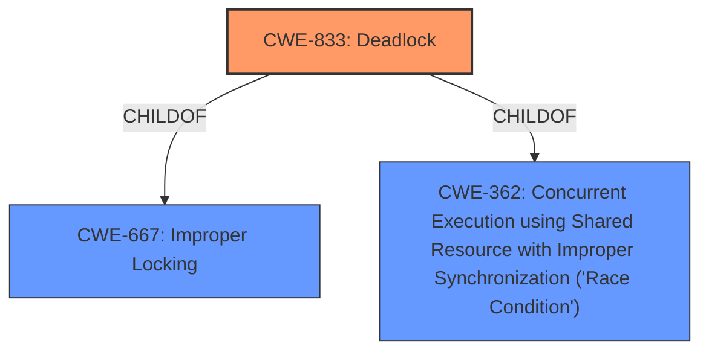

# Enhanced Analysis for CVE-2025-22014

# Summary
| CWE ID | CWE Name | Confidence | CWE Abstraction Level | CWE Vulnerability Mapping Label | CWE-Vulnerability Mapping Notes |
|---|---|---|---|---|---|
| CWE-833 | Deadlock | 1.0 | Base | Primary | Allowed |
| CWE-667 | Improper Locking | 0.7 | Class | Secondary | Allowed-with-Review |
| CWE-362 | Concurrent Execution using Shared Resource with Improper Synchronization ('Race Condition') | 0.6 | Class | Secondary | Allowed-with-Review |

## Evidence and Confidence

*   **Confidence Score:** 0.9
*   **Evidence Strength:** HIGH

## Relationship Analysis
The primary weakness is a deadlock (**CWE-833**). This can occur due to improper locking (**CWE-667**) and may involve a race condition (**CWE-362**). **CWE-667** and **CWE-362** are parent classes that describe the general condition that allows the base level weakness **CWE-833** to occur.



## Vulnerability Chain
The vulnerability chain starts with concurrent execution and shared resources, which leads to **improper locking**, and ultimately results in a **deadlock** that halts process execution.

## Summary of Analysis
The analysis is based on the provided vulnerability description, which clearly states a **potential deadlock** within the Linux kernel. The description details a scenario where two processes contend for the same lock, leading to a standstill. The evidence for this is the phrase "**potential deadlock**" and the description of process A and B both attempting to acquire `pdr->list_lock`.

The graph relationships support the selection of **CWE-833** as the primary cause, with **CWE-667** and **CWE-362** contributing to the conditions necessary for the deadlock to occur. The selection of **CWE-833** is at the optimal level of specificity as it directly describes the **deadlock** condition.

Relevant CWE Information:

# Enhanced Context (25 CWEs)
The following CWEs were identified as potentially relevant to this vulnerability:

## CWE-833: Deadlock
**Abstraction Level**: Base
**Similarity Score**: 0.78
**Source**: dense

**Description**:
The product contains multiple threads or executable segments that are waiting for each other to release a necessary lock, resulting in deadlock.

**Mapping Guidance**:
- Usage: Allowed
- Rationale: This CWE entry is at the Base level of abstraction, which is a preferred level of abstraction for mapping to the root causes of vulnerabilities.

## CWE-667: Improper Locking
**Abstraction Level**: Class
**Similarity Score**: 0.77
**Source**: dense

**Description**:
The product does not properly acquire or release a lock on a resource, leading to unexpected resource state changes and behaviors.

**Mapping Guidance**:
- Usage: Allowed-with-Review
- Rationale: This CWE entry is a Class and might have Base-level children that would be more appropriate

## CWE-362: Concurrent Execution using Shared Resource with Improper Synchronization ('Race Condition')
**Abstraction Level**: Class
**Similarity Score**: 0.74
**Source**: dense

**Description**:
The product contains a concurrent code sequence that requires temporary, exclusive access to a shared resource, but a timing window exists in which the shared resource can be modified by another code sequence operating concurrently.

**Mapping Guidance**:
- Usage: Allowed-with-Review
- Rationale: This CWE entry is a Class and might have Base-level children that would be more appropriate

**CWE-833: Deadlock** is the primary CWE because the vulnerability description explicitly mentions "**potential deadlock**" and describes the circumstances leading to it. This is a base-level CWE, which is preferred. The technical details describe two processes locking on the same resource, causing a deadlock. The impact is process termination and an audio regression. Confidence: 1.0

**CWE-667: Improper Locking** is a secondary CWE because the deadlock is caused by improper locking mechanisms. Confidence: 0.7. This is a class-level CWE so it is less specific than CWE-833.

**CWE-362: Concurrent Execution using Shared Resource with Improper Synchronization ('Race Condition')** is a secondary CWE because concurrent execution is a prerequisite to the improper locking that leads to deadlock. Confidence: 0.6. This is a class-level CWE so it is less specific than CWE-833.

CWEs considered but not used:

*   CWE-755, CWE-754: These relate to error handling, but the core issue is a deadlock, not a failure to handle errors.
*   CWE-346: Origin validation is not relevant to this vulnerability.
*   CWE-617: Reachable assertion is not relevant as the deadlock is the issue, not a triggered assertion.
*   CWE-131: Incorrect buffer size calculation is not relevant.
*   CWE-367: TOCTOU is not relevant.
*   CWE-184: Incomplete list of disallowed inputs is not relevant.
*   CWE-1285: Improper validation of index is not relevant.
*   CWE-390: Detection of error condition without action is not the primary issue.
*   CWE-1325: Improperly controlled memory allocation is not relevant.
*   CWE-770: Allocation of Resources Without Limits or Throttling is not relevant.
*   CWE-835: Loop with Unreachable Exit Condition ('Infinite Loop') is not relevant.
*   CWE-476: NULL Pointer Dereference is not relevant.
*   CWE-226: Sensitive Information in Resource Not Removed Before Reuse is not relevant.
*   CWE-212: Improper Removal of Sensitive Information Before Storage or Transfer is not relevant.
*   CWE-434: Unrestricted Upload of File with Dangerous Type is not relevant.
*   CWE-79: Improper Neutralization of Input During Web Page Generation ('Cross-site Scripting') is not relevant.
*   CWE-1322: Use of Blocking Code in Single-threaded, Non-blocking Context is not relevant.
*   CWE-201: Insertion of Sensitive Information Into Sent Data is not relevant.
*   CWE-863: Incorrect Authorization is not relevant.


## CWE Relationship Analysis

Current CWEs represent these abstraction levels: .


### Vulnerability Chain Analysis

**Chain starting from CWE-390:**
- 390 (Detection of Error Condition Without Action) - ROOT


**Chain starting from CWE-476:**
- 476 (NULL Pointer Dereference) - ROOT


### CWE Relationship Diagram

```mermaid
graph TD
    classDef primary fill:#f96,stroke:#333,stroke-width:2px
    classDef secondary fill:#69f,stroke:#333
    classDef tertiary fill:#9e9,stroke:#333
```