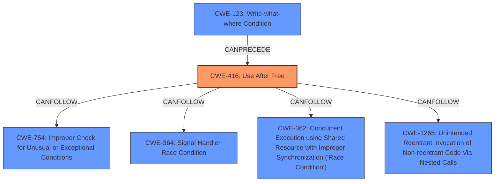

# Raw Analyzer Response for CVE-2025-22023

# Summary
| CWE ID | CWE Name | Confidence | CWE Abstraction Level | CWE Vulnerability Mapping Label | CWE-Vulnerability Mapping Notes |
|---|---|---|---|---|---|
| CWE-416 | Use After Free | 0.9 | Variant | Allowed | Primary CWE |

## Evidence and Confidence

*   **Confidence Score:** 0.9
*   **Evidence Strength:** MEDIUM

## Relationship Analysis
The primary relationship influencing the decision is the direct match of the vulnerability description to **CWE-416 (Use After Free)**. The retriever results also strongly suggest this CWE. The other relationships (CANFOLLOW, CANPRECEDE) are less relevant as they describe potential sequences rather than the root cause itself. The variant level of abstraction is appropriate since the description details a specific instance of UAF within the Linux kernel's USB XHCI driver.

## Vulnerability Chain
The vulnerability chain starts with a flawed logic in handling "Stopped - Length Invalid" events in the USB XHCI driver. This leads to premature skipping of pending TDs and giving them back before completion, ultimately resulting in a **UAF**.

## Summary of Analysis
The analysis strongly points to **CWE-416 (Use After Free)** as the primary weakness. The vulnerability description explicitly mentions the risk of **UAF** by HW.

The evidence is from the "Vulnerability Description Key Phrases" section:
*   **weakness:** **UAF**

The retriever results also prioritize **CWE-416 (Use After Free)** with a score of 1.0.

Other CWEs were considered but ultimately deemed less relevant:

*   **CWE-789 (Memory Allocation with Excessive Size Value)** and **CWE-1284 (Improper Validation of Specified Quantity in Input)**: While memory management is involved, the core issue isn't excessive allocation or improper validation of input size but rather the incorrect handling of events leading to a **UAF**.
*   **CWE-362 (Concurrent Execution using Shared Resource with Improper Synchronization ('Race Condition'))**: Concurrency might play a role in the timing of the **UAF**, but it's not the primary cause.
*   **CWE-754 (Improper Check for Unusual or Exceptional Conditions)**: This is a higher-level class that is less specific than **CWE-416 (Use After Free)**.

The selection of **CWE-416 (Use After Free)** at the Variant level is optimal because it precisely describes the vulnerability, which is triggered by a specific sequence of events related to USB XHCI driver's handling of stopped isochronous transfers.