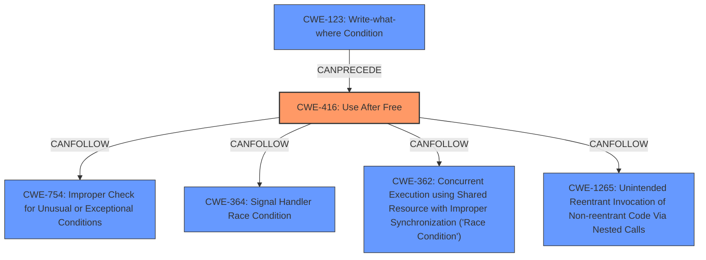

# Analysis Report for CVE-2025-22023

# Vulnerability Analysis Report: CVE-2025-22023

## Description

In the Linux kernel, the following vulnerability has been resolved usb xhci Dont skip on Stopped - Length Invalid Up until commit d56b0b2ab142 (usb xhci ensure skipped isoc TDs are returned when isoc ring is stopped) in v6.11, the driver didnt skip missed isochronous TDs when handling Stoppend and Stopped - Length Invalid events. Instead, it erroneously cleared the skip flag, which would cause the ring to get stuck, as future events wont match the missed TD which is never removed from the queue until its cancelled. This buggy logic seems to have been in place substantially unchanged since the 3.x series over 10 years ago, which probably speaks first and foremost about relative rarity of this case in normal usage, but by the spec I see no reason why it shouldnt be possible. After d56b0b2ab142, TDs are immediately skipped when handling those Stopped events. This poses a potential problem in case of Stopped - Length Invalid, which occurs either on completed TDs (likely already given back) or Link and No-Op TRBs. Such event wont be recognized as matching any TD (unless its the rare Link TRB inside a TD) and will result in skipping all pending TDs, giving them back possibly before they are done, risking isoc data loss and maybe **UAF** by HW. As a compromise, dont skip and dont clear the skip flag on this kind of event. Then the next event will skip missed TDs. A downside of not handling Stopped - Length Invalid on a Link inside a TD is that if the TD is cancelled, its actual length will not be updated to account for TRBs (silently) completed before the TD was stopped. I had no luck producing this sequence of completion events so there is no compelling demonstration of any resulting disaster. It may be a very rare, obscure condition. The sole motivation for this patch is that if such unlikely event does occur, Id rather risk reporting a cancelled partially done isoc frame as empty than gamble with **UAF**. This will be fixed more properly by looking at Stopped events TRB pointer when making skipping decisions, but such rework is unlikely to be backported to v6.12, which will stay around for a few years.

## Vulnerability Description Key Phrases

- **Weakness:** UAF
- **Impact:** data loss
- **Product:** Linux kernel
- **Version:** v6.11
- **Component:** usb xhci

## Analysis (with Relationship Data)

# Summary
| CWE ID | CWE Name | Confidence | CWE Abstraction Level | CWE Vulnerability Mapping Label | CWE-Vulnerability Mapping Notes |
|---|---|---|---|---|---|
| CWE-416 | Use After Free | 0.9 | Variant | Allowed | Primary CWE |

## Evidence and Confidence

*   **Confidence Score:** 0.9
*   **Evidence Strength:** MEDIUM

## Relationship Analysis
The primary relationship influencing the decision is the direct match of the vulnerability description to **CWE-416 (Use After Free)**. The retriever results also strongly suggest this CWE. The other relationships (CANFOLLOW, CANPRECEDE) are less relevant as they describe potential sequences rather than the root cause itself. The variant level of abstraction is appropriate since the description details a specific instance of UAF within the Linux kernel's USB XHCI driver.



## Vulnerability Chain
The vulnerability chain starts with a flawed logic in handling "Stopped - Length Invalid" events in the USB XHCI driver. This leads to premature skipping of pending TDs and giving them back before completion, ultimately resulting in a **UAF**.

## Summary of Analysis
The analysis strongly points to **CWE-416 (Use After Free)** as the primary weakness. The vulnerability description explicitly mentions the risk of **UAF** by HW.

The evidence is from the "Vulnerability Description Key Phrases" section:
*   **weakness:** **UAF**

The retriever results also prioritize **CWE-416 (Use After Free)** with a score of 1.0.

Other CWEs were considered but ultimately deemed less relevant:

*   **CWE-789 (Memory Allocation with Excessive Size Value)** and **CWE-1284 (Improper Validation of Specified Quantity in Input)**: While memory management is involved, the core issue isn't excessive allocation or improper validation of input size but rather the incorrect handling of events leading to a **UAF**.
*   **CWE-362 (Concurrent Execution using Shared Resource with Improper Synchronization ('Race Condition'))**: Concurrency might play a role in the timing of the **UAF**, but it's not the primary cause.
*   **CWE-754 (Improper Check for Unusual or Exceptional Conditions)**: This is a higher-level class that is less specific than **CWE-416 (Use After Free)**.

The selection of **CWE-416 (Use After Free)** at the Variant level is optimal because it precisely describes the vulnerability, which is triggered by a specific sequence of events related to USB XHCI driver's handling of stopped isochronous transfers.


## CWE Relationship Analysis

Current CWEs represent these abstraction levels: .


### Vulnerability Chain Analysis

**Chain starting from CWE-123:**
- 123 (Write-what-where Condition) - ROOT


**Chain starting from CWE-1284:**
- 1284 (Improper Validation of Specified Quantity in Input) - ROOT


### CWE Relationship Diagram

```mermaid
graph TD
    classDef primary fill:#f96,stroke:#333,stroke-width:2px
    classDef secondary fill:#69f,stroke:#333
    classDef tertiary fill:#9e9,stroke:#333
```


*Report generated on 2025-07-14 10:06:48*
