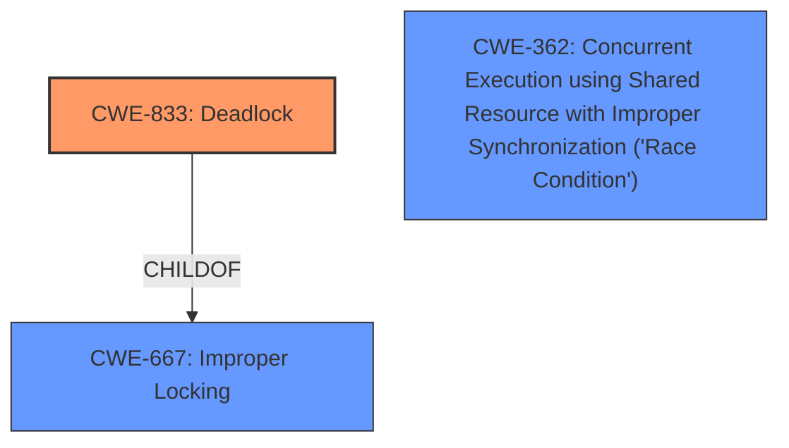

# Enhanced Analysis for CVE-2025-22030

# Summary
| CWE ID | CWE Name | Confidence | CWE Abstraction Level | CWE Vulnerability Mapping Label | CWE-Vulnerability Mapping Notes |
|---|---|---|---|---|---|
| CWE-833 | Deadlock | 1.0 | Base | Allowed | Primary CWE |
| CWE-667 | Improper Locking | 0.7 | Class | Allowed-with-Review | Secondary Candidate |
| CWE-362 | Concurrent Execution using Shared Resource with Improper Synchronization ('Race Condition') | 0.5 | Class | Allowed-with-Review | Secondary Candidate |

## Evidence and Confidence

*   **Confidence Score:** 0.9
*   **Evidence Strength:** HIGH

## Relationship Analysis
The primary weakness is **CWE-833: Deadlock**. This is a base-level CWE, which is the preferred level of abstraction. **CWE-667: Improper Locking** and **CWE-362: Concurrent Execution using Shared Resource with Improper Synchronization ('Race Condition')** are class-level CWEs that are related to concurrency issues. **CWE-667** is a parent of **CWE-833**, but **CWE-833** is more specific to the vulnerability description.



## Vulnerability Chain
The vulnerability chain is as follows:
1.  **Improper Lock Ordering (Root Cause):** The code acquires locks in an inconsistent order, leading to a **lock ordering dependency**.
2.  **CWE-833: Deadlock (Weakness):** The inconsistent lock ordering can result in a **deadlock** condition where two or more threads are blocked indefinitely, waiting for each other to release the locks.

## Summary of Analysis
The vulnerability is a **deadlock** caused by a **lock ordering dependency** in the Linux kernel's zswap functionality. The code acquires locks in an inconsistent order, leading to a potential **deadlock** scenario. The provided information clearly indicates a **deadlock** situation, making **CWE-833: Deadlock** the most appropriate primary CWE.

The vulnerability description explicitly mentions the term "**deadlock**" and describes a scenario where tasks are blocked indefinitely, waiting for each other to release locks. The fix involves reordering the lock acquisition to avoid the **deadlock** condition.

**CWE-833: Deadlock** is the most specific and accurate representation of the vulnerability based on the available evidence.

Other CWEs Considered:
*   **CWE-667: Improper Locking**: This is a more general class of weakness that could apply to the vulnerability, but **CWE-833** is more specific.
*   **CWE-362: Concurrent Execution using Shared Resource with Improper Synchronization ('Race Condition')**: This is another class-level CWE related to concurrency issues, but **CWE-833** is a more precise description of the vulnerability.
*   **CWE-119: Improper Restriction of Operations within the Bounds of a Memory Buffer**, **CWE-120: Buffer Copy without Checking Size of Input ('Classic Buffer Overflow')**, **CWE-125: Out-of-bounds Read**: These are not relevant to the described vulnerability.
*   **CWE-835: Loop with Unreachable Exit Condition ('Infinite Loop')**: Not relevant, as this involves a loop and not a deadlock.
*   **CWE-400: Uncontrolled Resource Consumption**: Not relevant, as this involves consumption of resources but no mention of deadlock.
*   **CWE-407: Inefficient Algorithmic Complexity**: Not relevant, as there is no mention of algorithm complexity.


## CWE Relationship Analysis

Current CWEs represent these abstraction levels: .


### Vulnerability Chain Analysis

**Chain starting from CWE-400:**
- 400 (Uncontrolled Resource Consumption) - ROOT


**Chain starting from CWE-407:**
- 407 (Inefficient Algorithmic Complexity) - ROOT


### CWE Relationship Diagram

```mermaid
graph TD
    classDef primary fill:#f96,stroke:#333,stroke-width:2px
    classDef secondary fill:#69f,stroke:#333
    classDef tertiary fill:#9e9,stroke:#333
```