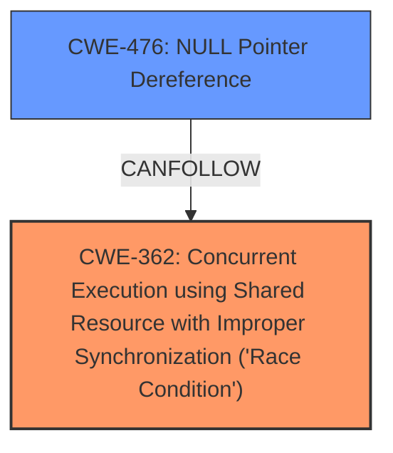

# Enhanced Analysis for CVE-2025-22050

# Summary
| CWE ID | CWE Name | Confidence | CWE Abstraction Level | CWE Vulnerability Mapping Label | CWE-Vulnerability Mapping Notes |
|---|---|---|---|---|---|
| CWE-362 | Concurrent Execution using Shared Resource with Improper Synchronization ('Race Condition') | 0.9 | Class | Primary | Allowed-with-Review |
| CWE-476 | NULL Pointer Dereference | 0.8 | Base | Secondary | Allowed |

## Evidence and Confidence

*   **Confidence Score:** 0.85
*   **Evidence Strength:** HIGH

## Relationship Analysis
The primary relationship identified is that **CWE-362** can lead to **CWE-476**. **CWE-362** is a Class-level CWE, while **CWE-476** is a Base-level CWE. While there may be more specific children of **CWE-362**, the provided evidence doesn't support selecting a more specific CWE. **CWE-476** is a direct result of the **race condition**, where a pointer is dereferenced when it is unexpectedly NULL.



## Vulnerability Chain
The vulnerability chain starts with a **missing check** (`usbnet_going_away`) in a critical path, leading to a **race condition**. This **race condition** allows a URB request to succeed while the corresponding SKB data fails to be queued. Subsequent access to `skb->next` results in a **NULL pointer dereference**, ultimately causing a kernel panic.

**Missing Check** -> **Race Condition** (CWE-362) -> **NULL Pointer Dereference** (CWE-476) -> **Kernel Panic**

## Summary of Analysis
The analysis focuses on identifying the root cause and subsequent weaknesses. The initial **missing check** leads directly to a **race condition**, where the state of a resource changes unexpectedly between the check and its use. This condition results in a **NULL pointer dereference** when the code attempts to access `skb->next`, leading to a kernel panic.

The primary CWE is **CWE-362**, as it represents the **race condition** that is the core of the vulnerability. The secondary CWE is **CWE-476**, which represents the direct consequence of the **race condition**.

The evidence for **CWE-362** is found in the description: "This inconsistency creates a **race condition** where A URB request may succeed, but the corresponding SKB data fails to be queued." The evidence for **CWE-476** is found in the description: "Subsequent processes (e.g., rx_complete defer_bh __skb_unlink(skb, list)) attempt to access skb->next, triggering a **NULL pointer dereference** (Kernel Panic)."

The selection of these CWEs is based on direct evidence from the vulnerability description and aligns with the CWE specifications. The abstraction levels are appropriate, with **CWE-362** at the Class level and **CWE-476** at the Base level.

Other CWEs Considered:

*   CWE-833 (Deadlock): While concurrency is involved, the vulnerability does not describe a deadlock situation.
*   CWE-667 (Improper Locking): No specific evidence points to improper locking mechanisms.
*   CWE-367 (Time-of-check Time-of-use (TOCTOU) Race Condition): While a TOCTOU condition might be present, the description focuses more on the general **race condition** due to the **missing check**.
*   CWE-252 (Unchecked Return Value): There's no explicit mention of an unchecked return value leading to the vulnerability.
*   CWE-824 (Access of Uninitialized Pointer): While it can lead to **NULL pointer dereference**, the race condition is the more direct cause.

# Relevant CWE Information:

# Enhanced Context (25 CWEs)
The following CWEs were identified as potentially relevant to this vulnerability:

## CWE-667: Improper Locking
**Abstraction Level**: Class
**Similarity Score**: 0.75
**Source**: dense

**Description**:
The product does not properly acquire or release a lock on a resource, leading to unexpected resource state changes and behaviors.

**Mapping Guidance**:
- Usage: Allowed-with-Review
- Rationale: This CWE entry is a Class and might have Base-level children that would be more appropriate


## CWE-824: Access of Uninitialized Pointer
**Abstraction Level**: Base
**Similarity Score**: 0.75
**Source**: dense

**Description**:
The product accesses or uses a pointer that has not been initialized.

**Mapping Guidance**:
- Usage: Allowed
- Rationale: This CWE entry is at the Base level of abstraction, which is a preferred level of abstraction for mapping to the root causes of vulnerabilities.


## CWE-703: Improper Check or Handling of Exceptional Conditions
**Abstraction Level**: Pillar
**Similarity Score**: 0.74
**Source**: dense

**Description**:
The product does not properly anticipate or handle exceptional conditions that rarely occur during normal operation of the product.

**Mapping Guidance**:
- Usage: Discouraged
- Rationale: This CWE entry is extremely high-level, a Pillar.


## CWE-833: Deadlock
**Abstraction Level**: Base
**Similarity Score**: 0.74
**Source**: dense

**Description**:
The product contains multiple threads or executable segments that are waiting for each other to release a necessary lock, resulting in deadlock.

**Mapping Guidance**:
- Usage: Allowed
- Rationale: This CWE entry is at the Base level of abstraction, which is a preferred level of abstraction for mapping to the root causes of vulnerabilities.


## CWE-665: Improper Initialization
**Abstraction Level**: Class
**Similarity Score**: 0.73
**Source**: dense

**Description**:
The product does not initialize or incorrectly initializes a resource, which might leave the resource in an unexpected state when it is accessed or used.

**Mapping Guidance**:
- Usage: Discouraged
- Rationale: This CWE entry is a level-1 Class (i.e., a child of a Pillar). It might have lower-level children that would be more appropriate


## CWE-754: Improper Check for Unusual or Exceptional Conditions
**Abstraction Level**: Class
**Similarity Score**: 0.73
**Source**: dense

**Description**:
The product does not check or incorrectly checks for unusual or exceptional conditions that are not expected to occur frequently during day to day operation of the product.

**Mapping Guidance**:
- Usage: Allowed-with-Review
- Rationale: This CWE entry is a Class and might have Base-level children that would be more appropriate


## CWE-476: NULL Pointer Dereference
**Abstraction Level**: Base
**Similarity Score**: 0.72
**Source**: dense

**Description**:
The product dereferences a pointer that it expects to be valid but is NULL.

**Mapping Guidance**:
- Usage: Allowed
- Rationale: This CWE entry is at the Base level of abstraction, which is a preferred level of abstraction for mapping to the root causes of vulnerabilities.


## CWE-362: Concurrent Execution using Shared Resource with Improper Synchronization ('Race Condition')
**Abstraction Level**: Class
**Similarity Score**: 0.72
**Source**: dense

**Description**:
The product contains a concurrent code sequence that requires temporary, exclusive access to a shared resource, but a timing window exists in which the shared resource can be modified by another code sequence operating concurrently.

**Mapping Guidance**:
- Usage: Allowed-with-Review
- Rationale: This CWE entry is a Class and might have Base-level children that would be more appropriate


## CWE-367: Time-of-check Time-of-use (TOCTOU) Race Condition
**Abstraction Level**: Base
**Similarity Score**: 0.72
**Source**: dense

**Description**:
The product checks the state of a resource before using that resource, but the resource's state can change between the check and the use in a way that invalidates the results of the check. This can cause the product to perform invalid actions when the resource is in an unexpected state.

**Mapping Guidance**:
- Usage: Allowed
- Rationale: This CWE entry is at the Base level of abstraction, which is a preferred level of abstraction for mapping to the root causes of vulnerabilities.


## CWE-696: Incorrect Behavior Order
**Abstraction Level**: Class
**Similarity Score**: 0.72
**Source**: dense

**Description**:
The product performs multiple related behaviors, but the behaviors are performed in the wrong order in ways which may produce resultant weaknesses.

**Mapping Guidance**:
- Usage: Allowed-with-Review
- Rationale


## CWE Relationship Analysis

Current CWEs represent these abstraction levels: .


### Vulnerability Chain Analysis

**Chain starting from CWE-476:**
- 476 (NULL Pointer Dereference) - ROOT


**Chain starting from CWE-754:**
- 754 (Improper Check for Unusual or Exceptional Conditions) - ROOT


### CWE Relationship Diagram

```mermaid
graph TD
    classDef primary fill:#f96,stroke:#333,stroke-width:2px
    classDef secondary fill:#69f,stroke:#333
    classDef tertiary fill:#9e9,stroke:#333
```