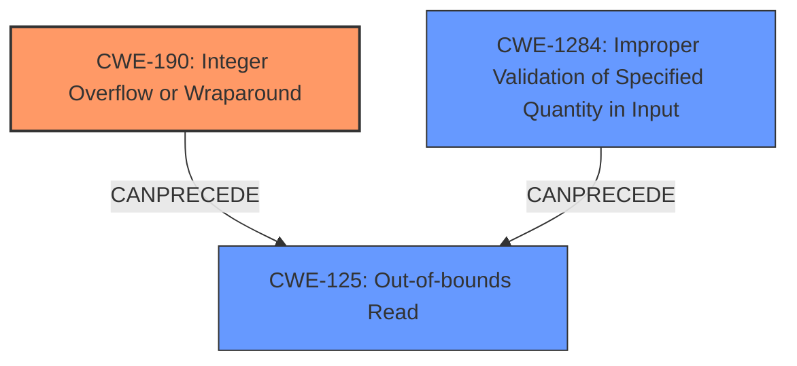

# Analysis Report for CVE-2025-22055

# Vulnerability Analysis Report: CVE-2025-22055

## Description

In the Linux kernel, the following vulnerability has been resolved net fix geneve_opt length **integer overflow** struct geneve_opt uses 5 bit length for each single option, which means every vary size option should be smaller than 128 bytes. However, all current related Netlink policies cannot promise this length condition and the attacker can exploit a exact 128-byte size option to *fake* a zero length option and confuse the parsing logic, further achieve heap out-of-bounds read. One example crash log is like below [ 3.905425] ================================================================== [ 3.905925] BUG KASAN slab-out-of-bounds in nla_put+0xa9/0xe0 [ 3.906255] Read of size 124 at addr ffff888005f291cc by task poc/177 [ 3.906646] [ 3.906775] CPU 0 PID 177 Comm poc-oob-read Not tainted 6.1.132 #1 [ 3.907131] Hardware name QEMU Standard PC (i440FX + PIIX, 1996), BIOS rel-1.16.0-0-gd239552ce722-prebuilt.qemu.org 04/01/2014 [ 3.907784] Call Trace [ 3.907925] [ 3.908048] dump_stack_lvl+0x44/0x5c [ 3.908258] print_report+0x184/0x4be [ 3.909151] kasan_report+0xc5/0x100 [ 3.909539] kasan_check_range+0xf3/0x1a0 [ 3.909794] memcpy+0x1f/0x60 [ 3.909968] nla_put+0xa9/0xe0 [ 3.910147] tunnel_key_dump+0x945/0xba0 [ 3.911536] tcf_action_dump_1+0x1c1/0x340 [ 3.912436] tcf_action_dump+0x101/0x180 [ 3.912689] tcf_exts_dump+0x164/0x1e0 [ 3.912905] fw_dump+0x18b/0x2d0 [ 3.913483] tcf_fill_node+0x2ee/0x460 [ 3.914778] tfilter_notify+0xf4/0x180 [ 3.915208] tc_new_tfilter+0xd51/0x10d0 [ 3.918615] rtnetlink_rcv_msg+0x4a2/0x560 [ 3.919118] netlink_rcv_skb+0xcd/0x200 [ 3.919787] netlink_unicast+0x395/0x530 [ 3.921032] netlink_sendmsg+0x3d0/0x6d0 [ 3.921987] __sock_sendmsg+0x99/0xa0 [ 3.922220] __sys_sendto+0x1b7/0x240 [ 3.922682] __x64_sys_sendto+0x72/0x90 [ 3.922906] do_syscall_64+0x5e/0x90 [ 3.923814] entry_SYSCALL_64_after_hwframe+0x6e/0xd8 [ 3.924122] RIP 00330x7e83eab84407 [ 3.924331] Code 48 89 fa 4c 89 df e8 38 aa 00 00 8b 93 08 03 00 00 59 5e 48 83 f8 fc 74 1a 5b c3 0f 1f 84 00 00 00 00 00 48 8b 44 24 10 0f 05 c3 0f 1f 80 00 00 00 00 83 e2 39 83 faf [ 3.925330] RSP 002b00007ffff505e370 EFLAGS 00000202 ORIG_RAX 000000000000002c [ 3.925752] RAX ffffffffffffffda RBX 00007e83eaafa740 RCX 00007e83eab84407 [ 3.926173] RDX 00000000000001a8 RSI 00007ffff505e3c0 RDI 0000000000000003 [ 3.926587] RBP 00007ffff505f460 R08 00007e83eace1000 R09 000000000000000c [ 3.926977] R10 0000000000000000 R11 0000000000000202 R12 00007ffff505f3c0 [ 3.927367] R13 00007ffff505f5c8 R14 00007e83ead1b000 R15 00005d4fbbe6dcb8 Fix these issues by enforing correct length condition in related policies.

## Vulnerability Description Key Phrases

- **Rootcause:** weakness in the length condition
- **Weakness:** ['slab-out-of-bounds read', 'integer overflow']
- **Impact:** heap out-of-bounds read
- **Vector:** 128-byte size option
- **Product:** Linux kernel
- **Component:** geneve_opt

## Analysis (with Relationship Data)

# Summary
| CWE ID   | CWE Name                                                     | Confidence | CWE Abstraction Level | CWE Vulnerability Mapping Label | CWE-Vulnerability Mapping Notes |
| :-------- | :----------------------------------------------------------- | :--------- | :-------------------- | :------------------------------ | :------------------------------ |
| CWE-190 | Integer Overflow or Wraparound                                           | 0.90       | Base                  | Primary                         | Allowed                       |
| CWE-125 | Out-of-bounds Read                                       | 0.80       | Base                  | Secondary                       | Allowed                       |
| CWE-1284 | Improper Validation of Specified Quantity in Input                                      | 0.60       | Base                  | Secondary                       | Allowed                       |

## Evidence and Confidence

*   **Confidence Score:** 0.85
*   **Evidence Strength:** HIGH

## Relationship Analysis
The primary weakness is an **integer overflow** (CWE-190) when calculating the length of the `geneve_opt`. This can lead to an out-of-bounds read (CWE-125) because the incorrect length calculation results in reading memory beyond the allocated buffer. CWE-1284 is also relevant because the input is not properly validated to ensure the quantity (length) is within the required properties. CWE-190 can precede CWE-125. CWE-1284 can precede CWE-789 (Memory Allocation with Excessive Size Value) based on its relationships. The abstraction levels are all Base/Variant levels, which are preferable for root cause analysis.



## Vulnerability Chain
1.  The vulnerability begins with an **integer overflow** (CWE-190) in the calculation of the length of `geneve_opt`.
2.  This **incorrect** length calculation leads to an **improper** validation of the specified quantity in the input (CWE-1284).
3.  The **improper** validation causes a heap out-of-bounds read (CWE-125) during parsing, as the system attempts to read data beyond the buffer's boundaries.

## Summary of Analysis
The primary **root cause** of this vulnerability is the **integer overflow** (CWE-190) within the length calculation for `geneve_opt`. The vulnerability description explicitly mentions the **integer overflow** and how it leads to a heap out-of-bounds read, which confirms CWE-190's role as the initial flaw. The other aspect is the **improper** validation of the input length (CWE-1284) which allows the overflow to occur in the first place. Finally, the ultimate impact is the heap out-of-bounds read (CWE-125), which results from the **integer overflow** leading to read beyond buffer boundaries.

The selection of CWE-190 is based on the explicit mention of **integer overflow** as the **root cause**. The vulnerability description states that the **integer overflow** can "fake a zero length option and confuse the parsing logic," which is direct evidence.

CWE-125 is a direct consequence of the **integer overflow**, as it results in the system attempting to read beyond the bounds of the allocated memory.

CWE-1284 is included because the system does not properly validate the size or length of the input, which would have prevented the **integer overflow** from occurring.

Other CWEs Considered:

*   CWE-20: Improper Input Validation was considered but is too high-level. CWE-1284 is a more specific child of CWE-20.
*   CWE-770: Allocation of Resources Without Limits or Throttling was considered, but the primary issue is not related to resource allocation, but rather the **integer overflow** and subsequent out-of-bounds read.
*   CWE-121: Stack-based Buffer Overflow was considered, but the crash log indicates a slab-out-of-bounds read, which suggests a heap-based issue rather than a stack-based one.


## CWE Relationship Analysis

Current CWEs represent these abstraction levels: .


### Vulnerability Chain Analysis

**Chain starting from CWE-1284:**
- 1284 (Improper Validation of Specified Quantity in Input) - ROOT


**Chain starting from CWE-121:**
- 121 (Stack-based Buffer Overflow) - ROOT


### CWE Relationship Diagram

```mermaid
graph TD
    classDef primary fill:#f96,stroke:#333,stroke-width:2px
    classDef secondary fill:#69f,stroke:#333
    classDef tertiary fill:#9e9,stroke:#333
```


*Report generated on 2025-07-14 10:09:16*
