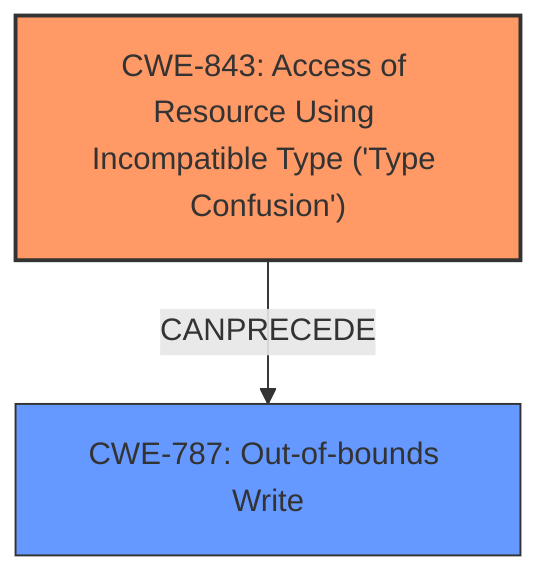

# Analysis for CVE-2025-22056

# Summary
| CWE ID | CWE Name | Confidence | CWE Abstraction Level | CWE Vulnerability Mapping Label | CWE-Vulnerability Mapping Notes |
|---|---|---|---|---|---|
| CWE-843 | Access of Resource Using Incompatible Type ('Type Confusion') | 1.0 | Base | Primary | Allowed |
| CWE-787 | Out-of-bounds Write | 0.8 | Base | Secondary | Allowed |

## Evidence and Confidence

*   **Confidence Score:** 0.9
*   **Evidence Strength:** HIGH

## Relationship Analysis
The primary relationship that influenced my decision was the direct connection between the **type confusion** and the resulting out-of-bounds write. CWE-843 (Type Confusion) is the root cause, leading to CWE-787 (Out-of-bounds Write) as the impact.

## Vulnerability Chain
The vulnerability chain starts with **type confusion** (CWE-843), which then leads to a **heap out-of-bounds write** (CWE-787).

## Summary of Analysis
The primary weakness is CWE-843 (**Type Confusion**), which directly caused the **heap out-of-bounds write**.

The vulnerability description explicitly mentions "**type confusion**" as the root cause and "**heap out-of-bounds write**" as the weakness.

> In the Linux kernel, the following vulnerability has been resolved netfilter nft_tunnel fix geneve_opt **type confusion** addition When handling multiple NFTA_TUNNEL_KEY_OPTS_GENEVE attributes, the parsing logic should place every geneve_opt structure one by one compactly. Hence, when deciding the next geneve_opt position, the pointer addition should be in units of char *. However, the current implementation erroneously does type conversion before the addition, which will lead to heap out-of-bounds write. [ 6.989857] ================================================================== [ 6.990293] BUG KASAN slab-out-of-bounds in nft_tunnel_obj_init+0x977/0xa70 [ 6.990725] Write of size 124 at addr ffff888005f18974 by task poc/178

The **type confusion** results in incorrect pointer arithmetic, leading to the out-of-bounds write. The provided information is sufficient for mapping CWE-843 as the primary CWE.

CWE-787 (Out-of-bounds Write) is a direct consequence of the type confusion.

The other CWEs were not selected because they did not directly address the root cause or the immediate impact. For example, CWE-20 (Improper Input Validation) might be a contributing factor, but it is not the primary cause of the vulnerability.

Relevant CWE Information:

# Enhanced Context (25 CWEs)
The following CWEs were identified as potentially relevant to this vulnerability:

## CWE-843: Access of Resource Using Incompatible Type ('Type Confusion')
**Abstraction Level**: Base
**Similarity Score**: 0.78
**Source**: dense

**Description**:
The product allocates or initializes a resource such as a pointer, object, or variable using one type, but it later accesses that resource using a type that is incompatible with the original type.

**Mapping Guidance**:
- Usage: Allowed
- Rationale: This CWE entry is at the Base level of abstraction, which is a preferred level of abstraction for mapping to the root causes of vulnerabilities.
## CWE-787: Out-of-bounds Write
**Abstraction Level**: Base
**Similarity Score**: N/A
**Source**: N/A

**Description**:
The product writes data past the end, or before the beginning, of the intended buffer. The location of the error is typically off by one byte, but it could be larger.

**Mapping Guidance**:
- Usage: Allowed
- Rationale: This CWE entry is at the Base level of abstraction, which is a preferred level of abstraction for mapping to the root causes of vulnerabilities.