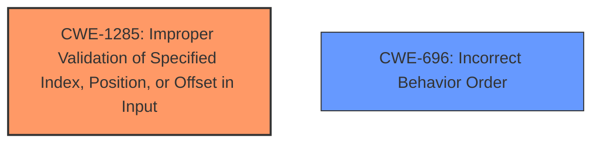

# Enhanced Analysis for CVE-2025-22086

# Summary
| CWE ID | CWE Name | Confidence | CWE Abstraction Level | CWE Vulnerability Mapping Label | CWE-Vulnerability Mapping Notes |
|---|---|---|---|---|---|
| CWE-1285 | Improper Validation of Specified Index, Position, or Offset in Input | 0.7 | Base | Allowed | Primary CWE |
| CWE-696 | Incorrect Behavior Order | 0.5 | Class | Allowed-with-Review | Secondary Candidate |

## Evidence and Confidence

*   **Confidence Score:** 0.7
*   **Evidence Strength:** MEDIUM

## Relationship Analysis
The primary CWE selected is CWE-1285, a base-level CWE, due to the **incorrect** comparison leading to usage of the **wrong QP** (queue pair). The secondary CWE selected is CWE-696 which is a Class level, which covers scenarios where the order of operations is incorrect. The improper validation leads to using the wrong QP.



## Vulnerability Chain
The vulnerability chain begins with an **incorrect** comparison of QP numbers, leading to the selection of the **wrong QP**, ultimately resulting in a kernel trace. The root cause is the **improper validation** of the QP number, represented by CWE-1285.

## Summary of Analysis
The primary CWE is CWE-1285 Improper Validation of Specified Index, Position, or Offset in Input because the vulnerability description indicates that the **QP number mismatch** leads to using the **wrong QP** when handling a CQE. The vulnerability description states "The bug however is that we are checking if the QP is identical by checking the QP number inside the CQE against the QP number inside the mlx5_ib_qp, but thats wrong since the QP number from the CQE is from FW so it should be matched against mlx5_core_qp which is our FW QP number. Otherwise we could use the wrong QP when handling a CQE which could cause the kernel trace below."

CWE-696 Incorrect Behavior Order was also considered because the **incorrect** comparison is performed before the correct one is attempted and the behavior is performed in the wrong order in ways which may produce resultant weaknesses.

CWE-335, CWE-1284, CWE-476, CWE-125, CWE-130, CWE-770, CWE-863, CWE-824 and CWE-129 were considered but are not a good fit for the vulnerability because of the reasons below:
- CWE-335: Incorrect Usage of Seeds in Pseudo-Random Number Generator (PRNG) - The vulnerability does not involve usage of seeds.
- CWE-1284: Improper Validation of Specified Quantity in Input - The vulnerability is not about validation of quantities but the index/offset.
- CWE-476: NULL Pointer Dereference - The vulnerability does not involve dereferencing of NULL pointers.
- CWE-125: Out-of-bounds Read - The vulnerability does not involve reading data past the end of the buffer.
- CWE-130: Improper Handling of Length Parameter Inconsistency - The vulnerability is not related to the length parameter inconsistency.
- CWE-770: Allocation of Resources Without Limits or Throttling - The vulnerability does not involve allocation of resources.
- CWE-863: Incorrect Authorization - The vulnerability is not an authorization issue.
- CWE-824: Access of Uninitialized Pointer - The vulnerability does not involve an uninitialized pointer.
- CWE-129: Improper Validation of Array Index - The vulnerability is not about validating an array index.


## CWE Relationship Analysis

Current CWEs represent these abstraction levels: .


### Vulnerability Chain Analysis

**Chain starting from CWE-863:**
- 863 (Incorrect Authorization) - ROOT


**Chain starting from CWE-1284:**
- 1284 (Improper Validation of Specified Quantity in Input) - ROOT


### CWE Relationship Diagram

```mermaid
graph TD
    classDef primary fill:#f96,stroke:#333,stroke-width:2px
    classDef secondary fill:#69f,stroke:#333
    classDef tertiary fill:#9e9,stroke:#333
```