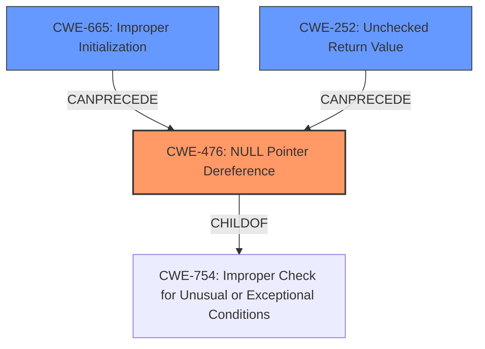

# Analysis Report for CVE-2025-22092

# Vulnerability Analysis Report: CVE-2025-22092

## Description

In the Linux kernel, the following vulnerability has been resolved PCI Fix **NULL dereference** in SR-IOV VF creation error path Clean up when virtfn setup fails to prevent NULL pointer dereference during device removal. The kernel oops below occurred due to **incorrect error handling** flow when pci_setup_device() fails. Add pci_iov_scan_device(), which handles virtfn allocation and setup and cleans up if pci_setup_device() fails, so pci_iov_add_virtfn() doesnt need to call pci_stop_and_remove_bus_device(). This prevents accessing partially initialized virtfn devices during removal.

## Vulnerability Description Key Phrases

- **Rootcause:** ['incorrect error handling', 'NULL dereference']
- **Impact:** kernel oops
- **Product:** Linux kernel
- **Component:** SR-IOV VF creation error path

## Analysis (with Relationship Data)

# Summary
| CWE ID  | CWE Name                                                                                                | Confidence | CWE Abstraction Level | CWE Vulnerability Mapping Label | CWE-Vulnerability Mapping Notes |
| :-------- | :------------------------------------------------------------------------------------------------------- | :---------- | :----------------------- | :------------------------------- | :--------------------------------- |
| CWE-476 | NULL Pointer Dereference                                                                               | 0.90       | Base                    | Primary                          | Allowed                           |
| CWE-665 | Improper Initialization                                                                                  | 0.75       | Class                   | Secondary                       | Discouraged                       |
| CWE-252 | Unchecked Return Value                                                                                   | 0.60       | Base                    | Secondary                       | Allowed                           |

## Evidence and Confidence

*   **Confidence Score:** 0.80
*   **Evidence Strength:** MEDIUM

## Relationship Analysis
The primary weakness is a **NULL pointer dereference** (CWE-476). This can be caused by various factors, including **improper initialization** (CWE-665) and **unchecked return values** (CWE-252). CWE-476 is a Base level CWE which is more specific than its Class level parent CWE-754 (Improper Check for Unusual or Exceptional Conditions). CWE-665 is a Class level CWE, and while more specific Base level children may exist, the description matches well. CWE-252, while a Base level CWE, is less descriptive of the root cause than CWE-665 in this context.



## Vulnerability Chain
The vulnerability chain starts with **incorrect error handling**, potentially involving **improper initialization** (CWE-665) or an **unchecked return value** (CWE-252), leading to a **NULL pointer dereference** (CWE-476), which results in a kernel oops.

## Summary of Analysis
The initial analysis identified **NULL dereference** and **incorrect error handling** as key root causes. The provided information strongly suggests that a **NULL pointer dereference** (CWE-476) occurred due to **incorrect error handling** during the setup of virtfn devices. The **incorrect error handling** may have resulted from **improper initialization** (CWE-665) or an **unchecked return value** (CWE-252). The remediation involves adding `pci_iov_scan_device()` to handle virtfn allocation and setup, and cleaning up if `pci_setup_device()` fails, preventing the access of partially initialized virtfn devices.

The selection of CWE-476 as the primary CWE is based on the explicit mention of a **NULL dereference** in the vulnerability description: "PCI Fix **NULL dereference** in SR-IOV VF creation error path". This directly aligns with the definition of CWE-476. The other CWEs are contributing factors.

CWE-665 and CWE-252 were selected as secondary CWEs because the **incorrect error handling** could stem from either a failure to properly initialize a resource or a failure to check the return value of a function, both potentially leading to the **NULL pointer dereference**.

The selected CWEs are at an appropriate level of specificity, with CWE-476 being a Base level CWE and CWE-665 being a Class level CWE.
Relevant CWE Information:

# Enhanced Context (25 CWEs)
The following CWEs were identified as potentially relevant to this vulnerability:

## CWE-667: Improper Locking
**Abstraction Level**: Class
**Similarity Score**: 0.73
**Source**: dense

**Description**:
The product does not properly acquire or release a lock on a resource, leading to unexpected resource state changes and behaviors.

**Mapping Guidance**:
- Usage: Allowed-with-Review
- Rationale: This CWE entry is a Class and might have Base-level children that would be more appropriate

*Not Selected:* This vulnerability does not appear to be related to locking mechanisms.

## CWE-824: Access of Uninitialized Pointer
**Abstraction Level**: Base
**Similarity Score**: 0.73
**Source**: dense

**Description**:
The product accesses or uses a pointer that has not been initialized.

**Mapping Guidance**:
- Usage: Allowed
- Rationale: This CWE entry is at the Base level of abstraction, which is a preferred level of abstraction for mapping to the root causes of vulnerabilities.

*Not Selected:* While related to the potential of an uninitialized pointer leading to the dereference, the description clearly states a NULL pointer dereference.

## CWE-665: Improper Initialization
**Abstraction Level**: Class
**Similarity Score**: 0.72
**Source**: dense

**Description**:
The product does not initialize or incorrectly initializes a resource, which might leave the resource in an unexpected state when it is accessed or used.

**Mapping Guidance**:
- Usage: Discouraged
- Rationale: This CWE entry is a level-1 Class (i.e., a child of a Pillar). It might have lower-level children that would be more appropriate

*Selected as Secondary:* This is a possible contributing factor to the NULL pointer dereference. The **incorrect error handling** may stem from a failure to properly initialize the resource.

## CWE-703: Improper Check or Handling of Exceptional Conditions
**Abstraction Level**: Pillar
**Similarity Score**: 0.72
**Source**: dense

**Description**:
The product does not properly anticipate or handle exceptional conditions that rarely occur during normal operation of the product.

**Mapping Guidance**:
- Usage: Discouraged
- Rationale: This CWE entry is extremely high-level, a Pillar.

*Not Selected:* Too general. The description provides more specific information about the vulnerability.

## CWE-909: Missing Initialization of Resource
**Abstraction Level**: Class
**Similarity Score**: 0.71
**Source**: dense

**Description**:
The product does not initialize a critical resource.

**Mapping Guidance**:
- Usage: Allowed-with-Review
- Rationale: This CWE entry is a Class and might have Base-level children that would be more appropriate

*Not Selected:* Similar to CWE-665, but less fitting. CWE-665 describes the more general case of improper initialization, which includes missing initialization.

## CWE-252: Unchecked Return Value
**Abstraction Level**: Base
**Similarity Score**: 0.71
**Source**: dense

**Description**:
The product does not check the return value from a method or function, which can prevent it from detecting unexpected states and conditions.

**Mapping Guidance**:
- Usage: Allowed
- Rationale: This CWE entry is at the Base level of abstraction, which is a preferred level of abstraction for mapping to the root causes of vulnerabilities.

*Selected as Secondary:* This is a possible contributing factor to the NULL pointer dereference. The **incorrect error handling** may stem from a failure to check the return value of a function.

## CWE-476: NULL Pointer Dereference
**Abstraction Level**: Base
**Similarity Score**: 0.71
**Source**: dense

**Description**:
The product dereferences a pointer that it expects to be valid but is NULL.

**Mapping Guidance**:
- Usage: Allowed
- Rationale: This CWE entry is at the Base level of abstraction, which is a preferred level of abstraction for mapping to the root causes of vulnerabilities.

*Selected as Primary:* The vulnerability description explicitly mentions a **NULL dereference**.

## CWE-833: Deadlock
**Abstraction Level**: Base
**Similarity Score**: 0.71
**Source**: dense

**Description**:
The product contains multiple threads or executable segments that are waiting for each other to release a necessary lock, resulting in deadlock.

**Mapping Guidance**:
- Usage: Allowed
- Rationale: This CWE entry is at the Base level of abstraction, which is a preferred level of abstraction for mapping to the root causes of vulnerabilities.

*Not Selected:* This vulnerability does not appear to be related to deadlock conditions.

## CWE-754: Improper Check for Unusual or Exceptional Conditions
**Abstraction Level**: Class
**Similarity Score**: 0.70
**Source**: dense

**Description**:
The product does not check or incorrectly checks for unusual or exceptional conditions that are not expected to occur frequently during day to day operation of the product.

**Mapping Guidance**:
- Usage: Allowed-with-Review
- Rationale:


## CWE Relationship Analysis

Current CWEs represent these abstraction levels: .


### Vulnerability Chain Analysis

**Chain starting from CWE-665:**
- 665 (Improper Initialization) - ROOT


**Chain starting from CWE-476:**
- 476 (NULL Pointer Dereference) - ROOT


### CWE Relationship Diagram

```mermaid
graph TD
    classDef primary fill:#f96,stroke:#333,stroke-width:2px
    classDef secondary fill:#69f,stroke:#333
    classDef tertiary fill:#9e9,stroke:#333
```


*Report generated on 2025-07-14 10:12:27*
