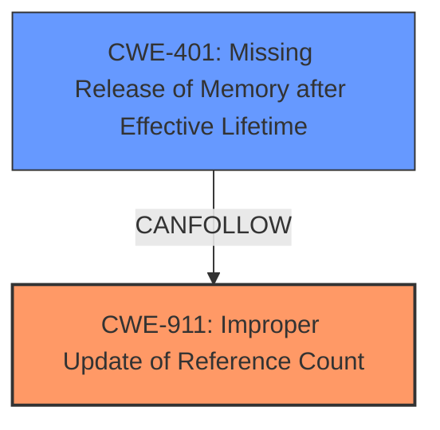

# Analysis Report for CVE-2025-22109

# Vulnerability Analysis Report: CVE-2025-22109

## Description

In the Linux kernel, the following vulnerability has been resolved ax25 Remove broken autobind Binding AX25 socket by using the autobind feature leads to memory leaks in ax25_connect() and also refcount leaks in ax25_release(). Memory leak was detected with kmemleak ================================================================ unreferenced object 0xffff8880253cd680 (size 96) backtrace __kmalloc_node_track_caller_noprof (./include/linux/kmemleak.h43) kmemdup_noprof (mm/util.c136) ax25_rt_autobind (net/ax25/ax25_route.c428) ax25_connect (net/ax25/af_ax25.c1282) __sys_connect_file (net/socket.c2045) __sys_connect (net/socket.c2064) __x64_sys_connect (net/socket.c2067) do_syscall_64 (arch/x86/entry/common.c52 arch/x86/entry/common.c83) entry_SYSCALL_64_after_hwframe (arch/x86/entry/entry_64.S130) ================================================================ When socket is bound, refcounts must be incremented the way it is done in ax25_bind() and ax25_setsockopt() (SO_BINDTODEVICE). In case of autobind, the refcounts are not incremented. This bug leads to the following issue reported by Syzkaller ================================================================ ax25_connect() syz-executor318 uses autobind, please contact jreuter@yaina.de ------------[ cut here ]------------ refcount_t decrement hit 0 leaking memory. WARNING CPU 0 PID 5317 at lib/refcount.c31 refcount_warn_saturate+0xfa/0x1d0 lib/refcount.c31 Modules linked in CPU 0 UID 0 PID 5317 Comm syz-executor318 Not tainted 6.14.0-rc4-syzkaller-00278-gece144f151ac #0 Hardware name QEMU Standard PC (Q35 + ICH9, 2009), BIOS 1.16.3-debian-1.16.3-2~bpo12+1 04/01/2014 RIP 0010refcount_warn_saturate+0xfa/0x1d0 lib/refcount.c31 ... Call Trace __refcount_dec include/linux/refcount.h336 [inline] refcount_dec include/linux/refcount.h351 [inline] ref_tracker_free+0x6af/0x7e0 lib/ref_tracker.c236 netdev_tracker_free include/linux/netdevice.h4302 [inline] netdev_put include/linux/netdevice.h4319 [inline] ax25_release+0x368/0x960 net/ax25/af_ax25.c1080 __sock_release net/socket.c647 [inline] sock_close+0xbc/0x240 net/socket.c1398 __fput+0x3e9/0x9f0 fs/file_table.c464 __do_sys_close fs/open.c1580 [inline] __se_sys_close fs/open.c1565 [inline] __x64_sys_close+0x7f/0x110 fs/open.c1565 do_syscall_x64 arch/x86/entry/common.c52 [inline] do_syscall_64+0xf3/0x230 arch/x86/entry/common.c83 entry_SYSCALL_64_after_hwframe+0x77/0x7f ... ================================================================ Considering the issues above and the comments left in the code that say check if we can remove this feature. It is broken. autobinding in this may or may not work - it is better to completely remove this feature than to fix it because it is broken and leads to various kinds of memory bugs. Now calling connect() without first binding socket will result in an error (-EINVAL). Userspace software that relies on the autobind feature might get broken. However, this feature does not seem widely used with this specific driver as it was not reliable at any point of time, and it is already broken anyway. E.g. ax25-tools and ax25-apps packages for popular distributions do not use the autobind feature for AF_AX25. Found by Linux Verification Center (linuxtesting.org) with Syzkaller.

## Vulnerability Description Key Phrases

- **Component:** ax25_connect()
- **Rootcause:** refcount leaks, unreferenced object, weakness
- **Product:** Linux kernel
- **Impact:** memory leaks, refcount leaks, unreferenced object

## Analysis (with Relationship Data)

# Summary
| CWE ID | CWE Name | Confidence | CWE Abstraction Level | CWE Vulnerability Mapping Label | CWE-Vulnerability Mapping Notes |
|---|---|---|---|---|---|
| CWE-911 | Improper Update of Reference Count | 0.9 | Base | Allowed | Primary CWE. The **root cause** is the incorrect handling of reference counts during autobinding. |
| CWE-401 | Missing Release of Memory after Effective Lifetime | 0.7 | Variant | Allowed | Secondary CWE. Memory is allocated but not properly released due to the autobind feature, resulting in a memory leak. |

## Evidence and Confidence

*   **Confidence Score:** 0.8
*   **Evidence Strength:** MEDIUM

## Relationship Analysis
The primary weakness is CWE-911, as the **improper updating of the reference count** leads directly to the memory leak. CWE-401 represents the impact of this **improper update**, specifically the **failure to release memory**. CWE-911 is a base CWE, providing a specific description of the reference count issue, while CWE-401 is a variant, detailing the memory leak consequence.



## Vulnerability Chain
The vulnerability chain starts with the **improper updating of reference counts** (CWE-911) during the autobinding process. This leads to resources not being properly tracked, ultimately resulting in the **missing release of memory** (CWE-401) and memory leaks.

## Summary of Analysis
The analysis focuses on the **root cause** of the memory leak reported in the Linux kernel's ax25 implementation. The key evidence lies in the description stating that "In case of autobind, the refcounts are not incremented." This indicates an **improper update of the reference count**, aligning perfectly with CWE-911. The subsequent memory leak is a direct consequence of this **improper update**, leading to the secondary mapping of CWE-401. The graph relationships helped visualize the progression from **improper reference counting to memory leak**, solidifying the selection of CWE-911 as the primary cause and CWE-401 as the result. Both CWEs are at appropriate levels of specificity.

Relevant CWE Information:

# Enhanced Context (25 CWEs)
The following CWEs were identified as potentially relevant to this vulnerability:

## CWE-909: Missing Initialization of Resource
**Abstraction Level**: Class
**Similarity Score**: 0.76
**Source**: dense

**Description**:
The product does not initialize a critical resource.

**Mapping Guidance**:
- Usage: Allowed-with-Review
- Rationale: This CWE entry is a Class and might have Base-level children that would be more appropriate

## CWE-401: Missing Release of Memory after Effective Lifetime
**Abstraction Level**: Variant
**Similarity Score**: 0.76
**Source**: dense

**Description**:
The product does not sufficiently track and release allocated memory after it has been used, which slowly consumes remaining memory.

**Mapping Guidance**:
- Usage: Allowed
- Rationale: This CWE entry is at the Variant level of abstraction, which is a preferred level of abstraction for mapping to the root causes of vulnerabilities.

## CWE-667: Improper Locking
**Abstraction Level**: Class
**Similarity Score**: 0.75
**Source**: dense

**Description**:
The product does not properly acquire or release a lock on a resource, leading to unexpected resource state changes and behaviors.

**Mapping Guidance**:
- Usage: Allowed-with-Review
- Rationale: This CWE entry is a Class and might have Base-level children that would be more appropriate

## CWE-911: Improper Update of Reference Count
**Abstraction Level**: Base
**Similarity Score**: 0.75
**Source**: dense

**Description**:
The product uses a reference count to manage a resource, but it does not update or incorrectly updates the reference count.

**Mapping Guidance**:
- Usage: Allowed
- Rationale: This CWE entry is at the Base level of abstraction, which is a preferred level of abstraction for mapping to the root causes of vulnerabilities.

## CWE-252: Unchecked Return Value
**Abstraction Level**: Base
**Similarity Score**: 0.75
**Source**: dense

**Description**:
The product does not check the return value from a method or function, which can prevent it from detecting unexpected states and conditions.

**Mapping Guidance**:
- Usage: Allowed
- Rationale: This CWE entry is at the Base level of abstraction, which is a preferred level of abstraction for mapping to the root causes of vulnerabilities.

## CWE-362: Concurrent Execution using Shared Resource with Improper Synchronization ('Race Condition')
**Abstraction Level**: Class
**Similarity Score**: 0.75
**Source**: dense

**Description**:
The product contains a concurrent code sequence that requires temporary, exclusive access to a shared resource, but a timing window exists in which the shared resource can be modified by another code sequence operating concurrently.

**Mapping Guidance**:
- Usage: Allowed-with-Review
- Rationale: This CWE entry is a Class and might have Base-level children that would be more appropriate

## CWE-131: Incorrect Calculation of Buffer Size
**Abstraction Level**: Base
**Similarity Score**: 0.74
**Source**: dense

**Description**:
The product does not correctly calculate the size to be used when allocating a buffer, which could lead to a buffer overflow.

**Mapping Guidance**:
- Usage: Allowed
- Rationale: This CWE entry is at the Base level of abstraction, which is a preferred level of abstraction for mapping to the root causes of vulnerabilities.

## CWE-476: NULL Pointer Dereference
**Abstraction Level**: Base
**Similarity Score**: 0.74
**Source**: dense

**Description**:
The product dereferences a pointer that it expects to be valid but is NULL.

**Mapping Guidance**:
- Usage: Allowed
- Rationale: This CWE entry is at the Base level of abstraction, which is a preferred level of abstraction for mapping to the root causes of vulnerabilities.

## CWE-789: Memory Allocation with Excessive Size Value
**Abstraction Level**: Variant
**Similarity Score**: 0.74
**Source**: dense

**Description**:
The product allocates memory based on an untrusted, large size value, but it does not ensure that the size is within expected limits, allowing arbitrary amounts of memory to be allocated.

**Mapping Guidance**:
- Usage: Allowed
- Rationale: This CWE entry is at the Variant level of abstraction, which is a preferred level of abstraction for mapping to the root causes of vulnerabilities.

## CWE-617: Reachable Assertion
**Abstraction Level**: Base
**Similarity Score**: 0.74
**Source**: dense

**Description**:
The product contains an assert() or similar statement that can be triggered by an attacker, which leads to an application exit or other behavior that is more severe than necessary.

**Mapping Guidance**:
- Usage: Allowed
- Rationale: This CWE entry is at the Base level of abstraction, which is a preferred level of abstraction for mapping to the root causes of vulnerabilities.

## CWE-362: Concurrent Execution using Shared Resource with Improper Synchronization ('Race Condition')
**Abstraction Level**: Class
**Similarity Score**: 804.38
**Source**: sparse

**Description**:
The product contains a concurrent code sequence that requires temporary, exclusive access to a shared resource, but a timing window exists in which the shared resource can be modified by another code sequence operating concurrently.

**Mapping Guidance**:
- Usage: Allowed-with-Review
- Rationale: This CWE entry is a Class and might have Base-level children that would be more appropriate

## CWE-415: Double Free
**Abstraction Level**: Variant
**Similarity Score**: 768.83
**Source**: sparse

**Description**:
The product calls free() twice on the same memory address, potentially leading to modification of unexpected memory locations.

**Mapping Guidance**:
- Usage: Allowed
- Rationale: This CWE entry is at the Variant level of abstraction, which is a preferred level of abstraction for mapping to the root causes of vulnerabilities.

## CWE-367: Time-of-check Time-of-use (TOCTOU) Race Condition
**Abstraction Level**: Base
**Similarity Score**: 756.95
**Source**: sparse

**Description**:
The product checks the state of a resource before using that resource, but the resource's state can change between the check and the use in a way that invalidates the results of the check. This can cause the product to perform invalid actions when the resource is in an unexpected state.

**Mapping Guidance**:
- Usage: Allowed
- Rationale: This CWE entry is at the Base level of abstraction, which is a preferred level of abstraction for mapping to the root causes of vulnerabilities.

##


## CWE Relationship Analysis

Current CWEs represent these abstraction levels: .


### Vulnerability Chain Analysis

**Chain starting from CWE-617:**
- 617 (Reachable Assertion) - ROOT


**Chain starting from CWE-911:**
- 911 (Improper Update of Reference Count) - ROOT


### CWE Relationship Diagram

```mermaid
graph TD
    classDef primary fill:#f96,stroke:#333,stroke-width:2px
    classDef secondary fill:#69f,stroke:#333
    classDef tertiary fill:#9e9,stroke:#333
```


*Report generated on 2025-07-14 10:15:26*
