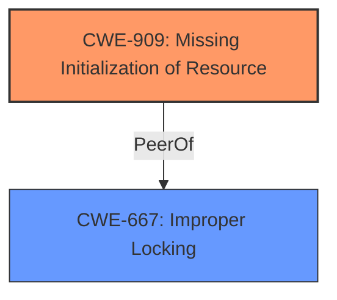

# Analysis Report for CVE-2025-22119

# Vulnerability Analysis Report: CVE-2025-22119

## Description

In the Linux kernel, the following vulnerability has been resolved wifi cfg80211 init wiphy_work before allocating rfkill fails syzbort reported a uninitialize wiphy_work_lock in cfg80211_dev_free. [1] After rfkill allocation fails, the wiphy release process will be performed, which will cause cfg80211_dev_free to access the uninitialized wiphy_work related data. Move the initialization of wiphy_work to before rfkill initialization to avoid this issue. [1] INFO trying to register non-static key. The code is fine but needs lockdep annotation, or maybe you didnt initialize this object before use? turning off the locking correctness validator. CPU 0 UID 0 PID 5935 Comm syz-executor550 Not tainted 6.14.0-rc6-syzkaller-00103-g4003c9e78778 #0 Hardware name QEMU Standard PC (Q35 + ICH9, 2009), BIOS 1.16.3-debian-1.16.3-2~bpo12+1 04/01/2014 Call Trace __dump_stack lib/dump_stack.c94 [inline] dump_stack_lvl+0x116/0x1f0 lib/dump_stack.c120 assign_lock_key kernel/locking/lockdep.c983 [inline] register_lock_class+0xc39/0x1240 kernel/locking/lockdep.c1297 __lock_acquire+0x135/0x3c40 kernel/locking/lockdep.c5103 lock_acquire.part.0+0x11b/0x380 kernel/locking/lockdep.c5851 __raw_spin_lock_irqsave include/linux/spinlock_api_smp.h110 [inline] _raw_spin_lock_irqsave+0x3a/0x60 kernel/locking/spinlock.c162 cfg80211_dev_free+0x30/0x3d0 net/wireless/core.c1196 device_release+0xa1/0x240 drivers/base/core.c2568 kobject_cleanup lib/kobject.c689 [inline] kobject_release lib/kobject.c720 [inline] kref_put include/linux/kref.h65 [inline] kobject_put+0x1e4/0x5a0 lib/kobject.c737 put_device+0x1f/0x30 drivers/base/core.c3774 wiphy_free net/wireless/core.c1224 [inline] wiphy_new_nm+0x1c1f/0x2160 net/wireless/core.c562 ieee80211_alloc_hw_nm+0x1b7a/0x2260 net/mac80211/main.c835 mac80211_hwsim_new_radio+0x1d6/0x54e0 drivers/net/wireless/virtual/mac80211_hwsim.c5185 hwsim_new_radio_nl+0xb42/0x12b0 drivers/net/wireless/virtual/mac80211_hwsim.c6242 genl_family_rcv_msg_doit+0x202/0x2f0 net/netlink/genetlink.c1115 genl_family_rcv_msg net/netlink/genetlink.c1195 [inline] genl_rcv_msg+0x565/0x800 net/netlink/genetlink.c1210 netlink_rcv_skb+0x16b/0x440 net/netlink/af_netlink.c2533 genl_rcv+0x28/0x40 net/netlink/genetlink.c1219 netlink_unicast_kernel net/netlink/af_netlink.c1312 [inline] netlink_unicast+0x53c/0x7f0 net/netlink/af_netlink.c1338 netlink_sendmsg+0x8b8/0xd70 net/netlink/af_netlink.c1882 sock_sendmsg_nosec net/socket.c718 [inline] __sock_sendmsg net/socket.c733 [inline] ____sys_sendmsg+0xaaf/0xc90 net/socket.c2573 ___sys_sendmsg+0x135/0x1e0 net/socket.c2627 __sys_sendmsg+0x16e/0x220 net/socket.c2659 do_syscall_x64 arch/x86/entry/common.c52 [inline] do_syscall_64+0xcd/0x250 arch/x86/entry/common.c83 Close https//syzkaller.appspot.com/bug?extid=aaf0488c83d1d5f4f029

## Vulnerability Description Key Phrases

- **Rootcause:** uninitialized wiphy_work_lock
- **Product:** Linux kernel
- **Component:** wifi cfg80211

## Analysis (with Relationship Data)

# Summary
| CWE ID | CWE Name | Confidence | CWE Abstraction Level | CWE Vulnerability Mapping Label | CWE-Vulnerability Mapping Notes |
|---|---|---|---|---|---|
| CWE-909 | Missing Initialization of Resource | 0.9 | Class | Primary | Allowed-with-Review |
| CWE-667 | Improper Locking | 0.7 | Class | Secondary | Allowed-with-Review |

## Evidence and Confidence

*   **Confidence Score:** 0.8
*   **Evidence Strength:** MEDIUM

## Relationship Analysis
The primary CWE is CWE-909, which is a Class-level CWE. While it's generally preferred to use Base or Variant level CWEs, in this case, the description clearly indicates a **missing initialization** problem. There isn't a more specific CWE available that fits better. CWE-667 is also considered because the **uninitialized resource** is related to locking, but CWE-909 is more directly related to the **root cause**.



## Vulnerability Chain
The vulnerability chain starts with the **missing initialization** of `wiphy_work_lock` (CWE-909). Because the `wiphy_work_lock` is not initialized, it leads to a locking issue (CWE-667) when `cfg80211_dev_free` attempts to access the **uninitialized** data, resulting in a crash.

## Summary of Analysis
The analysis is based on the provided vulnerability description, particularly the key phrase "**uninitialized wiphy_work_lock**". This directly points to CWE-909, Missing Initialization of Resource. The call trace further confirms that the issue occurs during the `cfg80211_dev_free` function, where the **uninitialized** `wiphy_work` related data is accessed. The retriever results also support CWE-909 as a strong candidate. While other CWEs like CWE-476 (NULL Pointer Dereference) or CWE-415 (Double Free) were considered, they don't accurately represent the **root cause** of the vulnerability, which is the **missing initialization**. The selection of CWE-909 is at the optimal level of specificity because there are no child CWEs that describe the specific type of resource that wasn't initialized.

Relevant CWE Information:

# Enhanced Context (25 CWEs)
The following CWEs were identified as potentially relevant to this vulnerability:

## CWE-824: Access of Uninitialized Pointer
**Abstraction Level**: Base
**Similarity Score**: 0.75
**Source**: dense

**Description**:
The product accesses or uses a pointer that has not been initialized.

**Mapping Guidance**:
- Usage: Allowed
- Rationale: This CWE entry is at the Base level of abstraction, which is a preferred level of abstraction for mapping to the root causes of vulnerabilities.


## CWE-909: Missing Initialization of Resource
**Abstraction Level**: Class
**Similarity Score**: 0.75
**Source**: dense

**Description**:
The product does not initialize a critical resource.

**Mapping Guidance**:
- Usage: Allowed-with-Review
- Rationale: This CWE entry is a Class and might have Base-level children that would be more appropriate


## CWE-667: Improper Locking
**Abstraction Level**: Class
**Similarity Score**: 0.75
**Source**: dense

**Description**:
The product does not properly acquire or release a lock on a resource, leading to unexpected resource state changes and behaviors.

**Mapping Guidance**:
- Usage: Allowed-with-Review
- Rationale: This CWE entry is a Class and might have Base-level children that would be more appropriate


## CWE-755: Improper Handling of Exceptional Conditions
**Abstraction Level**: Class
**Similarity Score**: 0.74
**Source**: dense

**Description**:
The product does not handle or incorrectly handles an exceptional condition.

**Mapping Guidance**:
- Usage: Discouraged
- Rationale: This CWE entry is a level-1 Class (i.e., a child of a Pillar). It might have lower-level children that would be more appropriate


## CWE-665: Improper Initialization
**Abstraction Level**: Class
**Similarity Score**: 0.74
**Source**: dense

**Description**:
The product does not initialize or incorrectly initializes a resource, which might leave the resource in an unexpected state when it is accessed or used.

**Mapping Guidance**:
- Usage: Discouraged
- Rationale: This CWE entry is a level-1 Class (i.e., a child of a Pillar). It might have lower-level children that would be more appropriate


## CWE-476: NULL Pointer Dereference
**Abstraction Level**: Base
**Similarity Score**: 0.74
**Source**: dense

**Description**:
The product dereferences a pointer that it expects to be valid but is NULL.

**Mapping Guidance**:
- Usage: Allowed
- Rationale: This CWE entry is at the Base level of abstraction, which is a preferred level of abstraction for mapping to the root causes of vulnerabilities.


## CWE-703: Improper Check or Handling of Exceptional Conditions
**Abstraction Level**: Pillar
**Similarity Score**: 0.74
**Source**: dense

**Description**:
The product does not properly anticipate or handle exceptional conditions that rarely occur during normal operation of the product.

**Mapping Guidance**:
- Usage: Discouraged
- Rationale: This CWE entry is extremely high-level, a Pillar.


## CWE-252: Unchecked Return Value
**Abstraction Level**: Base
**Similarity Score**: 0.74
**Source**: dense

**Description**:
The product does not check the return value from a method or function, which can prevent it from detecting unexpected states and conditions.

**Mapping Guidance**:
- Usage: Allowed
- Rationale: This CWE entry is at the Base level of abstraction, which is a preferred level of abstraction for mapping to the root causes of vulnerabilities.


## CWE-908: Use of Uninitialized Resource
**Abstraction Level**: Base
**Similarity Score**: 0.73
**Source**: dense

**Description**:
The product uses or accesses a resource that has not been initialized.

**Mapping Guidance**:
- Usage: Allowed
- Rationale: This CWE entry is at the Base level of abstraction, which is a preferred level of abstraction for mapping to the root causes of vulnerabilities.


## CWE-362: Concurrent Execution using Shared Resource with Improper Synchronization ('Race Condition')
**Abstraction Level**: Class
**Similarity Score**: 0.73
**Source**: dense

**Description**:
The product contains a concurrent code sequence that requires temporary, exclusive access to a shared resource, but a timing window exists in which the shared resource can be modified by another code sequence operating concurrently.

**Mapping Guidance**:
- Usage: Allowed-with-Review
- Rationale: This CWE entry is a Class and might have Base-level children that would be more appropriate


## CWE-667: Improper Locking
**Abstraction Level**: Class
**Similarity Score**: 571.85
**Source**: sparse

**Description**:
The product does not properly acquire or release a lock on a resource, leading to unexpected resource state changes and behaviors.

**Mapping Guidance**:
- Usage: Allowed-with-Review
- Rationale: This CWE entry is a Class and might have Base-level children that would be more appropriate


## CWE-415: Double Free
**Abstraction Level**: Variant
**Similarity Score**: 561.76
**Source**: sparse

**Description**:
The product calls free() twice on the same memory address, potentially leading to modification of unexpected memory locations.

**Mapping Guidance**:
- Usage: Allowed
- Rationale: This CWE entry is at the Variant level of abstraction, which is a preferred level of abstraction for mapping to the root causes of vulnerabilities.


## CWE-362: Concurrent Execution using Shared Resource with Improper Synchronization ('Race Condition')
**Abstraction Level**: Class
**Similarity Score**: 548.73
**Source**: sparse

**Description**:
The product contains a concurrent code sequence that requires temporary, exclusive access to a shared resource, but a timing window exists in which the shared resource can be modified by another code sequence operating concurrently.

**Mapping Guidance**:
- Usage: Allowed-with-Review
- Rationale: This CWE entry is a Class and might have Base-level children that would be more appropriate


## CWE-476: NULL Pointer Dereference
**Abstraction Level**: Base
**Similarity Score**: 547.79
**Source**: sparse

**Description**:
The product dereferences a pointer that it expects to be valid but is NULL.

**Mapping Guidance**:
- Usage: Allowed
- Rationale: This CWE entry is at the Base level of abstraction, which is a preferred level of


## CWE Relationship Analysis

Current CWEs represent these abstraction levels: .


### Vulnerability Chain Analysis

**Chain starting from CWE-476:**
- 476 (NULL Pointer Dereference) - ROOT


**Chain starting from CWE-703:**
- 703 (Improper Check or Handling of Exceptional Conditions) - ROOT


### CWE Relationship Diagram

```mermaid
graph TD
    classDef primary fill:#f96,stroke:#333,stroke-width:2px
    classDef secondary fill:#69f,stroke:#333
    classDef tertiary fill:#9e9,stroke:#333
```


*Report generated on 2025-07-14 10:16:12*
