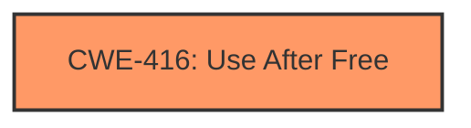

# Analysis Report for CVE-2025-22121

# Vulnerability Analysis Report: CVE-2025-22121

## Description

In the Linux kernel, the following vulnerability has been resolved ext4 fix out-of-bound read in ext4_xattr_inode_dec_ref_all() Theres issue as follows BUG KASAN **use-after-free** in ext4_xattr_inode_dec_ref_all+0x6ff/0x790 Read of size 4 at addr ffff88807b003000 by task syz-executor.0/15172 CPU 3 PID 15172 Comm syz-executor.0 Call Trace __dump_stack lib/dump_stack.c82 [inline] dump_stack+0xbe/0xfd lib/dump_stack.c123 print_address_description.constprop.0+0x1e/0x280 mm/kasan/report.c400 __kasan_report.cold+0x6c/0x84 mm/kasan/report.c560 kasan_report+0x3a/0x50 mm/kasan/report.c585 ext4_xattr_inode_dec_ref_all+0x6ff/0x790 fs/ext4/xattr.c1137 ext4_xattr_delete_inode+0x4c7/0xda0 fs/ext4/xattr.c2896 ext4_evict_inode+0xb3b/0x1670 fs/ext4/inode.c323 evict+0x39f/0x880 fs/inode.c622 iput_final fs/inode.c1746 [inline] iput fs/inode.c1772 [inline] iput+0x525/0x6c0 fs/inode.c1758 ext4_orphan_cleanup fs/ext4/super.c3298 [inline] ext4_fill_super+0x8c57/0xba40 fs/ext4/super.c5300 mount_bdev+0x355/0x410 fs/super.c1446 legacy_get_tree+0xfe/0x220 fs/fs_context.c611 vfs_get_tree+0x8d/0x2f0 fs/super.c1576 do_new_mount fs/namespace.c2983 [inline] path_mount+0x119a/0x1ad0 fs/namespace.c3316 do_mount+0xfc/0x110 fs/namespace.c3329 __do_sys_mount fs/namespace.c3540 [inline] __se_sys_mount+0x219/0x2e0 fs/namespace.c3514 do_syscall_64+0x33/0x40 arch/x86/entry/common.c46 entry_SYSCALL_64_after_hwframe+0x67/0xd1 Memory state around the buggy address ffff88807b002f00 00 00 00 00 00 00 00 00 00 00 00 00 00 00 00 00 ffff88807b002f80 00 00 00 00 00 00 00 00 00 00 00 00 00 00 00 00 >ffff88807b003000 ff ff ff ff ff ff ff ff ff ff ff ff ff ff ff ff ^ ffff88807b003080 ff ff ff ff ff ff ff ff ff ff ff ff ff ff ff ff ffff88807b003100 ff ff ff ff ff ff ff ff ff ff ff ff ff ff ff ff Above issue happens as ext4_xattr_delete_inode() isnt check xattr is valid if xattr is in inode. To solve above issue call xattr_check_inode() check if xattr if valid in inode. In fact, we can directly verify in ext4_iget_extra_inode(), so that there is no divergent verification.

## Vulnerability Description Key Phrases

- **Weakness:** use-after-free
- **Product:** Linux kernel
- **Component:** ext4_xattr_inode_dec_ref_all

## Analysis (with Relationship Data)

# Summary
| CWE ID  | CWE Name                                                   | Confidence | CWE Abstraction Level | CWE Vulnerability Mapping Label | CWE-Vulnerability Mapping Notes |
| :-------- | :--------------------------------------------------------- | :--------- | :-------------------- | :------------------------------ | :------------------------------ |
| CWE-416   | Use After Free                                             | 1.0        | Variant               | Primary                         | Allowed                       |

## Evidence and Confidence

*   **Confidence Score:** 1.0
*   **Evidence Strength:** HIGH

## Relationship Analysis
The primary relationship that impacted the decision was the direct identification of a "use-after-free" condition in the vulnerability description. This aligns directly with CWE-416. No other relationships were significant in this case.



## Vulnerability Chain
The vulnerability chain is straightforward:
1.  **Root Cause:** **Use-after-free** in `ext4_xattr_inode_dec_ref_all()`.
2.  Impact: Read of size 4 at a specific memory address, leading to a crash.

## Summary of Analysis
The vulnerability description clearly states a **use-after-free** condition. The KASAN report confirms this with a "Read of size 4" at a specific memory address. The suggested fix involves validating the xattr to prevent the **use-after-free**. This evidence strongly supports the selection of CWE-416 as the primary weakness.

The retriever results also lists CWE-416 as the top match with a score of 1.000, further solidifying the choice.

Relevant CWE Information:

# Enhanced Context (25 CWEs)
The following CWEs were identified as potentially relevant to this vulnerability:

## CWE-667: Improper Locking
**Abstraction Level**: Class
**Similarity Score**: 0.77
**Source**: dense

**Description**:
The product does not properly acquire or release a lock on a resource, leading to unexpected resource state changes and behaviors.

**Mapping Guidance**:
- Usage: Allowed-with-Review
- Rationale: This CWE entry is a Class and might have Base-level children that would be more appropriate


## CWE-252: Unchecked Return Value
**Abstraction Level**: Base
**Similarity Score**: 0.76
**Source**: dense

**Description**:
The product does not check the return value from a method or function, which can prevent it from detecting unexpected states and conditions.

**Mapping Guidance**:
- Usage: Allowed
- Rationale: This CWE entry is at the Base level of abstraction, which is a preferred level of abstraction for mapping to the root causes of vulnerabilities.


## CWE-754: Improper Check for Unusual or Exceptional Conditions
**Abstraction Level**: Class
**Similarity Score**: 0.76
**Source**: dense

**Description**:
The product does not check or incorrectly checks for unusual or exceptional conditions that are not expected to occur frequently during day to day operation of the product.

**Mapping Guidance**:
- Usage: Allowed-with-Review
- Rationale: This CWE entry is a Class and might have Base-level children that would be more appropriate


## CWE-824: Access of Uninitialized Pointer
**Abstraction Level**: Base
**Similarity Score**: 0.75
**Source**: dense

**Description**:
The product accesses or uses a pointer that has not been initialized.

**Mapping Guidance**:
- Usage: Allowed
- Rationale: This CWE entry is at the Base level of abstraction, which is a preferred level of abstraction for mapping to the root causes of vulnerabilities.


## CWE-703: Improper Check or Handling of Exceptional Conditions
**Abstraction Level**: Pillar
**Similarity Score**: 0.75
**Source**: dense

**Description**:
The product does not properly anticipate or handle exceptional conditions that rarely occur during normal operation of the product.

**Mapping Guidance**:
- Usage: Discouraged
- Rationale: This CWE entry is extremely high-level, a Pillar.


## CWE-41: Improper Resolution of Path Equivalence
**Abstraction Level**: Base
**Similarity Score**: 0.75
**Source**: dense

**Description**:
The product is vulnerable to file system contents disclosure through path equivalence. Path equivalence involves the use of special characters in file and directory names. The associated manipulations are intended to generate multiple names for the same object.

**Mapping Guidance**:
- Usage: Allowed
- Rationale: This CWE entry is at the Base level of abstraction, which is a preferred level of abstraction for mapping to the root causes of vulnerabilities.


## CWE-665: Improper Initialization
**Abstraction Level**: Class
**Similarity Score**: 0.74
**Source**: dense

**Description**:
The product does not initialize or incorrectly initializes a resource, which might leave the resource in an unexpected state when it is accessed or used.

**Mapping Guidance**:
- Usage: Discouraged
- Rationale: This CWE entry is a level-1 Class (i.e., a child of a Pillar). It might have lower-level children that would be more appropriate


## CWE-1391: Use of Weak Credentials
**Abstraction Level**: Class
**Similarity Score**: 0.74
**Source**: dense

**Description**:
The product uses weak credentials (such as a default key or hard-coded password) that can be calculated, derived, reused, or guessed by an attacker.

**Mapping Guidance**:
- Usage: Allowed-with-Review
- Rationale: This CWE entry is a Class and might have Base-level children that would be more appropriate


## CWE-362: Concurrent Execution using Shared Resource with Improper Synchronization ('Race Condition')
**Abstraction Level**: Class
**Similarity Score**: 0.74
**Source**: dense

**Description**:
The product contains a concurrent code sequence that requires temporary, exclusive access to a shared resource, but a timing window exists in which the shared resource can be modified by another code sequence operating concurrently.

**Mapping Guidance**:
- Usage: Allowed-with-Review
- Rationale: This CWE entry is a Class and might have Base-level children that would be more appropriate


## CWE-125: Out-of-bounds Read
**Abstraction Level**: Base
**Similarity Score**: 0.74
**Source**: dense

**Description**:
The product reads data past the end, or before the beginning, of the intended buffer.

**Mapping Guidance**:
- Usage: Allowed
- Rationale: This CWE entry is at the Base level of abstraction, which is a preferred level of abstraction for mapping to the root causes of vulnerabilities.


## CWE-288: Authentication Bypass Using an Alternate Path or Channel
**Abstraction Level**: Base
**Similarity Score**: 568.13
**Source**: sparse

**Description**:
The product requires authentication, but the product has an alternate path or channel that does not require authentication.

**Mapping Guidance**:
- Usage: Allowed
- Rationale: This CWE entry is at the Base level of abstraction, which is a preferred level of abstraction for mapping to the root causes of vulnerabilities.


## CWE-912: Hidden Functionality
**Abstraction Level**: Class
**Similarity Score**: 546.23
**Source**: sparse

**Description**:
The product contains functionality that is not documented, not part of the specification, and not accessible through an interface or command sequence that is obvious to the product's users or administrators.

**Mapping Guidance**:
- Usage: Allowed-with-Review
- Rationale: This CWE entry is a Class and might have Base-level children that would be more appropriate


## CWE-763: Release of Invalid Pointer or Reference
**Abstraction Level**: Base
**Similarity Score**: 513.76
**Source**: sparse

**Description**:
The product attempts to return a memory resource to the system, but it calls the wrong release function or calls the appropriate release function incorrectly.

**Mapping Guidance**:
- Usage: Allowed
- Rationale: This CWE entry is at the Base level of abstraction, which is a preferred level of abstraction for mapping to the root causes of vulnerabilities.


## CWE-294: Authentication Bypass by Capture-replay
**Abstraction Level**: Base
**Similarity Score**: 510.36
**Source**: sparse

**Description**:
A capture-replay flaw exists when the design of the product makes it possible for a malicious user to sniff network traffic and bypass authentication by replaying it to the server in question to the same effect as the original message (or with minor changes).

**Mapping Guidance**:
- Usage: Allowed
- Rationale: This CWE entry is at the Base level of abstraction, which is a preferred level of abstraction for mapping to the root causes of vulnerabilities.


## CWE-158: Improper Neutralization of Null Byte or NUL Character
**Abstraction Level**: Variant
**Similarity Score**: 497.44
**Source**: sparse

**Description**:
The product receives input from an upstream component, but it does not neutralize or incorrectly neutralizes NUL characters or null bytes when they are sent to a downstream component.

**Mapping Guidance**:
- Usage: Allowed
- Rationale: This CWE entry is at the Variant level of abstraction


## CWE Relationship Analysis

Current CWEs represent these abstraction levels: .


### Vulnerability Chain Analysis

**Chain starting from CWE-665:**
- 665 (Improper Initialization) - ROOT


**Chain starting from CWE-288:**
- 288 (Authentication Bypass Using an Alternate Path or Channel) - ROOT


### CWE Relationship Diagram

```mermaid
graph TD
    classDef primary fill:#f96,stroke:#333,stroke-width:2px
    classDef secondary fill:#69f,stroke:#333
    classDef tertiary fill:#9e9,stroke:#333
```


*Report generated on 2025-07-14 10:16:35*
