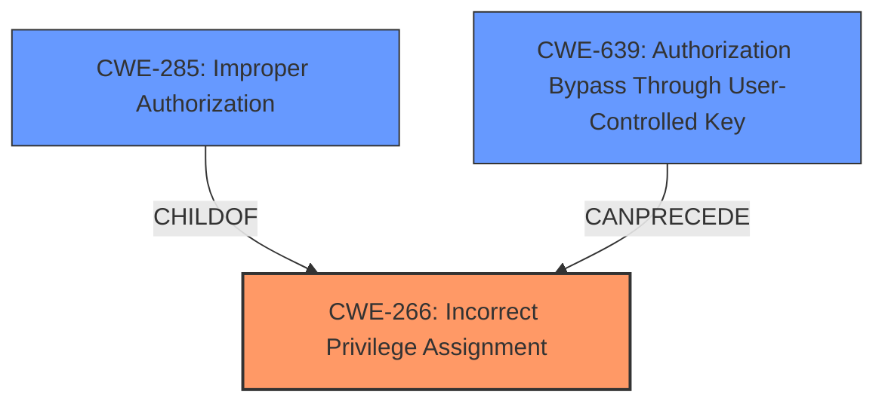

# Analysis for CVE-2025-2218

# Summary

| CWE ID | CWE Name | Confidence | CWE Abstraction Level | CWE Vulnerability Mapping Label | CWE-Vulnerability Mapping Notes |
|---|---|---|---|---|---|
| CWE-266 | Incorrect Privilege Assignment | 0.9 | Base | Allowed | Primary CWE. The vulnerability involves a flaw in how privileges are assigned, allowing unauthorized access. |

## Evidence and Confidence

*   **Confidence Score:** 0.9
*   **Evidence Strength:** HIGH

## Relationship Analysis
The primary CWE selected is CWE-266, Incorrect Privilege Assignment. While other CWEs like CWE-285 (Improper Authorization) and CWE-639 (Authorization Bypass Through User-Controlled Key) were considered, CWE-266 aligns most directly with the described root cause of **improper access controls**. There are no direct parent-child or chain relationships explicitly stated, but CWE-266 can often precede vulnerabilities related to authorization bypass or privilege escalation. Abstraction level considerations favored the base-level CWE-266 for its specificity.

## Vulnerability Chain
The vulnerability chain starts with **incorrect privilege assignment** (CWE-266). This leads to **improper access controls**, allowing remote attackers to perform unauthorized actions.
  - Root Cause: CWE-266
  - Impact: Unauthorized Access

## Summary of Analysis
The initial analysis focused on identifying the root cause of the vulnerability, which is described as **improper access controls**. The phrase "**improper access controls**" clearly indicates a problem with how privileges are assigned and managed within the application.

The retriever results suggested several candidate CWEs, including CWE-89 (Improper Neutralization of Special Elements used in an SQL Command ('SQL Injection')), CWE-79 (Improper Neutralization of Input During Web Page Generation ('Cross-site Scripting')), and CWE-285 (Improper Authorization). However, these CWEs focus on different types of vulnerabilities, such as injection flaws or general authorization issues. The description does not indicate an injection flaw, making CWE-89 and CWE-79 less suitable. CWE-285 is a class-level CWE, and it's less specific than CWE-266.

CWE-266 (Incorrect Privilege Assignment) directly addresses the root cause of "**improper access controls**." This CWE describes a scenario where privileges are incorrectly assigned, leading to unauthorized access. This aligns perfectly with the vulnerability description.

Therefore, based on the evidence provided and the CWE specifications, CWE-266 is the most appropriate CWE for this vulnerability. The selection is at the optimal level of specificity (Base) and is directly supported by the vulnerability description.