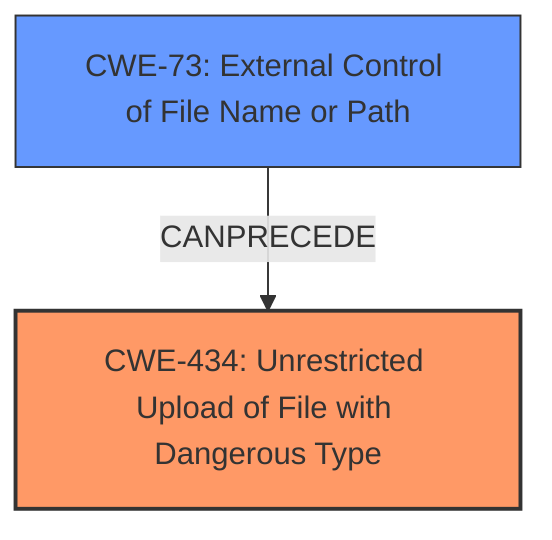

# Raw Analyzer Response for CVE-2025-2219

# Summary
| CWE ID | CWE Name | Confidence | CWE Abstraction Level | CWE Vulnerability Mapping Label | CWE-Vulnerability Mapping Notes |
|---|---|---|---|---|---|
| CWE-434 | Unrestricted Upload of File with Dangerous Type | 1.0 | Base | Allowed | Primary CWE |

## Evidence and Confidence

*   **Confidence Score:** 1.0
*   **Evidence Strength:** HIGH

## Relationship Analysis
The primary CWE is CWE-434, which is a Base level CWE. There are several related CWEs, particularly CWE-73 (External Control of File Name or Path) and CWE-430 (Insecurely Controlled Filename). The relationships suggest a possible chain involving external control of the filename leading to unrestricted upload of dangerous files.

## Vulnerability Chain
The vulnerability chain starts with the **manipulation of the file argument**, leading to the **unrestricted upload** of files.
- **Root Cause:** CWE-434 (Unrestricted Upload of File with Dangerous Type)

## Summary of Analysis
The vulnerability description clearly states that the **manipulation of the file argument** leads to **unrestricted upload**. This directly matches the description of CWE-434 (Unrestricted Upload of File with Dangerous Type). The evidence from the vulnerability description is strong and directly supports this classification. The retriever results also support CWE-434 as a highly relevant CWE.

Relevant CWE Information:

# Enhanced Context (25 CWEs)
The following CWEs were identified as potentially relevant to this vulnerability:

## CWE-434: Unrestricted Upload of File with Dangerous Type
**Abstraction Level**: Base
**Similarity Score**: 0.78
**Source**: dense

**Description**:
The product allows the upload or transfer of dangerous file types that are automatically processed within its environment.

**Mapping Guidance**:
- Usage: Allowed
- Rationale: This CWE entry is at the Base level of abstraction, which is a preferred level of abstraction for mapping to the root causes of vulnerabilities.

Based on the vulnerability details, the most appropriate CWE is:

*   **CWE-434: Unrestricted Upload of File with Dangerous Type**
    *   The vulnerability description explicitly mentions "**unrestricted upload**" as a key impact.
    *   The attack vector involves manipulating the 'file' argument, which directly relates to uploading files.
    *   This CWE is at the Base level of abstraction, which is preferred.
    *   The description of CWE-434 perfectly aligns with the vulnerability: "The product allows the upload or transfer of dangerous file types that are automatically processed within its environment."
    *   Confidence Level: 1.0

CWEs considered but not used:

*   CWE-89, CWE-79, CWE-1336, CWE-116, CWE-73: While these CWEs were present in the Retriever Results, they relate to SQL Injection, Cross-Site Scripting, Template Injection, Improper Encoding, and External Control of File Name or Path respectively. These do not directly address the root cause of the **unrestricted upload**, although some of them could be related as secondary weaknesses or potential consequences.
*   CWE-306: Missing Authentication for Critical Function is a plausible secondary weakness, but the description focuses on the **unrestricted upload** itself.
*   CWE-646: Reliance on File Name or Extension of Externally-Supplied File is also plausible, but CWE-434 is a more direct match.