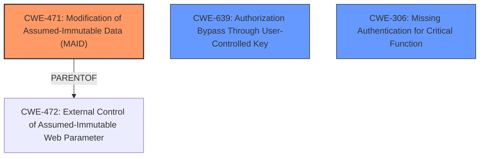

# Analysis Report for CVE-2025-2220

# Vulnerability Analysis Report: CVE-2025-2220

## Description

A vulnerability was found in Odyssey CMS up to 10.34. It has been classified as problematic. Affected is an unknown function of the file /modules/odyssey_contact_form/odyssey_contact_form.php of the component reCAPTCHA Handler. The manipulation of the argument g-recaptcha-response leads to **key management error**. Local access is required to approach this attack. The exploit has been disclosed to the public and may be used. The vendor was contacted early about this disclosure but did not respond in any way.

## Vulnerability Description Key Phrases

- **Weakness:** key management error
- **Product:** Odyssey CMS
- **Version:** up to 10.34
- **Component:** /modules/odyssey_contact_form/odyssey_contact_form.php

## Analysis (with Relationship Data)

# Summary
| CWE ID | CWE Name | Confidence | CWE Abstraction Level | CWE Vulnerability Mapping Label | CWE-Vulnerability Mapping Notes |
|---|---|---|---|---|---|
| CWE-471 | Modification of Assumed-Immutable Data (MAID) | 0.6 | Base | Allowed | Primary CWE. The vulnerability involves the manipulation of the 'g-recaptcha-response' argument, which should be immutable. |
| CWE-639 | Authorization Bypass Through User-Controlled Key | 0.4 | Base | Allowed | Secondary candidate. Modifying the 'g-recaptcha-response' could potentially bypass authorization. |
| CWE-306 | Missing Authentication for Critical Function | 0.3 | Base | Allowed | Secondary candidate. The reCAPTCHA may be a critical authentication function. |

## Evidence and Confidence

*   **Confidence Score:** 0.6
*   **Evidence Strength:** LOW

## Relationship Analysis
The primary CWE is CWE-471, Modification of Assumed-Immutable Data (MAID). CWE-471 has a parent-child relationship with CWE-472 (External Control of Assumed-Immutable Web Parameter). The vulnerability can also be seen as related to authorization bypass, which leads to considering CWE-639 (Authorization Bypass Through User-Controlled Key) and CWE-306 (Missing Authentication for Critical Function). The low confidence is due to the lack of sufficient rootcause evidence in the description.



## Vulnerability Chain
1.  The initial **weakness** is the **key management error** due to manipulation of the `g-recaptcha-response` parameter.
2.  This manipulation leads to **Modification of Assumed-Immutable Data** (CWE-471).
3.  Potentially, this could lead to **Authorization Bypass** (CWE-639) or **Missing Authentication for Critical Function** (CWE-306).
4.  The final impact is not explicitly stated, but could involve unauthorized access or actions.

## Summary of Analysis
The primary assigned CWE is CWE-471, Modification of Assumed-Immutable Data (MAID), as the vulnerability description explicitly states the manipulation of the `g-recaptcha-response` parameter, which should be treated as immutable. The statement about **key management error** also supports this.

The evidence is based on the "**weakness:** **key management error**" and "The manipulation of the argument g-recaptcha-response".

CWE-639 (Authorization Bypass Through User-Controlled Key) and CWE-306 (Missing Authentication for Critical Function) were considered as secondary CWEs because the manipulation of the reCAPTCHA response could potentially lead to bypassing authorization checks or indicate a missing authentication mechanism. However, the provided information does not definitively confirm these scenarios, hence the lower confidence.

The selected CWEs are at the base level of abstraction, which is preferred, and accurately represents the identified **weakness**. Other CWEs were considered but not selected due to a lack of direct evidence in the vulnerability description.

CWE-79 and CWE-89 were not selected because there is no evidence of improper neutralization of input leading to Cross-site Scripting or SQL Injection. Similarly, CWE-1336 was not selected as there is no direct mention of a template engine being involved.


## CWE Relationship Analysis

Current CWEs represent these abstraction levels: .


### Vulnerability Chain Analysis

**Chain starting from CWE-471:**
- 471 (Modification of Assumed-Immutable Data (MAID)) - ROOT


**Chain starting from CWE-89:**
- 89 (Improper Neutralization of Special Elements used in an SQL Command ('SQL Injection')) - ROOT


### CWE Relationship Diagram

```mermaid
graph TD
    classDef primary fill:#f96,stroke:#333,stroke-width:2px
    classDef secondary fill:#69f,stroke:#333
    classDef tertiary fill:#9e9,stroke:#333
```


*Report generated on 2025-07-14 10:20:04*
