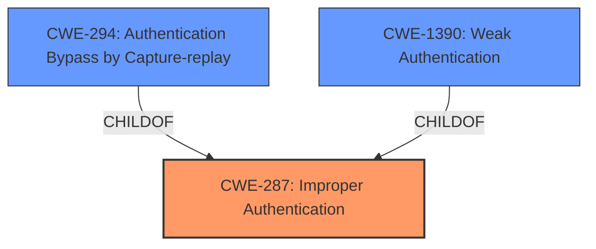

# Enhanced Analysis for CVE-2025-2230

# Summary
| CWE ID | CWE Name | Confidence | CWE Abstraction Level | CWE Vulnerability Mapping Label | CWE-Vulnerability Mapping Notes |
|---|---|---|---|---|---|
| CWE-287 | Improper Authentication | 0.8 | Class |  Primary CWE | Discouraged |
| CWE-294 | Authentication Bypass by Capture-replay | 0.5 | Base | Secondary Candidate | Allowed |

## Evidence and Confidence

*   **Confidence Score:** 0.7
*   **Evidence Strength:** LOW

## Relationship Analysis
The primary relationship identified is that CWE-287 is a class-level CWE, and several more specific CWEs, such as CWE-294, could be considered as potential child CWEs. The analysis focuses on authentication bypass, making authentication-related CWEs relevant.



## Vulnerability Chain
The vulnerability chain involves a **flaw in the Windows login flow** which leads to an **authentication bypass** through **replay attacks**. The root cause is the **improper authentication**, allowing the **AuthContext token** to be exploited.
  - Root Cause: **Improper Authentication (CWE-287)**
  - Mechanism: Replay Attack
  - Impact: Authentication Bypass

## Summary of Analysis
The initial assessment points to an authentication issue within the Windows login flow. The primary concern is the ability to bypass authentication using replay attacks on the AuthContext token.

The selection of CWE-287 is based on the vulnerability description indicating an **improper authentication** mechanism. However, due to the lack of detailed information in the "CVE Reference Links Content Summary", there's some uncertainty. Without more rootcause information, a more specific CWE is difficult to confirm.

CWE-294 (Authentication Bypass by Capture-replay) is a strong candidate because the vulnerability description mentions replay attacks, but there is no supporting evidence to confirm this.

Relevant CWE Information:

# Enhanced Context (25 CWEs)
The following CWEs were identified as potentially relevant to this vulnerability:

## CWE-287: Improper Authentication
**Abstraction Level**: Class
**Similarity Score**: 0.800
**Source**: alternate_terms

**Description**:
The product performs authentication, but there is a flaw in the authentication logic that allows attackers to bypass authentication.

**Mapping Guidance**:
- Usage: Discouraged
- Rationale: CWE-287 is a very general class. More specific children are strongly preferred.

## CWE-294: Authentication Bypass by Capture-replay
**Abstraction Level**: Base
**Similarity Score**: 0.051
**Source**: sparse

**Description**:
A capture-replay flaw exists when the design of the product makes it possible for a malicious user to sniff network traffic and bypass authentication by replaying it to the server in question to the same effect as the original message (or with minor changes).

**Mapping Guidance**:
- Usage: Allowed
- Rationale: This CWE entry is at the Base level of abstraction, which is a preferred level of abstraction for mapping to the root causes of vulnerabilities.

## CWE-1390: Weak Authentication
**Abstraction Level**: Class
**Similarity Score**: 0.051
**Source**: sparse

**Description**:
The product uses an authentication mechanism to restrict access to specific users or identities, but the mechanism does not sufficiently prove that the claimed identity is correct.

**Mapping Guidance**:
- Usage: Allowed-with-Review
- Rationale: This CWE entry is a Class and might have Base-level children that would be more appropriate

## CWE-201: Insertion of Sensitive Information Into Sent Data
**Abstraction Level**: Base
**Similarity Score**: 0.046
**Source**: sparse

**Description**:
CWE-201: Insertion of Sensitive Information Into Sent Data

**Mapping Guidance**:
- Usage: Allowed
- Rationale: This CWE entry is at the Base level of abstraction, which is a preferred level of abstraction for mapping to the root causes of vulnerabilities.

## CWE-1391: Use of Weak Credentials
**Abstraction Level**: Class
**Similarity Score**: 0.046
**Source**: sparse

**Description**:
The product uses weak credentials (such as a default key or hard-coded password) that can be calculated, derived, reused, or guessed by an attacker.

**Mapping Guidance**:
- Usage: Allowed-with-Review
- Rationale: This CWE entry is a Class and might have Base-level children that would be more appropriate

## CWE-522: Insufficiently Protected Credentials
**Abstraction Level**: Class
**Similarity Score**: 0.045
**Source**: sparse

**Description**:
The product stores credentials in a way that is not sufficiently protected, which can allow an attacker to obtain the credentials and use them to gain unauthorized access to the system.

**Mapping Guidance**:
- Usage: Allowed-with-Review
- Rationale: This CWE entry is a Class and might have Base-level children that would be more appropriate

## CWE-306: Missing Authentication for Critical Function
**Abstraction Level**: Base
**Similarity Score**: 0.045
**Source**: sparse

**Description**:
The product does not perform any authentication for functionality that requires a provable user identity or consumes a significant amount of resources.

**Mapping Guidance**:
- Usage: Allowed
- Rationale: This CWE entry is at the Base level of abstraction, which is a preferred level of abstraction for mapping to the root causes of vulnerabilities.

## CWE-208: Observable Timing Discrepancy
**Abstraction Level**: Base
**Similarity Score**: 0.045
**Source**: sparse

**Description**:
CWE-208: Observable Timing Discrepancy

**Mapping Guidance**:
- Usage: Allowed
- Rationale: This CWE entry is at the Base level of abstraction, which is a preferred level of abstraction for mapping to the root causes of vulnerabilities.

## CWE-289: Authentication Bypass by Alternate Name
**Abstraction Level**: base
**Similarity Score**: 0.568
**Source**: dense

**Description**:
CWE-289: Authentication Bypass by Alternate Name

**Mapping Guidance**:
- Usage: Allowed
- Rationale: This CWE entry is at the Base level of abstraction, which is a preferred level of abstraction for mapping to the root causes of vulnerabilities.

**Relationships**:
- CANFOLLOW -> CWE-52
- CANFOLLOW -> CWE-46
- CANFOLLOW -> CWE-178
- CANFOLLOW -> CWE-173
- CHILDOF -> CWE-1390

## CWE-178: Improper Handling of Case Sensitivity
**Abstraction Level**: Base
**Similarity Score**: 0.002
**Source**: graph

**Description**:
The product does not properly account for differences in case sensitivity when accessing or determining the properties of a resource, leading to inconsistent results.

**Mapping Guidance**:
- Usage: Allowed
- Rationale: This CWE entry is at the Base level of abstraction, which is a preferred level of abstraction for mapping to the root causes of vulnerabilities.

**Relationships**:
- CANPRECEDE -> CWE-289
- CANPRECEDE -> CWE-433
- CHILDOF -> CWE-706
- CHILDOF -> CWE-706
- PARENTOF -> CWE-178

CWE-287 is chosen as the primary CWE because the vulnerability involves a flaw in the authentication logic. CWE-294 is a secondary candidate because replay attacks are mentioned. The other CWEs were not chosen because there isn't enough evidence to support them.


## CWE Relationship Analysis

Current CWEs represent these abstraction levels: .


### Vulnerability Chain Analysis

**Chain starting from CWE-1390:**
- 1390 (Weak Authentication) - ROOT


**Chain starting from CWE-46:**
- 46 (Path Equivalence: 'filename ' (Trailing Space)) - ROOT


### CWE Relationship Diagram

```mermaid
graph TD
    classDef primary fill:#f96,stroke:#333,stroke-width:2px
    classDef secondary fill:#69f,stroke:#333
    classDef tertiary fill:#9e9,stroke:#333
```