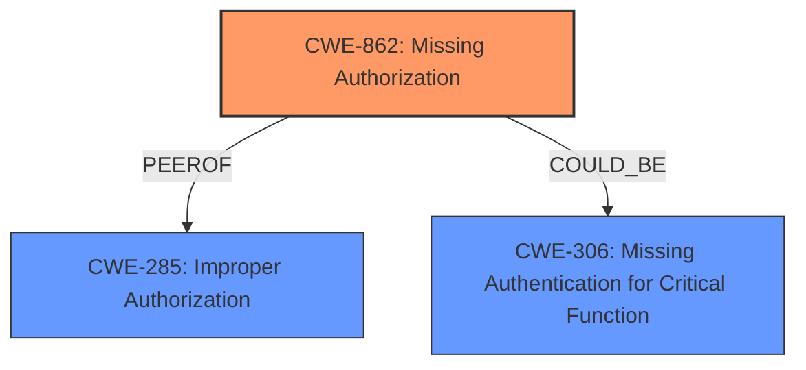

# Analysis for CVE-2025-2237

# Summary
| CWE ID | CWE Name | Confidence | CWE Abstraction Level | CWE Vulnerability Mapping Label | CWE-Vulnerability Mapping Notes |
|---|---|---|---|---|---|
| CWE-862 | Missing Authorization | 0.9 | Class | Allowed-with-Review | Primary CWE: The vulnerability is due to **insufficient role restrictions** in a function, indicating a missing authorization check. |
| CWE-306 | Missing Authentication for Critical Function | 0.7 | Base | Allowed | Secondary candidate: Could be considered if the registration function lacked *any* authentication, but the description focuses on role restrictions *after* a user attempts to register. |
| CWE-285 | Improper Authorization | 0.6 | Class | Discouraged | Secondary candidate: A more general authorization issue, but CWE-862 is more specific. |

## Evidence and Confidence

*   **Confidence Score:** 0.8
*   **Evidence Strength:** HIGH

## Relationship Analysis
The primary relationship that influenced the decision was the guidance on distinguishing between authentication and authorization issues. The description clearly indicates that the vulnerability stems from a lack of proper role checks during the registration process, which falls under authorization rather than authentication. Therefore, CWE-862 is a more precise classification than CWE-306.

## Vulnerability Chain
The vulnerability chain starts with **insufficient role restrictions** (CWE-862) in the `process_register` function, leading to the ability for unauthenticated attackers to register an account with the Administrator role.

## Summary of Analysis
The initial analysis focused on identifying the root cause of the vulnerability. The key phrase **"insufficient role restrictions in the process_register function"** points towards a missing authorization check. This aligns with CWE-862, which describes a situation where the application doesn't check whether the user is authorized at all. The guidance provided further reinforced this decision by highlighting the difference between authentication (CWE-306) and authorization (CWE-862). Because the issue is **insufficient role restrictions**, and not a complete lack of authentication, CWE-862 is the more accurate choice.

The evidence is based on the following vulnerability description:

> "The WP RealEstate plugin for WordPress... is vulnerable to **authentication bypass**... This is due to **insufficient role restrictions in the process_register function**. This makes it possible for unauthenticated attackers to register an account with the Administrator role."

CWE-862 is at the appropriate level of specificity as it directly addresses the missing authorization check. While CWE-285 (Improper Authorization) could also be considered, it is a more general category. Similarly, CWE-306 (Missing Authentication for Critical Function) is less appropriate because the issue is not a complete lack of authentication but rather a failure to properly restrict roles.

Relevant CWE Information:

# Enhanced Context (25 CWEs)
The following CWEs were identified as potentially relevant to this vulnerability:

## CWE-862: Missing Authorization
**Abstraction Level**: Class
**Similarity Score**: 0.406 (sparse)
**Description**: The product does not perform an authorization check when an actor attempts to access a resource or perform an action.
**Mapping Guidance**: Allowed-with-Review

## CWE-306: Missing Authentication for Critical Function
**Abstraction Level**: Base
**Similarity Score**: 0.377 (sparse)
**Description**: The product does not perform any authentication for functionality that requires a provable user identity or consumes a significant amount of resources.
**Mapping Guidance**: Allowed

## CWE-285: Improper Authorization
**Abstraction Level**: Class
**Similarity Score**: 0.382 (sparse)
**Description**: The product does not perform or incorrectly performs an authorization check when an actor attempts to access a resource or perform an action.
**Mapping Guidance**: Discouraged

**CWE Analysis and Selection:**

*   **CWE-862: Missing Authorization**
    *   **Explanation:** This CWE accurately captures the essence of the vulnerability, which is the **lack of proper authorization checks** within the `process_register` function. This allows unauthenticated users to gain administrator privileges, highlighting a critical oversight in access control.
    *   **Security Implications:** The impact is severe, as it allows unauthorized individuals to gain complete control over the WordPress site.
    *   **Relationship Analysis:** CWE-862 is a child of CWE-284 (Improper Access Control), but it's more specific because it pinpoints the missing authorization component.
    *   **Mapping Guidance Influence:** The guidance explicitly recommends using CWE-862 when an application doesn't check whether the user is authorized at all.
    *   **Confidence:** High (0.9)

*   **CWE-306: Missing Authentication for Critical Function**
    *   **Explanation:** This CWE was considered because the vulnerability description mentions **"authentication bypass"**. However, the root cause is **insufficient role restrictions**, not a complete absence of authentication.
    *   **Security Implications:** If there was no authentication, anyone could access administrator functions directly. In this case, the attackers must register first.
    *   **Relationship Analysis:** CWE-306 is a child of CWE-287 (Improper Authentication), which is not directly related to the authorization problem.
    *   **Mapping Guidance Influence:** The guidance suggests CWE-306 when no identity validation is enforced, which is not the case here.
    *   **Confidence:** Medium (0.7)

*   **CWE-285: Improper Authorization**
    *   **Explanation:** This CWE represents a broader category of authorization issues. While applicable, CWE-862 provides a more precise description of the specific flaw.
    *   **Security Implications:** Similar to CWE-862, but less specific in terms of the root cause.
    *   **Relationship Analysis:** CWE-285 is a parent of CWE-862, indicating a hierarchical relationship.
    *   **Mapping Guidance Influence:** The guidance discourages using CWE-285 when a more specific child CWE like 862 is appropriate.
    *   **Confidence:** Medium (0.6)

**Final Decision:**

CWE-862 is the most appropriate classification due to its precise description of the missing authorization check that allows unauthenticated users to register as administrators. CWE-306 and CWE-285 were considered but deemed less accurate due to the specific nature of the vulnerability.