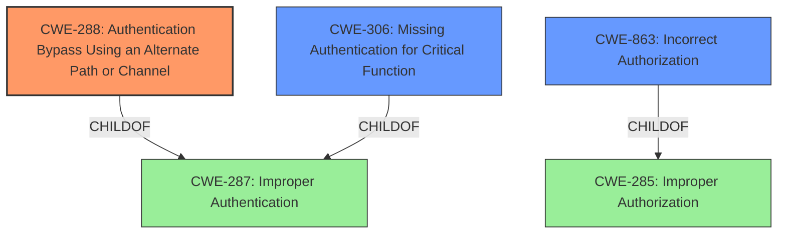

# Raw Analyzer Response for CVE-2025-22375

# Summary
| CWE ID | CWE Name | Confidence | CWE Abstraction Level | CWE Vulnerability Mapping Label | CWE-Vulnerability Mapping Notes |
|---|---|---|---|---|---|
| CWE-288 | Authentication Bypass Using an Alternate Path or Channel | 0.9 | Base | Primary | Allowed |
| CWE-306 | Missing Authentication for Critical Function | 0.7 | Base | Secondary | Allowed |
| CWE-863 | Incorrect Authorization | 0.6 | Class | Secondary | Allowed-with-Review |

## Evidence and Confidence

*   **Confidence Score:** 0.8
*   **Evidence Strength:** MEDIUM

## Relationship Analysis
The primary relationship that influenced the decision was the parent-child relationship between CWE-287 (Improper Authentication) and CWE-288 (Authentication Bypass Using an Alternate Path or Channel), and also the parent-child relationship between CWE-287 and CWE-306 (Missing Authentication for Critical Function). CWE-288 is a more specific case of improper authentication, where an alternate path or channel bypasses the authentication process. The relationship between CWE-285 (Improper Authorization) and CWE-863 (Incorrect Authorization) was considered since the vulnerability allows the creation of a valid session without credentials, however, the description points more directly to an authentication bypass.

## Vulnerability Chain
The vulnerability chain starts with a **logic flaw**, which leads to an authentication bypass, allowing an attacker to create a valid session without credentials.

Logic Flaw -> Authentication Bypass (CWE-288) -> Unauthorized Session Creation

## Summary of Analysis
The vulnerability description clearly states that a **logic flaw** allows an attacker to create a valid session without any credentials. This points towards an authentication bypass. The retriever results suggest CWE-863 (Incorrect Authorization), CWE-287 (Improper Authentication), and CWE-306 (Missing Authentication for Critical Function) as potential candidates.

Given the provided guidance, CWE-306 would be considered if there was completely missing authentication. However, the phrase "**logic flaw**" and "create a valid session" suggests that there is an attempt at authentication but it is being bypassed. This is better captured by CWE-288, Authentication Bypass Using an Alternate Path or Channel.
CWE-863 is about incorrect authorization, which is relevant if the user could log in, but then access restricted resources. Since the vulnerability is about creating a session without credentials, it is an authentication issue.

The description specifies a "**logic flaw**" that permits bypassing authentication, making CWE-288 the most accurate representation of the **root cause**. The fact that the attacker can create a valid session supports this classification.

Relevant CWE Information:

**CWE-288: Authentication Bypass Using an Alternate Path or Channel**
The product requires authentication, but the product has an alternate path or channel that does not require authentication. This is the primary CWE because it directly addresses the ability to bypass authentication through a **logic flaw**.

**CWE-306: Missing Authentication for Critical Function**
The product does not perform any authentication for functionality that requires a provable user identity or consumes a significant amount of resources. This is a secondary CWE. While the vulnerability allows creating a session without credentials, it is not due to a complete lack of authentication, but rather a bypass.

**CWE-863: Incorrect Authorization**
The product performs an authorization check when an actor attempts to access a resource or perform an action, but it does not correctly perform the check. This is a secondary CWE. Since the vulnerability allows the creation of a valid session without credentials, it is primarily an authentication issue, not an authorization issue.