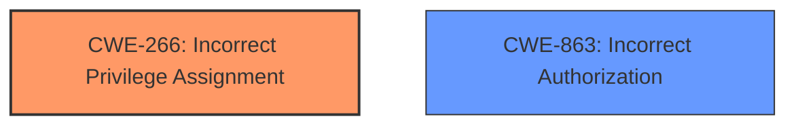

# Analysis Report for CVE-2025-2238

# Vulnerability Analysis Report: CVE-2025-2238

## Description

The Vikinger theme for WordPress is vulnerable to privilege in all versions up to, and including, 1.9.30. This is due to **insufficient user_meta restrictions** in the vikinger_user_meta_update_ajax function. This makes it possible for authenticated attackers, with Subscriber-level access and above, to escalate their privileges to Administrator-level.

## Vulnerability Description Key Phrases

- **Rootcause:** insufficient user_meta restrictions
- **Impact:** privilege escalation
- **Attacker:** authenticated attackers with Subscriber-level access and above
- **Product:** Vikinger theme for WordPress
- **Version:** up to and including 1.9.30
- **Component:** vikinger_user_meta_update_ajax function

## Analysis (with Relationship Data)

# Summary
| CWE ID | CWE Name | Confidence | CWE Abstraction Level | CWE Vulnerability Mapping Label | CWE-Vulnerability Mapping Notes |
|---|---|---|---|---|---|
| CWE-266 | Incorrect Privilege Assignment | 0.9 | Base | Allowed | Primary CWE |
| CWE-863 | Incorrect Authorization | 0.7 | Class | Allowed-with-Review | Secondary Candidate |

## Evidence and Confidence

*   **Confidence Score:** 0.9
*   **Evidence Strength:** HIGH

## Relationship Analysis
The primary CWE is CWE-266, which is a Base level CWE. CWE-863 is a Class level CWE and a parent of more specific CWEs. There isn't a clear parent-child relationship that would override the selection of CWE-266. The vulnerability description indicates an **incorrect assignment of privileges** due to **insufficient user_meta restrictions**. This aligns directly with CWE-266. CWE-863 could also apply as there is **incorrect authorization**, however, the evidence points more specifically to **incorrect privilege assignment**.



## Vulnerability Chain
The vulnerability chain starts with the **insufficient user_meta restrictions** (CWE-266), which leads to the ability for authenticated attackers to escalate their privileges to Administrator-level. The root cause is the **incorrect privilege assignment**, and the impact is privilege escalation.

## Summary of Analysis
The primary focus is on identifying the root cause of the vulnerability. The vulnerability description clearly indicates that there are **insufficient user_meta restrictions**, leading to **incorrect privilege assignment**. This aligns directly with CWE-266 (Incorrect Privilege Assignment). The vulnerability description key phrases and the retriever results both support this conclusion. The MITRE mapping guidance also supports using CWE-266 when there is a misconfigured role.

CWE-863 (Incorrect Authorization) was considered, but it is a more general class of weakness. Since the evidence specifically points to **incorrect privilege assignment**, CWE-266 is more appropriate.

Relevant CWE Information:

# Enhanced Context (25 CWEs)
The following CWEs were identified as potentially relevant to this vulnerability:

## CWE-266: Incorrect Privilege Assignment
**Abstraction Level**: Base
**Similarity Score**: 0.79
**Source**: dense

**Description**:
A product incorrectly assigns a privilege to a particular actor, creating an unintended sphere of control for that actor.

**Mapping Guidance**:
- Usage: Allowed
- Rationale: This CWE entry is at the Base level of abstraction, which is a preferred level of abstraction for mapping to the root causes of vulnerabilities.

# Complete CWE Specifications

CWE-863: Incorrect Authorization

CWE-266: Incorrect Privilege Assignment
# Summary
| CWE ID | CWE Name | Confidence | CWE Abstraction Level | CWE Vulnerability Mapping Label | CWE-Vulnerability Mapping Notes |
|---|---|---|---|---|---|
| CWE-266 | Incorrect Privilege Assignment | 0.9 | Base | Allowed | Primary CWE |
| CWE-863 | Incorrect Authorization | 0.7 | Class | Allowed-with-Review | Secondary Candidate |

## Evidence and Confidence

*   **Confidence Score:** 0.9
*   **Evidence Strength:** HIGH

## Relationship Analysis
The primary CWE is CWE-266, which is a Base level CWE. CWE-863 is a Class level CWE and a parent of more specific CWEs. There isn't a clear parent-child relationship that would override the selection of CWE-266. The vulnerability description indicates an **incorrect assignment of privileges** due to **insufficient user_meta restrictions**. This aligns directly with CWE-266. CWE-863 could also apply as there is **incorrect authorization**, however, the evidence points more specifically to **incorrect privilege assignment**.


## Vulnerability Chain
The vulnerability chain starts with the **insufficient user_meta restrictions** (CWE-266), which leads to the ability for authenticated attackers to escalate their privileges to Administrator-level. The root cause is the **incorrect privilege assignment**, and the impact is privilege escalation.

## Summary of Analysis
The primary focus is on identifying the root cause of the vulnerability. The vulnerability description clearly indicates that there are **insufficient user_meta restrictions**, leading to **incorrect privilege assignment**. This aligns directly with CWE-266 (Incorrect Privilege Assignment). The vulnerability description key phrases and the retriever results both support this conclusion. The MITRE mapping guidance also supports using CWE-266 when there is a misconfigured role.

CWE-863 (Incorrect Authorization) was considered, but it is a more general class of weakness. Since the evidence specifically points to **incorrect privilege assignment**, CWE-266 is more appropriate.


## CWE Relationship Analysis

Current CWEs represent these abstraction levels: .


### Vulnerability Chain Analysis

**Chain starting from CWE-266:**
- 266 (Incorrect Privilege Assignment) - ROOT


**Chain starting from CWE-863:**
- 863 (Incorrect Authorization) - ROOT


### CWE Relationship Diagram

```mermaid
graph TD
    classDef primary fill:#f96,stroke:#333,stroke-width:2px
    classDef secondary fill:#69f,stroke:#333
    classDef tertiary fill:#9e9,stroke:#333
```


*Report generated on 2025-07-14 10:29:46*
