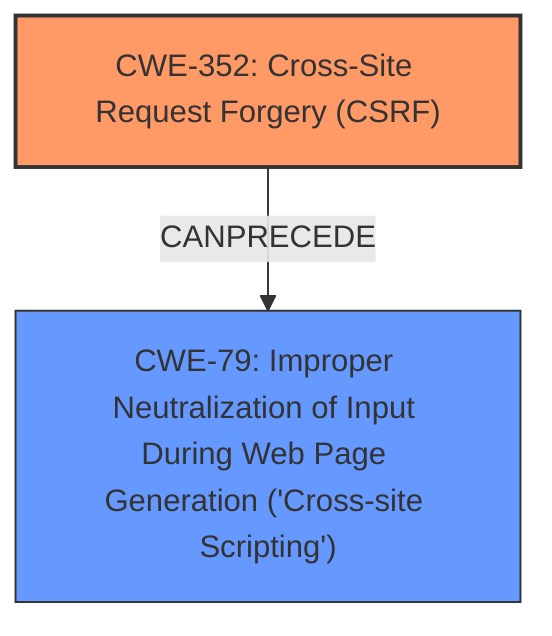

# Raw Analyzer Response for CVE-2025-22589

# Summary
| CWE ID | CWE Name | Confidence | CWE Abstraction Level | CWE Vulnerability Mapping Label | CWE-Vulnerability Mapping Notes |
|---|---|---|---|---|---|
| CWE-352 | Cross-Site Request Forgery (CSRF) | 0.9 | Compound | Allowed | Primary CWE: The description clearly states that the vulnerability is a Cross-Site Request Forgery (CSRF). |
| CWE-79 | Improper Neutralization of Input During Web Page Generation ('Cross-site Scripting') | 0.7 | Base | Allowed | Secondary: The CSRF vulnerability allows for Stored XSS, making CWE-79 a secondary weakness. |

## Evidence and Confidence

*   **Confidence Score:** 0.8
*   **Evidence Strength:** MEDIUM

## Relationship Analysis
The primary weakness is identified as CWE-352, Cross-Site Request Forgery (CSRF). This vulnerability then allows for Stored XSS, which is classified as CWE-79. This creates a chain relationship where CSRF is exploited to inject malicious scripts.

## Vulnerability Chain
1.  **Root Cause:** CWE-352 Cross-Site Request Forgery (CSRF) vulnerability exists in the bozdoz Quote Tweet plugin.
2.  **Weakness:** The CSRF allows a malicious actor to force higher privileged users to execute unwanted actions.
3.  **Impact:** These unwanted actions result in Stored XSS (CWE-79), allowing the attacker to inject malicious scripts that are executed by other users.

## Summary of Analysis
The primary vulnerability is Cross-Site Request Forgery (CSRF), which allows for Stored XSS. The description explicitly mentions "Cross-Site Request Forgery (CSRF) vulnerability" and "Stored XSS". The evidence suggests that the CSRF vulnerability is exploited to inject malicious scripts that are then stored and executed by other users, resulting in XSS.

The selection of CWE-352 is based on the explicit mention of CSRF. The selection of CWE-79 is based on the fact that the CSRF vulnerability allows for Stored XSS, which aligns with the description of CWE-79. Both CWEs are at an appropriate level of specificity.

**Evidence:**

*   "Cross-Site Request Forgery (CSRF) vulnerability in bozdoz Quote Tweet allows Stored XSS."

Relevant CWE Information:

# Enhanced Context (25 CWEs)
The following CWEs were identified as potentially relevant to this vulnerability:

## CWE-352: Cross-Site Request Forgery (CSRF)
**Abstraction Level**: Compound
**Similarity Score**: 0.71
**Source**: dense

**Description**:
The web application does not, or can not, sufficiently verify whether a well-formed, valid, consistent request was intentionally provided by the user who submitted the request.

**Mapping Guidance**:
- Usage: Allowed
- Rationale: This is a well-known Composite of multiple weaknesses that must all occur simultaneously, although it is attack-oriented in nature.

## CWE-79: Improper Neutralization of Input During Web Page Generation ('Cross-site Scripting')
**Abstraction Level**: Base
**Similarity Score**: 0.68
**Source**: dense

**Description**:
The product does not neutralize or incorrectly neutralizes user-controllable input before it is placed in output that is used as a web page that is served to other users.

**Mapping Guidance**:
- Usage: Allowed
- Rationale: This CWE entry is at the Base level of abstraction, which is a preferred level of abstraction for mapping to the root causes of vulnerabilities.