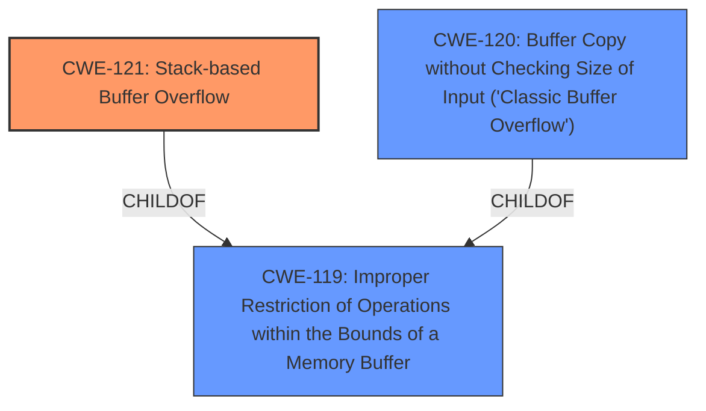

# Analysis for CVE-2025-2263

# Summary
| CWE ID | CWE Name | Confidence | CWE Abstraction Level | CWE Vulnerability Mapping Label | CWE-Vulnerability Mapping Notes |
|---|---|---|---|---|---|
| CWE-121 | Stack-based Buffer Overflow | 1.0 | Variant | Allowed | Primary CWE |
| CWE-120 | Buffer Copy without Checking Size of Input ('Classic Buffer Overflow') | 0.7 | Base | Allowed-with-Review | Secondary Candidate |
| CWE-119 | Improper Restriction of Operations within the Bounds of a Memory Buffer | 0.6 | Class | Discouraged | Secondary Candidate |

## Evidence and Confidence

*   **Confidence Score:** 0.9
*   **Evidence Strength:** HIGH

## Relationship Analysis
The primary CWE is CWE-121, which is a variant of CWE-119. The vulnerability description clearly states a stack-based buffer overflow, making the variant a more precise choice than the class. CWE-120 is also related to buffer overflows, but the description explicitly mentions the overflow occurs during decryption using EVP_DecryptUpdate which writes to a stack-based buffer.

## Vulnerability Chain
The vulnerability chain starts with the **stack-based buffer overflow** (CWE-121) due to the `EVP_DecryptUpdate` function writing beyond the allocated buffer size when decrypting the username or password. This leads to a potential access violation and process termination.

## Summary of Analysis
The vulnerability description and CVE summary clearly point to a **stack-based buffer overflow** when decrypting user credentials. The use of `EVP_DecryptUpdate` with a fixed-size buffer is the root cause.

The evidence:
*   "During login to the web server in Sante PACS Server.exe, OpenSSL function EVP_DecryptUpdate is called to decrypt the username and password. A fixed 0x80-byte stack-based buffer is passed to the function as the output buffer. A **stack-based buffer overflow** exists if a long encrypted username or password is supplied by an unauthenticated remote attacker."
*   "**Root cause of vulnerability:** ... A fixed 0x80-byte stack-based buffer is passed to the function as the output buffer. A stack-based buffer overflow exists if a long encrypted username or password is supplied."
*   "**Weaknesses/vulnerabilities present:** Stack-based buffer overflow."

CWE-121 is the most specific and accurate representation of the vulnerability. CWE-119 is a broader class, and CWE-120 applies to buffer copies without size checks, but this case involves a specific function call that can overflow the buffer on the stack.

Relevant CWE Information:

# Enhanced Context (25 CWEs)
The following CWEs were identified as potentially relevant to this vulnerability:

## CWE-131: Incorrect Calculation of Buffer Size
**Abstraction Level**: Base
**Similarity Score**: 0.71
**Source**: dense

**Description**:
The product does not correctly calculate the size to be used when allocating a buffer, which could lead to a buffer overflow.

**Mapping Guidance**:
- Usage: Allowed
- Rationale: This CWE entry is at the Base level of abstraction, which is a preferred level of abstraction for mapping to the root causes of vulnerabilities.

## CWE-120: Buffer Copy without Checking Size of Input ('Classic Buffer Overflow')
**Abstraction Level**: Base
**Similarity Score**: 777.14
**Source**: sparse

**Description**:
The product copies an input buffer to an output buffer without verifying that the size of the input buffer is less than the size of the output buffer, leading to a buffer overflow.

**Mapping Guidance**:
- Usage: Allowed-with-Review
- Rationale: There are some indications that this CWE ID might be misused and selected simply because it mentions "buffer overflow" - an increasingly vague term. This CWE entry is only appropriate for "Buffer Copy" operations (not buffer reads), in which where there is no "Checking [the] Size of Input", and (by implication of the copy) writing past the end of the buffer.

## CWE-121: Stack-based Buffer Overflow
**Abstraction Level**: Variant
**Similarity Score**: 0.69
**Source**: dense

**Description**:
A stack-based buffer overflow condition is a condition where the buffer being overwritten is allocated on the stack (i.e., is a local variable or, rarely, a parameter to a function).

**Mapping Guidance**:
- Usage: Allowed
- Rationale: This CWE entry is at the Variant level of abstraction, which is a preferred level of abstraction for mapping to the root causes of vulnerabilities.

## CWE-190: Integer Overflow or Wraparound
**Abstraction Level**: Base
**Similarity Score**: 777.32
**Source**: sparse

**Description**:
The product performs a calculation that can
         produce an integer overflow or wraparound when the logic
         assumes that the resulting value will always be larger than
         the original value. This occurs when an integer value is
         incremented to a value that is too large to store in the
         associated representation. When this occurs, the value may
         become a very small or negative number.

**Mapping Guidance**:
- Usage: Allowed
- Rationale: This CWE entry is at the Base level of abstraction, which is a preferred level of abstraction for mapping to the root causes of vulnerabilities.