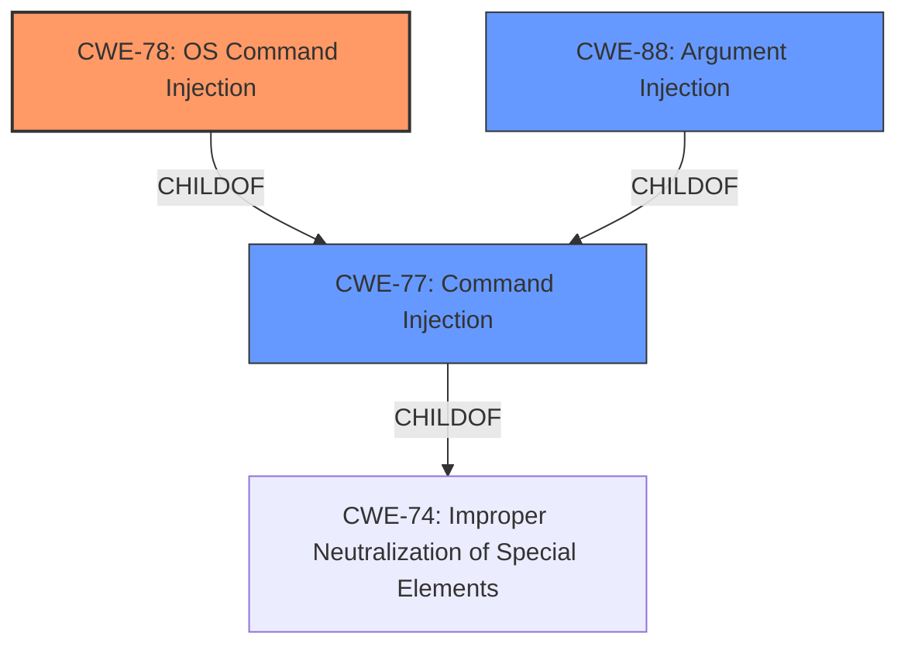

# Analysis Report for CVE-2025-22630

# Vulnerability Analysis Report: CVE-2025-22630

## Description

**Improper Neutralization of Special Elements used in a Command** (Command Injection) vulnerability in MarketingFire Widget Options allows OS Command Injection.This issue affects Widget Options from n/a through 4.1.0.

## Vulnerability Description Key Phrases

- **Rootcause:** Improper Neutralization of Special Elements used in a Command
- **Weakness:** command injection
- **Impact:** OS Command Injection
- **Product:** MarketingFire Widget Options
- **Version:** n/a through 4.1.0
- **Component:** Widget Options

## Analysis (with Relationship Data)

# Summary

| CWE ID | CWE Name | Confidence | CWE Abstraction Level | CWE Vulnerability Mapping Label | CWE-Vulnerability Mapping Notes |
|---|---|---|---|---|---|
| CWE-78 | Improper Neutralization of Special Elements used in an OS Command ('OS Command Injection') | 1.0 | Base | Allowed | Primary CWE |
| CWE-77 | Improper Neutralization of Special Elements used in a Command ('Command Injection') | 0.7 | Class | Allowed-with-Review | Secondary Candidate |
| CWE-88 | Improper Neutralization of Argument Delimiters in a Command ('Argument Injection') | 0.6 | Base | Allowed | Secondary Candidate |

## Evidence and Confidence

*   **Confidence Score:** 0.9
*   **Evidence Strength:** HIGH

## Relationship Analysis

The primary relationship influencing the CWE selection is the hierarchical structure, specifically the ChildOf relationship between CWE-78 (OS Command Injection) and CWE-77 (Command Injection). Because the vulnerability specifically involves OS commands, CWE-78 is a more precise classification. CWE-88 is also a child of CWE-77 and represents a specific type of command injection, but it is not clear if argument delimiters are the specific issue.



## Vulnerability Chain

The vulnerability chain starts with the **improper neutralization of special elements** in a command, leading directly to OS command injection. The chain is:

1.  **Improper Neutralization of Special Elements used in a Command** (**ROOTCAUSE**)
2.  OS Command Injection (Impact)

## Summary of Analysis

The vulnerability description explicitly mentions "**Improper Neutralization of Special Elements used in a Command** (Command Injection) vulnerability ... allows OS Command Injection." The CVE Reference Links Content Summary also states the root cause is categorized as an "Injection" vulnerability.

Given the explicit mention of "OS Command Injection" and "**Improper Neutralization of Special Elements used in a Command**", CWE-78 is the most appropriate primary CWE. It is a Base level CWE, which is preferred.

CWE-77 is a Class level CWE and represents a more general case of command injection. It could be considered a secondary CWE, but it is less specific than CWE-78. The retriever results also list CWE-77 with a high score.

CWE-88 is another possible candidate because it deals with argument delimiters, but there is no explicit information given to suggest argument delimiters were the issue.

Therefore, CWE-78 is the most specific and appropriate CWE based on the available evidence.

Other CWEs Considered:

*   CWE-74, CWE-138, CWE-790: These are Class level CWEs that are too general. They refer to improper neutralization or filtering but don't specify the type of injection.
*   CWE-89 (SQL Injection), CWE-91 (XML Injection), CWE-94 (Code Injection), CWE-98 (PHP Remote File Inclusion), CWE-1236 (CSV Injection), CWE-1336 (Template Injection): These are specific types of injection vulnerabilities that are not relevant to the description, which focuses on OS Command Injection.
*   CWE-425 (Direct Request), CWE-456 (Missing Initialization of a Variable), CWE-457 (Use of Uninitialized Variable): These are unrelated to the concept of command injection.


## CWE Relationship Analysis

Current CWEs represent these abstraction levels: .


### Vulnerability Chain Analysis

**Chain starting from CWE-89:**
- 89 (Improper Neutralization of Special Elements used in an SQL Command ('SQL Injection')) - ROOT


**Chain starting from CWE-91:**
- 91 (XML Injection (aka Blind XPath Injection)) - ROOT


### CWE Relationship Diagram

```mermaid
graph TD
    classDef primary fill:#f96,stroke:#333,stroke-width:2px
    classDef secondary fill:#69f,stroke:#333
    classDef tertiary fill:#9e9,stroke:#333
```


*Report generated on 2025-07-14 10:36:07*
