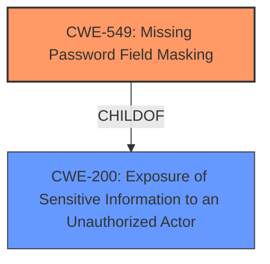

# Analysis Report for CVE-2025-2277

# Vulnerability Analysis Report: CVE-2025-2277

## Description

Exposure of password in web-based SSH authentication component in Devolutions Server 2024.3.13 and earlier allows a user to unadvertently leak his SSH password due to **missing password masking**.

## Vulnerability Description Key Phrases

- **Component:** web-based SSH authentication component
- **Rootcause:** missing password masking
- **Weakness:** exposure of password
- **Product:** Devolutions Server
- **Impact:** unadvertently leak his SSH password, leak SSH password
- **Version:** 2024.3.13 and earlier

## Analysis (with Relationship Data)

# Summary
| CWE ID | CWE Name | Confidence | CWE Abstraction Level | CWE Vulnerability Mapping Label | CWE-Vulnerability Mapping Notes |
|---|---|---|---|---|---|
| CWE-549 | Missing Password Field Masking | 1.0 | Base | Allowed | Primary CWE - The **root cause** is the **missing password masking**. |
| CWE-200 | Exposure of Sensitive Information to an Unauthorized Actor | 0.7 | Class | Discouraged | Secondary Candidate - The **exposure of the password** is a consequence of the primary weakness. |

## Evidence and Confidence

*   **Confidence Score:** 0.9
*   **Evidence Strength:** HIGH

## Relationship Analysis
The primary CWE, CWE-549, is a Base level weakness that directly describes the **missing password masking**. CWE-200, Exposure of Sensitive Information to an Unauthorized Actor, is a Class level weakness that represents the impact of the missing masking. CWE-549 is a child of CWE-200, indicating that it is a more specific type of information exposure. The relationship supports the selection of CWE-549 as the primary cause and CWE-200 as a secondary consequence.



## Vulnerability Chain
The vulnerability chain starts with the **missing password masking** (CWE-549), which leads to the **exposure of the password** (CWE-200), resulting in a user inadvertently leaking their SSH password.

## Summary of Analysis
The analysis is based on the provided vulnerability description and the CVE Reference Links Content Summary. The primary **root cause** identified is the **missing password masking** in the web-based SSH authentication component, which directly leads to the **exposure of the password**. The graph relationships reinforce the selection of CWE-549 as the primary cause and CWE-200 as a secondary consequence. CWE-549 is at the optimal level of specificity because it directly describes the **missing password masking**, whereas CWE-200 is a broader category.

Relevant CWE Information:

# Enhanced Context (25 CWEs)
The following CWEs were identified as potentially relevant to this vulnerability:

## CWE Classification Guidance

The following guidance has been automatically included because relevant keywords were detected in the vulnerability description:

### Authentication vs Authorization vs Access Control Guidance

The vulnerability description states that there is **missing password masking**. Therefore, authentication vs authorization does not apply here.

### 1. **CWE-306 vs CWE-862**:
Not applicable here.

### 2. **CWE-285 vs CWE-284**:
Not applicable here.

## Technical Impact vs Root Cause Clarification
The **root cause** is identified as the **missing password masking**, which causes exposure of passwords.

# Complete CWE Specifications

CWE-549: Missing Password Field Masking - The product does not mask passwords during entry, increasing the potential for attackers to observe and capture passwords. This aligns directly with the vulnerability description.

CWE-256: Plaintext Storage of a Password - This is not applicable here, as the vulnerability is about displaying the password, not storing it.

CWE-798: Use of Hard-coded Credentials - This is not applicable here, as the vulnerability is not about hard-coded credentials.

CWE-532: Insertion of Sensitive Information into Log File - This is not applicable here, as the vulnerability is not about logging.

CWE-522: Insufficiently Protected Credentials - This is a broader category than CWE-549. It is a Class rather than Base.

CWE-200: Exposure of Sensitive Information to an Unauthorized Actor - This is a broader category than CWE-549. It is a Class rather than Base.

CWE-306: Missing Authentication for Critical Function - This is not applicable here, as the vulnerability is not about authentication.

CWE-1390: Weak Authentication - This is not applicable here, as the vulnerability is not about authentication.

CWE-916: Use of Password Hash With Insufficient Computational Effort - This is not applicable here, as the vulnerability is not about password hashing.

CWE-261: Weak Encoding for Password - This is not applicable here, as the vulnerability is not about encoding passwords.


## CWE Relationship Analysis

Current CWEs represent these abstraction levels: .


### Vulnerability Chain Analysis

**Chain starting from CWE-1390:**
- 1390 (Weak Authentication) - ROOT


**Chain starting from CWE-522:**
- 522 (Insufficiently Protected Credentials) - ROOT


### CWE Relationship Diagram

```mermaid
graph TD
    classDef primary fill:#f96,stroke:#333,stroke-width:2px
    classDef secondary fill:#69f,stroke:#333
    classDef tertiary fill:#9e9,stroke:#333
```


*Report generated on 2025-07-14 10:39:21*
