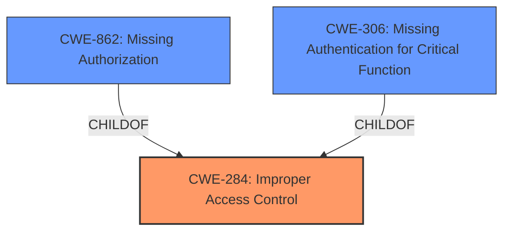

# Analysis Report for CVE-2025-22844

# Vulnerability Analysis Report: CVE-2025-22844

## Description

**Improper access control** for some Edge Orchestrator software for Intel(R) Tiber Edge Platform may allow an unauthenticated user to potentially enable information disclosure via adjacent access.

## Vulnerability Description Key Phrases

- **Rootcause:** Improper access control
- **Product:** Edge Orchestrator software for Intel(R) Tiber Edge Platform
- **Impact:** information disclosure, potentially enable information disclosure
- **Attacker:** unauthenticated user

## Analysis (with Relationship Data)

# Summary
| CWE ID | CWE Name | Confidence | CWE Abstraction Level | CWE Vulnerability Mapping Label | CWE-Vulnerability Mapping Notes |
|---|---|---|---|---|---|
| CWE-284 | Improper Access Control | 0.8 | Pillar |  | Allowed-with-Review |
| CWE-862 | Missing Authorization | 0.6 | Base |  | Allowed |
| CWE-306 | Missing Authentication for Critical Function | 0.4 | Base |  | Allowed |

## Evidence and Confidence

*   **Confidence Score:** 0.8
*   **Evidence Strength:** MEDIUM

## Relationship Analysis
The primary relationship that influenced my decision was the hierarchical structure related to access control. CWE-284 is a high-level category, while CWE-862 and CWE-306 are more specific. The guidance suggests using more specific CWEs when possible. However, due to the limited information, I am hesitant to commit to a specific root cause and am only reasonably confident in my assessment.



## Vulnerability Chain
The vulnerability chain starts with **improper access control**, leading to potential information disclosure. Depending on whether authentication is present, the chain could involve either missing authentication (CWE-306) or missing authorization (CWE-862) as the root cause.

## Summary of Analysis
The initial analysis focused on identifying the **root cause** of the vulnerability, which is stated as **"Improper access control"**. The retriever results also highlighted CWE-284 as the top candidate. However, the guidance suggests using more specific CWEs related to authentication and authorization where possible.

Given the information provided, I considered the following:
*   CWE-284: **Improper Access Control** - This is a general category and could be applicable if the root cause is unclear.
*   CWE-862: **Missing Authorization** - This applies if the application doesn't check whether the user is authorized at all *after* authentication.
*   CWE-306: **Missing Authentication for Critical Function** - This applies if there is no authentication required for sensitive functionality.

Since the description states "**Improper access control** for some Edge Orchestrator software for Intel(R) Tiber Edge Platform may allow an unauthenticated user to potentially enable information disclosure via adjacent access," it's unclear whether authentication exists. The mention of an "unauthenticated user" suggests a potential lack of authentication, but the **improper access control** could also mean that authorization checks are **incorrect**.

Therefore, I've selected CWE-284 as the primary CWE due to the lack of clarity. I've also included CWE-862 and CWE-306 as secondary considerations, depending on whether authentication is present. If authentication is present, then CWE-862 would be a good fit. If authentication is missing, then CWE-306 would be a better fit.

The final CWE selection represents the optimal level of specificity given the available evidence.

Relevant CWE Information:

# Enhanced Context (25 CWEs)
The following CWEs were identified as potentially relevant to this vulnerability:

## CWE-274: Improper Handling of Insufficient Privileges
**Abstraction Level**: Base
**Similarity Score**: 0.76
**Source**: dense

**Description**:
The product does not handle or incorrectly handles when it has insufficient privileges to perform an operation, leading to resultant weaknesses.

**Mapping Guidance**:
- Usage: Discouraged
- Rationale: This CWE entry could be deprecated in a future version of CWE.

*I did not select this because the vulnerability description does not mention handling of privileges.*

## CWE-497: Exposure of Sensitive System Information to an Unauthorized Control Sphere
**Abstraction Level**: Base
**Similarity Score**: 0.76
**Source**: dense

**Description**:
The product does not properly prevent sensitive system-level information from being accessed by unauthorized actors who do not have the same level of access to the underlying system as the product does.

**Mapping Guidance**:
- Usage: Allowed
- Rationale: This CWE entry is at the Base level of abstraction, which is a preferred level of abstraction for mapping to the root causes of vulnerabilities.

*I did not select this because the description doesn't focus on exposure of sensitive system information, but rather on the **improper access control** itself.*

## CWE-668: Exposure of Resource to Wrong Sphere
**Abstraction Level**: Class
**Similarity Score**: 0.76
**Source**: dense

**Description**:
The product exposes a resource to the wrong control sphere, providing unintended actors with inappropriate access to the resource.

**Mapping Guidance**:
- Usage: Discouraged
- Rationale: CWE-668 is high-level and is often misused as a catch-all when lower-level CWE IDs might be applicable. It is sometimes used for low-information vulnerability reports [REF-1287]. It is a level-1 Class (i.e., a child of a Pillar). It is not useful for trend analysis.

*I did not select this because it is a high level class and there are more specific options available.*

## CWE-280: Improper Handling of Insufficient Permissions or Privileges 
**Abstraction Level**: Base
**Similarity Score**: 0.76
**Source**: dense

**Description**:
The product does not handle or incorrectly handles when it has insufficient privileges to access resources or functionality as specified by their permissions. This may cause it to follow unexpected code paths that may leave the product in an invalid state.

**Mapping Guidance**:
- Usage: Allowed
- Rationale: This CWE entry is at the Base level of abstraction, which is a preferred level of abstraction for mapping to the root causes of vulnerabilities.

*I did not select this because the vulnerability description does not mention handling of privileges.*

## CWE-41: Improper Resolution of Path Equivalence
**Abstraction Level**: Base
**Similarity Score**: 0.76
**Source**: dense

**Description**:
The product is vulnerable to file system contents disclosure through path equivalence. Path equivalence involves the use of special characters in file and directory names. The associated manipulations are intended to generate multiple names for the same object.

**Mapping Guidance**:
- Usage: Allowed
- Rationale: This CWE entry is at the Base level of abstraction, which is a preferred level of abstraction for mapping to the root causes of vulnerabilities.

*I did not select this because this vulnerability is about improper path equivalence, which is not related to this vulnerability.*

## CWE-703: Improper Check or Handling of Exceptional Conditions
**Abstraction Level**: Pillar
**Similarity Score**: 0.76
**Source**: dense

**Description**:
The product does not properly anticipate or handle exceptional conditions that rarely occur during normal operation of the product.

**Mapping Guidance**:
- Usage: Discouraged
- Rationale: This CWE entry is extremely high-level, a Pillar.

*I did not select this because this is a high level pillar and not a good fit for the vulnerability.*

## CWE-807: Reliance on Untrusted Inputs in a Security Decision
**Abstraction Level**: Base
**Similarity Score**: 0.76
**Source**: dense

**Description**:
The product uses a protection mechanism that relies on the existence or values of an input, but the input can be modified by an untrusted actor in a way that bypasses the protection mechanism.

**Mapping Guidance**:
- Usage: Allowed
- Rationale: This CWE entry is at the Base level of abstraction, which is a preferred level of abstraction for mapping to the root causes of vulnerabilities.

*I did not select this because the vulnerability description does not mention reliance on untrusted inputs.*

## CWE-691: Insufficient Control Flow Management
**Abstraction Level**: Pillar
**Similarity Score**: 0.76
**Source**: dense

**Description**:
The code does not sufficiently manage its control flow during execution, creating conditions in which the control flow can be modified in unexpected ways.

**Mapping Guidance**:
- Usage: Discouraged
- Rationale: This CWE entry is extremely high-level, a Pillar. However, classification research is limited for weaknesses of this type, so there can be gaps or organizational difficulties within CWE that force use of this weakness, even at such a high level of abstraction.

*I did not select this because the vulnerability description does not mention control flow management.*

## CWE-1220: Insufficient Granularity of Access Control
**Abstraction Level**: Base
**Similarity Score**: 0.75
**Source**: dense

**Description**:
The product implements access controls via a policy or other feature with the intention to disable or restrict accesses (reads and/or writes) to assets in a system from


## CWE Relationship Analysis

Current CWEs represent these abstraction levels: .


### Vulnerability Chain Analysis

**Chain starting from CWE-274:**
- 274 (Improper Handling of Insufficient Privileges) - ROOT


**Chain starting from CWE-280:**
- 280 (Improper Handling of Insufficient Permissions or Privileges ) - ROOT


### CWE Relationship Diagram

```mermaid
graph TD
    classDef primary fill:#f96,stroke:#333,stroke-width:2px
    classDef secondary fill:#69f,stroke:#333
    classDef tertiary fill:#9e9,stroke:#333
```


*Report generated on 2025-07-14 10:41:18*
