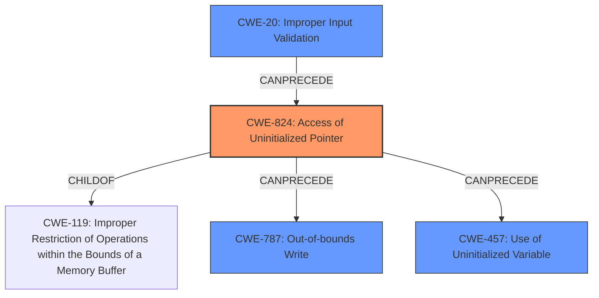

# Enhanced Analysis for CVE-2025-2285

# Summary
| CWE ID  | CWE Name                                                     | Confidence | CWE Abstraction Level | CWE Vulnerability Mapping Label | CWE-Vulnerability Mapping Notes |
| :-------- | :----------------------------------------------------------- | :--------- | :---------------------- | :------------------------------ | :------------------------------ |
| CWE-824   | Access of Uninitialized Pointer                              | 0.9        | Base                    | Primary                         | Allowed                         |
| CWE-20    | Improper Input Validation                                    | 0.8        | Class                   | Secondary                       | Discouraged                     |
| CWE-787   | Out-of-bounds Write                                          | 0.7        | Base                    | Secondary                       | Allowed                         |
| CWE-457   | Use of Uninitialized Variable                                | 0.6        | Variant                 | Secondary                       | Allowed                         |

## Evidence and Confidence

*   **Confidence Score:** 0.8
*   **Evidence Strength:** MEDIUM

## Relationship Analysis

The primary weakness is **CWE-824 (Access of Uninitialized Pointer)**, representing the root cause. **CWE-20 (Improper Input Validation)** is related, as the lack of proper input validation can lead to an uninitialized pointer being accessed. **CWE-787 (Out-of-bounds Write)** and **CWE-457 (Use of Uninitialized Variable)** are potential consequences or contributing factors stemming from the initial uninitialized pointer. CWE-824 is a child of CWE-119 (Improper Restriction of Operations within the Bounds of a Memory Buffer), but we don't have enough information to move that high up in the abstraction.



## Vulnerability Chain

The vulnerability chain starts with **CWE-20 (Improper Input Validation)**, which leads to **CWE-824 (Access of Uninitialized Pointer)**. This, in turn, can result in **CWE-787 (Out-of-bounds Write)** and **CWE-457 (Use of Uninitialized Variable)**, ultimately leading to local code execution.

## Summary of Analysis

The analysis identified **CWE-824 (Access of Uninitialized Pointer)** as the primary root cause, supported by the statement "A local code execution vulnerability exists in the Rockwell Automation Arena due to an **uninitialized pointer**". The related issue of "**improper validation of user-supplied data**" points to **CWE-20 (Improper Input Validation)**. The potential for code execution suggests the possibility of **CWE-787 (Out-of-bounds Write)** as a consequence. The **uninitialized pointer** could also lead to **CWE-457 (Use of Uninitialized Variable)**. The evidence supports selecting these CWEs, but the confidence is medium because the description does not explicitly state out-of-bounds write or use of uninitialized variables, only that they *can* occur.

Relevant CWE Information:

**CWE-824: Access of Uninitialized Pointer**
The product accesses or uses a pointer that has not been initialized.

**CWE-20: Improper Input Validation**
The product receives input or data, but it does not validate or incorrectly validates that the input has the properties that are required to process the data safely and correctly.

**CWE-787: Out-of-bounds Write**
The product writes data past the end, or before the beginning, of the intended buffer.

**CWE-457: Use of Uninitialized Variable**
The code uses a variable that has not been initialized, leading to unpredictable or unintended results.

CWEs considered but not used:

*   CWE-908, CWE-665: These are related to initialization issues, but CWE-824 and CWE-457 are more specific to the case of an *uninitialized* pointer/variable being accessed/used.
*   CWE-119: Although CWE-824 is a ChildOf CWE-119, the description lacks details on buffer operations to justify using the parent class.
*   CWE-1284: Could be considered as the root cause of the input validation, but CWE-20 is a better starting point without further information.


## CWE Relationship Analysis

Current CWEs represent these abstraction levels: .


### Vulnerability Chain Analysis

**Chain starting from CWE-1284:**
- 1284 (Improper Validation of Specified Quantity in Input) - ROOT


**Chain starting from CWE-457:**
- 457 (Use of Uninitialized Variable) - ROOT


### CWE Relationship Diagram

```mermaid
graph TD
    classDef primary fill:#f96,stroke:#333,stroke-width:2px
    classDef secondary fill:#69f,stroke:#333
    classDef tertiary fill:#9e9,stroke:#333
```