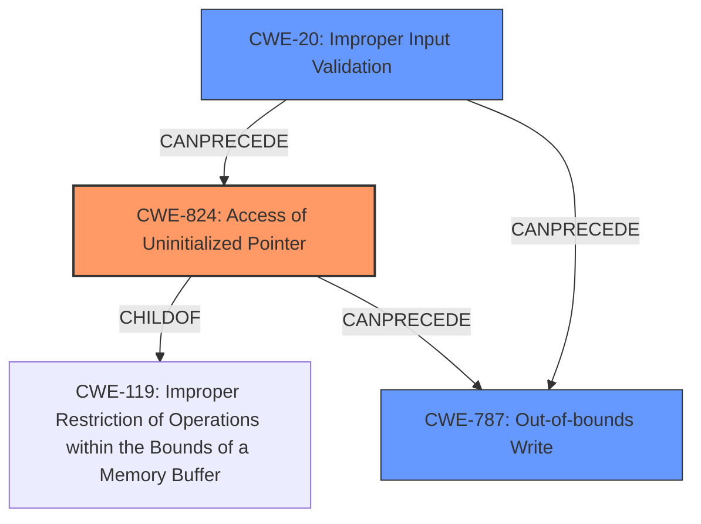

# Enhanced Analysis for CVE-2025-2287

# Summary
| CWE ID  | CWE Name                                                                                   | Confidence | CWE Abstraction Level | CWE Vulnerability Mapping Label | CWE-Vulnerability Mapping Notes |
| :-------- | :----------------------------------------------------------------------------------------- | :--------- | :---------------------- | :------------------------------ | :-------------------------------- |
| CWE-824   | Access of Uninitialized Pointer                                                            | 0.9        | Base                    | Primary                         | Allowed                           |
| CWE-20    | Improper Input Validation                                                                  | 0.7        | Base                    | Secondary                       | Allowed                           |
| CWE-787   | Out-of-bounds Write                                                                      | 0.6        | Base                    | Secondary                       | Allowed                           |

## Evidence and Confidence

*   **Confidence Score:** 0.8
*   **Evidence Strength:** MEDIUM

## Relationship Analysis
The primary weakness is an **uninitialized pointer**, represented by CWE-824. The **improper validation** of user-supplied data (CWE-20) can precede the use of this uninitialized pointer, potentially leading to an out-of-bounds write (CWE-787) if the uninitialized pointer is used to access memory. CWE-824 is a child of CWE-119 (Improper Restriction of Operations within the Bounds of a Memory Buffer). CWE-20 can precede CWE-787. All three CWEs are at the Base level of abstraction, which is preferred.



## Vulnerability Chain
1.  **Root Cause:** CWE-824 (Access of Uninitialized Pointer) due to **improper validation** (CWE-20) of user-supplied data.
2.  **Weakness:** The uninitialized pointer is then used in a way that leads to.
3.  **Impact:** CWE-787 (Out-of-bounds Write), leading to information disclosure and arbitrary code execution.

## Summary of Analysis
The primary weakness is the **uninitialized pointer** (CWE-824). The vulnerability description states: "A local code execution vulnerability exists in the Rockwell Automation Arena due to an **uninitialized pointer**. The flaw is result of **improper validation** of user-supplied data." This **improper validation** (CWE-20) can lead to the use of the uninitialized pointer (CWE-824), which then results in an out-of-bounds write (CWE-787) if the pointer is used to access memory. The analysis is based on the provided evidence, which highlights both the **uninitialized pointer** and the **improper validation**. The graph relationships confirm that CWE-20 can precede both CWE-824 and CWE-787. The selected CWEs are at the optimal level of specificity (Base).

The initial assessment focused on CWE-824 as the primary cause, with CWE-20 and CWE-787 as contributing factors. The final conclusion is that CWE-824 is the root cause, and CWE-20 and CWE-787 are secondary weaknesses that contribute to the exploitability and impact of the vulnerability.

Relevant CWE Information:

# Enhanced Context (25 CWEs)
The following CWEs were identified as potentially relevant to this vulnerability:

## CWE-824: Access of Uninitialized Pointer
**Abstraction Level**: Base
**Similarity Score**: 0.76
**Source**: dense

**Description**:
The product accesses or uses a pointer that has not been initialized.

**Mapping Guidance**:
- Usage: Allowed
- Rationale: This CWE entry is at the Base level of abstraction, which is a preferred level of abstraction for mapping to the root causes of vulnerabilities.

## CWE-20: Improper Input Validation
**Abstraction Level**: Base
**Similarity Score**: High

**Description**:
The product receives input or data, but it does not validate or incorrectly validates that the input has the properties that are required to process the data safely and correctly.

**Mapping Guidance**:
- Usage: Allowed
- Rationale: This CWE entry is at the Base level of abstraction, which is a preferred level of abstraction for mapping to the root causes of vulnerabilities.

## CWE-787: Out-of-bounds Write
**Abstraction Level**: Base
**Similarity Score**: Moderate

**Description**:
The product writes data past the end, or before the beginning, of the intended buffer.

**Mapping Guidance**:
- Usage: Allowed
- Rationale: This CWE entry is at the Base level of abstraction, which is a preferred level of abstraction for mapping to the root causes of vulnerabilities.


## CWE Relationship Analysis

Current CWEs represent these abstraction levels: .


### Vulnerability Chain Analysis

**Chain starting from CWE-824:**
- 824 (Access of Uninitialized Pointer) - ROOT


**Chain starting from CWE-119:**
- 119 (Improper Restriction of Operations within the Bounds of a Memory Buffer) - ROOT


### CWE Relationship Diagram

```mermaid
graph TD
    classDef primary fill:#f96,stroke:#333,stroke-width:2px
    classDef secondary fill:#69f,stroke:#333
    classDef tertiary fill:#9e9,stroke:#333
```