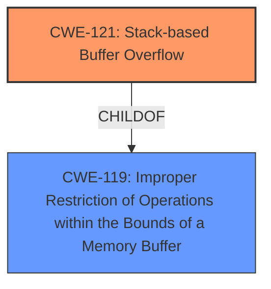

# Enhanced Analysis for CVE-2025-22884

# Summary
| CWE ID | CWE Name | Confidence | CWE Abstraction Level | CWE Vulnerability Mapping Label | CWE-Vulnerability Mapping Notes |
|---|---|---|---|---|---|
| CWE-121 | Stack-based Buffer Overflow | 1.0 | Variant |  Primary CWE | Allowed |
| CWE-119 | Improper Restriction of Operations within the Bounds of a Memory Buffer | 0.5 | Class | Secondary Candidate | Discouraged |

## Evidence and Confidence

*   **Confidence Score:** 1.0
*   **Evidence Strength:** HIGH

## Relationship Analysis
The primary relationship is that CWE-121 (Stack-based Buffer Overflow) is a variant (more specific) of CWE-119 (Improper Restriction of Operations within the Bounds of a Memory Buffer). This means CWE-121 is a specialized type of buffer overflow that occurs on the stack. Since the vulnerability description specifically mentions a "Stack-Based buffer overflow", using the variant CWE-121 is more accurate and provides a greater level of detail.



## Vulnerability Chain
The vulnerability chain starts with the **stack-based buffer overflow** (CWE-121), caused during the parsing of a DVP file. The impact of this overflow is the ability to execute arbitrary code.

## Summary of Analysis
The vulnerability description clearly states a "**Stack-Based buffer overflow**" vulnerability. This aligns directly with CWE-121 (Stack-based Buffer Overflow). While CWE-119 (Improper Restriction of Operations within the Bounds of a Memory Buffer) is a broader category that includes stack-based overflows, choosing CWE-121 provides a more specific and accurate representation of the vulnerability.

The retriever results also list CWE-121 as a candidate, further supporting this choice. The use of CWE-119 is discouraged, and should be used only if lower level CWEs are not available, which is not the case in this vulnerability description.

Therefore, the decision to classify this vulnerability as CWE-121 is based on the explicit mention of a stack-based buffer overflow in the description, the hierarchical relationship between CWE-121 and CWE-119, and the usage guidance provided by MITRE.

Relevant CWE Information:

# Enhanced Context (25 CWEs)
The following CWEs were identified as potentially relevant to this vulnerability:

## CWE-121: Stack-based Buffer Overflow
**Abstraction Level**: Variant
**Similarity Score**: 0.71
**Source**: dense

**Description**:
A stack-based buffer overflow condition is a condition where the buffer being overwritten is allocated on the stack (i.e., is a local variable or, rarely, a parameter to a function).

**Mapping Guidance**:
- Usage: Allowed
- Rationale: This CWE entry is at the Variant level of abstraction, which is a preferred level of abstraction for mapping to the root causes of vulnerabilities.

### Other CWEs Considered and Rejected:

*   **CWE-119 (Improper Restriction of Operations within the Bounds of a Memory Buffer):** While related, it is a more general class. The description specifically mentions a stack-based buffer overflow, making CWE-121 a more precise fit. Additionally, CWE-119's usage is discouraged when more specific CWEs are available.
*   **CWE-120 (Buffer Copy without Checking Size of Input ('Classic Buffer Overflow')):** This CWE is related to buffer overflows but focuses on the specific case of copying data without checking the size. There's no explicit mention of a copy operation in the description, so it's less relevant.
*   **CWE-190 (Integer Overflow or Wraparound):** This CWE is for integer overflows, which is not the primary weakness described.
*   **CWE-94 (Improper Control of Generation of Code ('Code Injection')):** This CWE relates to code injection vulnerabilities. While the impact is code execution, the root cause is a buffer overflow, not code injection.
*   **CWE-1284 (Improper Validation of Specified Quantity in Input):** The description doesn't mention improper validation of input quantity.
*   **CWE-122 (Heap-based Buffer Overflow):** This is for heap-based overflows, while the vulnerability is stack-based.
*   **CWE-126 (Buffer Over-read):** This CWE is about reading beyond buffer boundaries, while the vulnerability is about writing.
*   **CWE-674 (Uncontrolled Recursion):** This CWE is not related to buffer overflows.
*   **CWE-128 (Wrap-around Error):** This CWE is not the primary weakness described.
*   **CWE-131 (Incorrect Calculation of Buffer Size):** The root cause in the description doesn't mention how the size of the buffer was calculated or allocated.
*   **CWE-193 (Off-by-one Error):** The root cause in the description doesn't mention an off-by-one error.
*   **CWE-824 (Access of Uninitialized Pointer):** The root cause in the description doesn't mention an uninitialized pointer.
*   **CWE-805 (Buffer Access with Incorrect Length Value):** The root cause in the description doesn't mention incorrect length value.
*   **CWE-123 (Write-what-where Condition):** This CWE is more specific, and there's no evidence in the description to support it.
*   **CWE-416 (Use After Free):** This CWE is not related to buffer overflows.
*   **CWE-124 (Buffer Underwrite ('Buffer Underflow')):** This is the opposite of a buffer overflow.
*   **CWE-1339 (Insufficient Precision or Accuracy of a Real Number):** This CWE is not related to buffer overflows.


## CWE Relationship Analysis

Current CWEs represent these abstraction levels: .


### Vulnerability Chain Analysis

**Chain starting from CWE-123:**
- 123 (Write-what-where Condition) - ROOT


**Chain starting from CWE-121:**
- 121 (Stack-based Buffer Overflow) - ROOT


### CWE Relationship Diagram

```mermaid
graph TD
    classDef primary fill:#f96,stroke:#333,stroke-width:2px
    classDef secondary fill:#69f,stroke:#333
    classDef tertiary fill:#9e9,stroke:#333
```