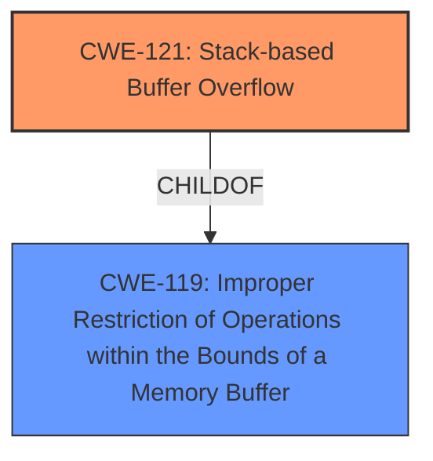

# Analysis Report for CVE-2025-22916

# Vulnerability Analysis Report: CVE-2025-22916

## Description

RE11S v1.11 was discovered to contain a **stack overflow** via the pppUserName parameter in the formPPPoESetup function.

## Vulnerability Description Key Phrases

- **Weakness:** stack overflow
- **Version:** 1.11
- **Component:** formPPPoESetup function

## Analysis (with Relationship Data)

# Summary
| CWE ID | CWE Name | Confidence | CWE Abstraction Level | CWE Vulnerability Mapping Label | CWE-Vulnerability Mapping Notes |
|---|---|---|---|---|---|
| CWE-121 | Stack-based Buffer Overflow | 1.0 | Variant | Allowed | Primary CWE. The vulnerability description and CVE reference clearly indicate a stack-based buffer overflow. |

## Evidence and Confidence

*   **Confidence Score:** 1.0
*   **Evidence Strength:** HIGH

## Relationship Analysis
The primary identified CWE is CWE-121 (Stack-based Buffer Overflow), which is a variant of CWE-119 (Improper Restriction of Operations within the Bounds of a Memory Buffer). The vulnerability description explicitly states a "stack overflow," aligning perfectly with CWE-121. There isn't a need to consider parent or peer relationships further as the provided information sufficiently describes the vulnerability as CWE-121.



## Vulnerability Chain
The vulnerability chain starts with a **stack overflow** in the `formPPPoESetup` function. This occurs due to the **lack of proper bounds checking** when copying data into a stack-allocated buffer using the `pppUserName` parameter. The result is a **write out-of-bounds** that overwrites other data on the stack, potentially leading to arbitrary code execution.

## Summary of Analysis
The analysis strongly supports classifying this vulnerability as CWE-121 (Stack-based Buffer Overflow). The vulnerability description clearly states a **stack overflow**, and the CVE reference confirms that the root cause is a **stack buffer overflow** in the `formPPPoESetup` function when handling the `pppUserName` parameter. The provided evidence is sufficient to classify the vulnerability as CWE-121 with high confidence. The retriever results also list CWE-121 as the top combined result.

Relevant CWE Information:

# Enhanced Context (25 CWEs)
The following CWEs were identified as potentially relevant to this vulnerability:

## CWE-121: Stack-based Buffer Overflow
**Abstraction Level**: Variant
**Similarity Score**: 0.70
**Source**: dense

**Description**:
A stack-based buffer overflow condition is a condition where the buffer being overwritten is allocated on the stack (i.e., is a local variable or, rarely, a parameter to a function).

**Mapping Guidance**:
- Usage: Allowed
- Rationale: This CWE entry is at the Variant level of abstraction, which is a preferred level of abstraction for mapping to the root causes of vulnerabilities.

## CWE-120: Buffer Copy without Checking Size of Input ('Classic Buffer Overflow')
**Abstraction Level**: base
**Similarity Score**: 3.65
**Source**: graph

**Description**:
CWE-120: Buffer Copy without Checking Size of Input ('Classic Buffer Overflow')

**Mapping Guidance**:
- Usage: Allowed-with-Review
- Rationale: There are some indications that this CWE ID might be misused and selected simply because it mentions "buffer overflow" - an increasingly vague term. This CWE entry is only appropriate for "Buffer Copy" operations (not buffer reads), in which where there is no "Checking [the] Size of Input", and (by implication of the copy) writing past the end of the buffer.

**Relationships**:
- PARENTOF -> CWE-785
- CANFOLLOW -> CWE-456
- CANFOLLOW -> CWE-416
- CANFOLLOW -> CWE-231
- CANFOLLOW -> CWE-170

## CWE-787: Out-of-bounds Write
**Abstraction Level**: base
**Similarity Score**: 2.28
**Source**: graph

**Description**:
CWE-787: Out-of-bounds Write

**Mapping Guidance**:
- Usage: Allowed
- Rationale: This CWE entry is at the Base level of abstraction, which is a preferred level of abstraction for mapping to the root causes of vulnerabilities.

**Relationships**:
- CANFOLLOW -> CWE-825
- CANFOLLOW -> CWE-824
- CANFOLLOW -> CWE-823
- CANFOLLOW -> CWE-822
- PARENTOF -> CWE-124

CWE-120 was considered because it relates to buffer overflows, specifically when the size of the input is not checked. However, CWE-121 is more specific, indicating that the overflow occurs on the stack, which aligns directly with the vulnerability description.

CWE-787 (Out-of-bounds Write) was considered because a buffer overflow leads to an out-of-bounds write. However, CWE-121 is a more precise description of the root cause, as it specifies the location (stack) of the buffer overflow.


## CWE Relationship Analysis

Current CWEs represent these abstraction levels: .


### Vulnerability Chain Analysis

**Chain starting from CWE-121:**
- 121 (Stack-based Buffer Overflow) - ROOT


**Chain starting from CWE-416:**
- 416 (Use After Free) - ROOT


### CWE Relationship Diagram

```mermaid
graph TD
    classDef primary fill:#f96,stroke:#333,stroke-width:2px
    classDef secondary fill:#69f,stroke:#333
    classDef tertiary fill:#9e9,stroke:#333
```


*Report generated on 2025-07-14 10:46:01*
