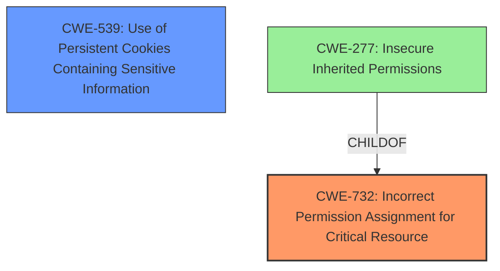

# Raw Analyzer Response for CVE-2025-22918

# Summary
| CWE ID | CWE Name | Confidence | CWE Abstraction Level | CWE Vulnerability Mapping Label | CWE-Vulnerability Mapping Notes |
|---|---|---|---|---|---|
| CWE-732 | Incorrect Permission Assignment for Critical Resource | 0.75 | Class | Allowed-with-Review | Primary CWE. The **insecure permissions** on the resource allow unintended actors to access it. |
| CWE-539 | Use of Persistent Cookies Containing Sensitive Information | 0.60 | Variant | Allowed | Secondary candidate. The cookies are automatically loaded, suggesting the cookies contain sensitive information that should not be stored persistently. |

## Evidence and Confidence

*   **Confidence Score:** 0.70
*   **Evidence Strength:** MEDIUM

## Relationship Analysis
The primary relationship influencing the decision is the hierarchical structure of CWEs related to permission and privilege management. CWE-732 is a Class-level CWE that encompasses scenarios where permissions for critical resources are incorrectly assigned. The guidance suggests that while the name indicates assignment of permissions for resources, this is often misused for vulnerabilities in which "permissions" are not checked, which is an "authorization" weakness. However, the vulnerability description clearly states "**insecure permissions**," suggesting that the permissions themselves are the problem, rather than a missing authorization check.

## Vulnerability Chain
The vulnerability chain starts with **insecure permissions** being set on the Polycom RealPresence Group 500, specifically with automatically loaded cookies. This leads to the ability to use administrator functions, ultimately resulting in the leakage of sensitive user information.

Root Cause: CWE-732 Incorrect Permission Assignment for Critical Resource
Impact: Leakage of Sensitive User Information.

## Summary of Analysis
The initial analysis focused on identifying the root cause of the vulnerability, which is clearly stated as "**insecure permissions**." The retriever results and CWE guidance both pointed to CWE-732, Incorrect Permission Assignment for Critical Resource, as a strong candidate. The key factor in selecting CWE-732 was the explicit mention of "**insecure permissions**," which aligns directly with the CWE's description of incorrectly specified permissions for critical resources. The evidence is primarily based on the vulnerability description itself, and the retriever scores support this selection. A secondary weakness that could be present is the **Use of Persistent Cookies Containing Sensitive Information** since the cookies are automatically loaded. This would lead to the **leakage of sensitive user information.**

The selected CWEs are at the optimal level of specificity because CWE-732 directly addresses the root cause of the vulnerability, which is the **incorrect assignment of permissions** allowing unintended access to critical resources.
CWE-539 directly addresses the **use of cookies that contain sensitive information.**

Relevant CWE Information:

# Enhanced Context (25 CWEs)
The following CWEs were identified as potentially relevant to this vulnerability:

## CWE-732: Incorrect Permission Assignment for Critical Resource
**Abstraction Level**: Class
**Similarity Score**: 1271.12
**Source**: sparse

**Description**:
The product specifies permissions for a security-critical resource in a way that allows that resource to be read or modified by unintended actors.

**Mapping Guidance**:
- Usage: Allowed-with-Review
- Rationale: While the name itself indicates an assignment of permissions for resources, this is often misused for vulnerabilities in which "permissions" are not checked, which is an "authorization" weakness (CWE-285 or descendants) within CWE's model [REF-1287].

## CWE-539: Use of Persistent Cookies Containing Sensitive Information
**Abstraction Level**: Variant
**Similarity Score**: 0.554
**Source**: dense

**Description**:
The product uses cookies to store sensitive information, and the cookies are set to persist across sessions, which increases the window of opportunity for attack.

**Mapping Guidance**:
- Usage: Allowed
- Rationale: This CWE entry is at the Variant level of abstraction, which is a preferred level of abstraction for mapping to the root causes of vulnerabilities.