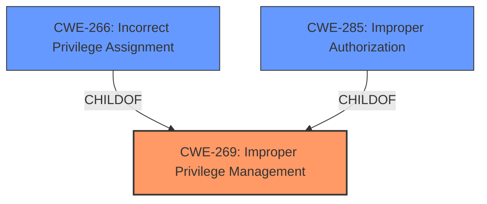

# Analysis for CVE-2025-22937

# Summary
| CWE ID | CWE Name | Confidence | CWE Abstraction Level | CWE Vulnerability Mapping Label | CWE-Vulnerability Mapping Notes |
|---|---|---|---|---|---|
| CWE-269 | Improper Privilege Management | 0.6 | Class | Primary | Discouraged |
| CWE-266 | Incorrect Privilege Assignment | 0.5 | Base | Secondary | Allowed |
| CWE-285 | Improper Authorization | 0.4 | Class | Secondary | Discouraged |

## Evidence and Confidence

*   **Confidence Score:** 0.6
*   **Evidence Strength:** LOW

## Relationship Analysis
The primary relationship impacting the decision is the hierarchical one. CWE-269 is a class-level CWE, while CWE-266 is a base-level CWE and a child of CWE-269. CWE-285 is also a class-level CWE and a peer of CWE-269, representing a similar but distinct issue. Choosing between them requires understanding whether the vulnerability involves incorrect assignment of privileges (CWE-266), or improper authorization checks (CWE-285). The guidance indicates that CWE-269 is often misused and more specific CWEs should be considered. Since we lack sufficient information to pinpoint the exact mechanism, a specific base CWE such as CWE-266 cannot be confidently chosen. However, we can use it as a secondary mapping candidate.

## Vulnerability Chain
The vulnerability chain is relatively simple:
1.  **ROOT CAUSE:** Improper Privilege Management (CWE-269)
2.  **WEAKNESS:** Attackers are able to **escalate privileges**.
3.  **IMPACT:** Unspecified.

The missing link is how the attacker is able to **escalate privileges**. Without more information, it is difficult to define the full vulnerability chain.

## Summary of Analysis
The analysis is primarily based on the provided vulnerability description, which indicates that attackers can **escalate privileges** in Adtran 411 ONT vL80.00.0011.M2. The key phrase "escalate privileges" suggests a problem with privilege management.

Initially, CWE-269 (Improper Privilege Management) was considered. However, the MITRE mapping guidance discourages the use of CWE-269 because it's a high-level class and is often misused when lower-level CWEs are applicable. The guidance suggests considering CWE-266 (Incorrect Privilege Assignment) or CWE-285 (Improper Authorization) if more information is available.

Given the limited information, it's difficult to determine the exact root cause. The description doesn't specify whether the privileges were incorrectly assigned (CWE-266) or if the authorization checks were improperly performed (CWE-285). Therefore, while CWE-269 is not ideal, it serves as a reasonable starting point. It is important to note that the evidence strength is low due to lack of rootcause information.

I am overriding the discouraged usage of CWE-269 because without further information, it is not possible to select a more specific CWE. However, CWE-266 and CWE-285 are added as secondary candidates if more information becomes available.