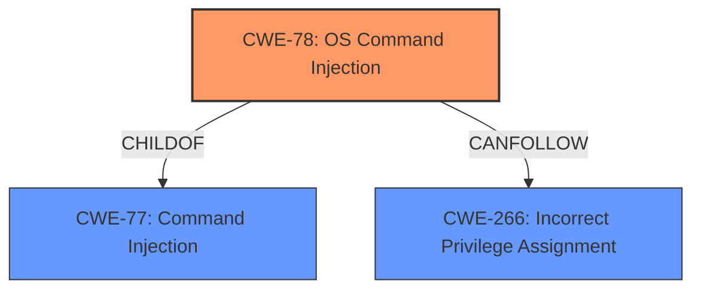

# Raw Analyzer Response for CVE-2025-22941

# Summary

| CWE ID    | CWE Name                                                                        | Confidence | CWE Abstraction Level | CWE Vulnerability Mapping Label | CWE-Vulnerability Mapping Notes |
| --------- | ------------------------------------------------------------------------------- | ---------- | --------------------- | ------------------------------- | ------------------------------- |
| CWE-78    | Improper Neutralization of Special Elements used in an OS Command ('OS Command Injection') | 1          | Base                  | Primary                         | Allowed                       |
| CWE-266 | Incorrect Privilege Assignment | 0.7      | Base                  | Secondary                       | Allowed                       |

## Evidence and Confidence

*   **Confidence Score:** 0.85
*   **Evidence Strength:** MEDIUM

## Relationship Analysis
The primary relationship that influenced my decision was the child-of relationship between CWE-78 and CWE-77, with CWE-78 being a more specific case of **command injection** related to operating system commands. The vulnerability description explicitly mentions "**command injection**", making CWE-78 a strong candidate. Additionally, the impact of privilege escalation suggests a potential issue with privilege management, leading to consideration of CWE-266, which is related to incorrect privilege assignment.

## Vulnerability Chain
The vulnerability chain starts with the **improper neutralization** of special elements in a command, specifically an OS command (**command injection**, CWE-78). This allows attackers to execute arbitrary commands and escalate privileges to root (CWE-266).

## Summary of Analysis
The initial analysis focused on identifying the **command injection** vulnerability, which led to the selection of CWE-78 as the primary CWE. The vulnerability description clearly states that the vulnerability is a "**command injection**" in the web interface that allows attackers to execute arbitrary commands and escalate privileges to root.

The retriever results also support this selection, with CWE-77 and CWE-78 being the top candidates. Since the description specifies that the commands are OS commands, CWE-78 is more appropriate.

The relationship analysis further supports this decision, as CWE-78 is a specific type of CWE-77. The privilege escalation impact was considered, leading to the addition of CWE-266 as a secondary CWE.

The final selection is based on the provided evidence and the understanding of CWE relationships, ensuring that the chosen CWEs are at the optimal level of specificity.

CWEs considered but not used:

*   CWE-77: While closely related, CWE-78 is a more specific type of **command injection**, making it a better fit.
*   CWE-20: This is too general and doesn't describe the specific weakness of **command injection**.
*   CWE-269: This is a class-level CWE, and the more specific CWE-266 is more appropriate given the privilege escalation context.
*   CWE-863: Incorrect Authorization - While there is privilege escalation, the root cause is **command injection**, not an authorization bypass. The injection leads to the ability to bypass authorization.
*   CWE-94: Improper Control of Generation of Code ('Code Injection') - This is about injecting code, not commands.

Relevant CWE Information:

# Enhanced Context (25 CWEs)
The following CWEs were identified as potentially relevant to this vulnerability:

## CWE-78: Improper Neutralization of Special Elements used in an OS Command ('OS Command Injection')
**Abstraction Level**: base

**Description**:
CWE-78: Improper Neutralization of Special Elements used in an OS Command ('OS Command Injection')
## CWE-266: Incorrect Privilege Assignment
**Abstraction Level**: Base

**Description**:
A product incorrectly assigns a privilege to a particular actor, creating an unintended sphere of control for that actor.