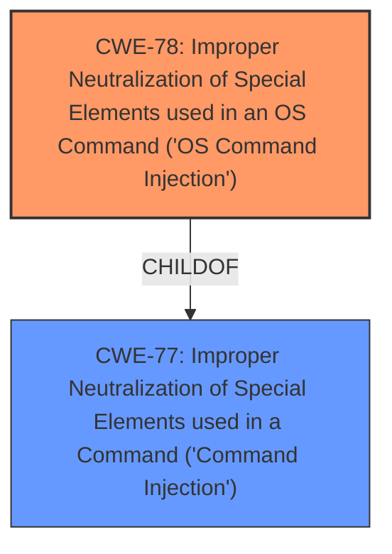

# Analysis for CVE-2025-22949

# Summary
| CWE ID | CWE Name | Confidence | CWE Abstraction Level | CWE Vulnerability Mapping Label | CWE-Vulnerability Mapping Notes |
|---|---|---|---|---|---|
| CWE-78 | Improper Neutralization of Special Elements used in an OS Command ('OS Command Injection') | 1.0 | Base | Allowed | Primary CWE |

## Evidence and Confidence

*   **Confidence Score:** 1.0
*   **Evidence Strength:** HIGH

## Relationship Analysis
The primary relationship that influenced the decision was the ChildOf relationship between CWE-78 and CWE-77. While both are related to command injection, CWE-78 is more specific, focusing on OS commands, which aligns with the vulnerability description. The retriever results also support this, with CWE-78 being a top contender.

## Vulnerability Chain
The vulnerability chain starts with **improper neutralization** of special elements within the Samba configuration settings, leading to **OS Command Injection** (CWE-78). This, in turn, allows for remote arbitrary code execution. The chain is relatively direct, with the **command injection** being the root cause that enables the final impact.

## Summary of Analysis
The initial assessment identified **command injection** as the root cause of the vulnerability in Tenda ac9. The retriever results and CWE specifications strongly suggest CWE-78 as the most appropriate mapping. The vulnerability description explicitly mentions that the vulnerability is a **command injection** in `/goform/SetSambaCfg`, which may lead to remote arbitrary code execution. CWE-78 (Improper Neutralization of Special Elements used in an OS Command ('OS Command Injection')) directly addresses this issue. The confidence in this mapping is high because the description aligns perfectly with the CWE description, and it's a base-level CWE, which is preferred.

CWE-77 (Improper Neutralization of Special Elements used in a Command ('Command Injection')) was considered but not chosen as the primary CWE because CWE-78 is a more specific child that better represents the vulnerability involving OS commands. Other CWEs like CWE-88 (Improper Neutralization of Argument Delimiters in a Command ('Argument Injection')) and CWE-95 (Improper Neutralization of Directives in Dynamically Evaluated Code ('Eval Injection')) were also considered but deemed less relevant as they describe different types of injection vulnerabilities.