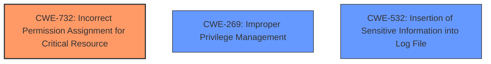

# Raw Analyzer Response for CVE-2025-23007

# Summary
| CWE ID | CWE Name | Confidence | CWE Abstraction Level | CWE Vulnerability Mapping Label | CWE-Vulnerability Mapping Notes |
|---|---|---|---|---|---|
| CWE-732 | Incorrect Permission Assignment for Critical Resource | 0.75 | Class | Allowed-with-Review | Primary CWE |
| CWE-269 | Improper Privilege Management | 0.6 | Class | Discouraged | Secondary Candidate |
| CWE-532 | Insertion of Sensitive Information into Log File | 0.5 | Base | Allowed | Secondary Candidate |

## Evidence and Confidence

*   **Confidence Score:** 0.7
*   **Evidence Strength:** MEDIUM

## Relationship Analysis
The analysis focused on the hierarchical relationships, particularly the parent-child relationships, to determine the most specific CWE. CWE-732 is a Class-level CWE that describes vulnerabilities where permissions for critical resources are incorrectly assigned. This aligns well with the description of the vulnerability, which involves unauthorized access to sensitive Windows system files due to a flaw in the log export function. CWE-269, a more general Class-level CWE, was considered but deemed less specific. CWE-532 was considered due to the mention of logs, but is likely an after effect of the **incorrect permission assignment**.

## Vulnerability Chain
The vulnerability chain starts with an **incorrect permission assignment** in the log export function (CWE-732). This allows unauthorized access to sensitive system files. The unauthorized access can then potentially lead to privilege escalation. The insertion of sensitive information into the log file (CWE-532) is a possible side effect of this vulnerability.

## Summary of Analysis
The initial analysis identified CWE-732 as the primary candidate due to the explicit mention of unauthorized access to sensitive files, pointing to a permission issue. The vulnerability description states that a flaw in the log export function allows unauthorized access to sensitive Windows system files, potentially leading to privilege escalation. This aligns directly with CWE-732, which describes incorrect permission assignments for critical resources. While CWE-269 (Improper Privilege Management) was considered, it is a more general category and the description leans more towards a specific permission issue rather than broad privilege management. CWE-532 was also considered because the vulnerable component is the log export function, so the sensitive information may be in the log file.

The selection of CWE-732 is at the optimal level of specificity because it directly addresses the **incorrect permission assignment** that leads to the unauthorized access. The evidence from the vulnerability description is strong, stating that the vulnerability "allows unauthorized access to sensitive Windows system files".

Relevant CWE Information:

# Enhanced Context (25 CWEs)
The following CWEs were identified as potentially relevant to this vulnerability:

## CWE-732: Incorrect Permission Assignment for Critical Resource
**Abstraction Level**: Class
**Similarity Score**: 1219.74
**Source**: sparse

**Description**:
The product specifies permissions for a security-critical resource in a way that allows that resource to be read or modified by unintended actors.

**Mapping Guidance**:
- Usage: Allowed-with-Review
- Rationale: While the name itself indicates an assignment of permissions for resources, this is often misused for vulnerabilities in which "permissions" are not checked, which is an "authorization" weakness (CWE-285 or descendants) within CWE's model [REF-1287].

## CWE-269: Improper Privilege Management
**Abstraction Level**: Class
**Similarity Score**: 1262.39
**Source**: sparse

**Description**:
The product does not properly assign, modify, track, or check privileges for an actor, creating an unintended sphere of control for that actor.

**Mapping Guidance**:
- Usage: Discouraged
- Rationale: CWE-269 is commonly misused. It can be conflated with "privilege escalation," which is a technical impact that is listed in many low-information vulnerability reports [REF-1287]. It is not useful for trend analysis.

## CWE-532: Insertion of Sensitive Information into Log File
**Abstraction Level**: Base
**Similarity Score**: 0.74
**Source**: dense

**Description**:
The product does not properly prevent sensitive system-level information from being accessed by unauthorized actors who do not have the same level of access to the underlying system as the product does.

**Mapping Guidance**:
- Usage: Allowed
- Rationale: This CWE entry is at the Base level of abstraction, which is a preferred level of abstraction for mapping to the root causes of vulnerabilities.